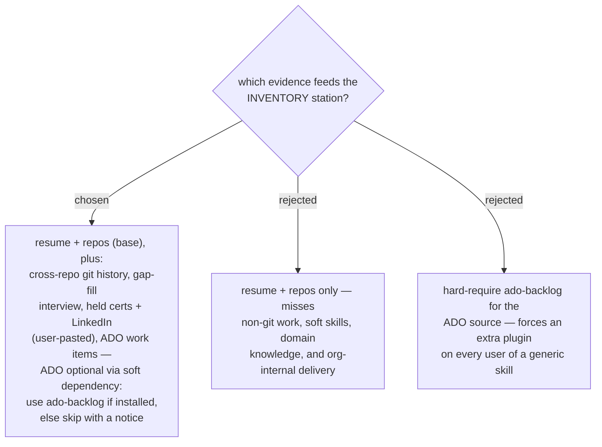

# ADR 0046 — INVENTORY reads five evidence sources; ADO is a soft dependency

- **Status:** Accepted
- **Date:** 2026-07-31

## Context

The owner asked what beyond resume and repos should ground the skill inventory.
Resumes under-report (stale, self-edited); repos only show what was committed.
The marketplace already has a precedent for cross-plugin composition: preflight
detection with graceful handling (ADR 0033; grill-then-plan's superpowers check).
LinkedIn blocks scraping, so profile data must be user-supplied.

## Decision

INVENTORY draws on **five evidence sources**:

1. **Resume** (file path, user-provided) — the baseline claim set.
2. **Repos + cross-repo git history** — what was actually built, how recently, and
   how often; the primary corrective to resume claims.
3. **Held certificates + LinkedIn profile** — user-pasted or exported; never
   scraped.
4. **Gap-fill interview** — short targeted questions covering only what evidence
   cannot show (non-git work, soft skills, languages, domain knowledge).
5. **ADO work items** — org-internal delivery evidence, via the `ado-backlog`
   plugin **if installed** (soft dependency): detect, use when present, otherwise
   skip with an explicit notice. Never hard-require it.

Every inventory entry records which source(s) attest it — claims with no evidence
beyond the resume are flagged as *unverified*.

## Consequences

- ➕ Inventory is evidence-graded, so the GAP+MOAT stage can weight verified skills
  above self-reported ones (feeds ADR 0044 test 2).
- ➕ Works out of the box without ado-backlog; richer when present.
- ➖ The interview adds an interactive step — INVENTORY is not fully unattended.
- ➖ Cross-repo git scanning needs the user to list repo roots per run.
