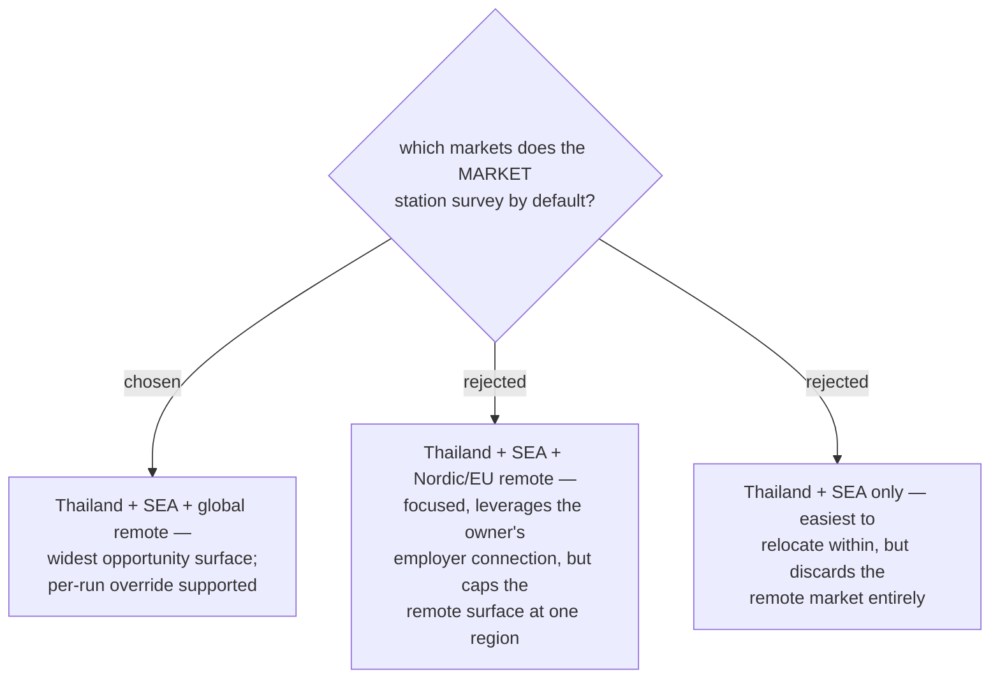

# ADR 0047 — default target markets: Thailand, SEA, and global remote

- **Status:** Accepted
- **Date:** 2026-07-31

## Context

The owner named "Thailand, Asia, and other markets"; *other* had to be pinned
because it multiplies research volume every run. The choice trades focus against
opportunity surface: global remote is the noisiest but largest pool, and remote
demand is also the strongest signal for what pays across borders.

## Decision

The MARKET station surveys **three rings by default**: (1) Thailand, (2) Southeast
Asia (incl. Singapore), (3) **global remote**. The set is a per-run parameter — a
user can narrow or swap rings when invoking the skill; the default is only what
runs when nothing is specified.

## Consequences

- ➕ Captures remote-first demand, which is where rare combinations price highest.
- ➖ Highest research volume of the options; the MARKET station must cap per-ring
  effort (e.g. fixed source list per ring) to stay a single-session stage.
- ➖ Global-remote noise means findings must carry their source and count, so the
  PRESENT stage can weigh signal quality.
