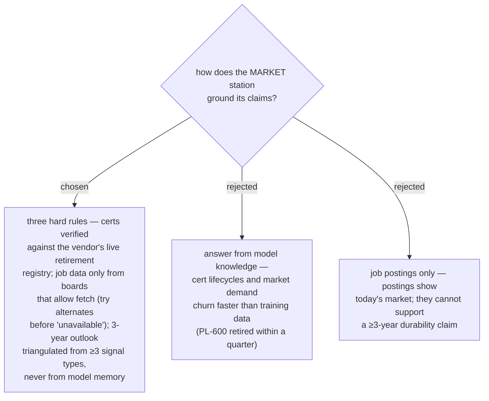

# ADR 0048 — MARKET evidence rules: live-verified certs, fetchable boards, triangulated foresight

- **Status:** Accepted
- **Date:** 2026-07-31

## Context

Two recorded gotchas (2026-07-31) bear directly on this station: any certificate or
SKU nameable from memory may already be retired (an entire Microsoft business-apps
cert line, incl. PL-600, retired within one quarter), and some job boards block
automated fetch (JobsDB 403s; LinkedIn and Indeed served fine). Separately, the
moat definition (ADR 0044) requires a ≥3-year durability judgment, which current
job postings alone cannot support.

## Decision

The MARKET station operates under **three non-negotiable evidence rules**:

1. **Certificates are live-verified.** Every certificate recommendation is checked
   against the vendor's retirement/lifecycle registry at run time (for Microsoft:
   `credentials/support/retired-certification-exams` + `credential-retirement`,
   plus the exam study guide's own banner). Model memory is never an acceptable
   source for cert existence, exam codes, or lifecycle status.
2. **Job data comes from fetchable boards.** Use boards that serve automated
   fetch; when one blocks (403), try alternates before reporting a metric
   unavailable. Every demand claim carries its source and posting count.
3. **The 3-year outlook is triangulated**, never asserted: at least three signal
   types — (a) vendor roadmaps (e.g. Microsoft release waves), (b) industry /
   developer-survey reports, (c) posting-trend deltas between skill runs, plus an
   explicit per-skill AI-absorption assessment feeding ADR 0044 test 4.

## Consequences

- ➕ Recommendations survive contact with reality — no retired certs, no phantom
  demand; failures of the 2026-07 cert incident class are prevented structurally.
- ➖ MARKET is web-dependent: offline runs degrade to inventory-only value.
- ➖ Triangulation costs research time each run; the station design must budget it
  (bounded source list per ring, ADR 0047).
