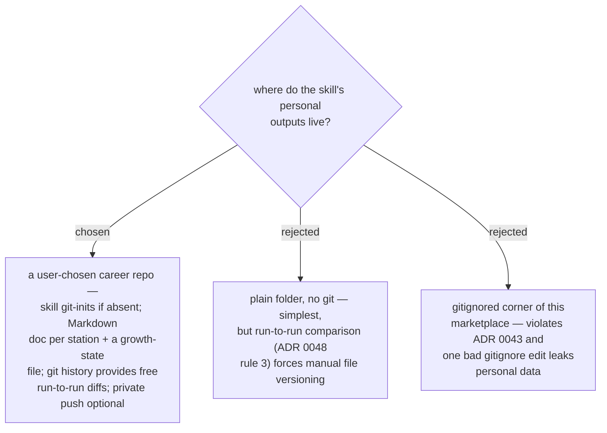

# ADR 0049 — station outputs live in a personal career git repo

- **Status:** Accepted
- **Date:** 2026-07-31

## Context

ADR 0043 keeps personal data out of the plugin; ADR 0048 requires posting-trend
deltas *between runs*, which demands history. The marketplace already has a
state-file precedent (`daily-state.md`, ADR 0014) and a convention that documents
are Markdown under the diagram convention.

## Decision

All personal outputs live in a **user-chosen career repo** (any path outside the
marketplace). On first run the skill offers to `git init` it. Contents:

- `profile.md` — the evidence-graded skill inventory (INVENTORY output, updated
  each run).
- `market-report.md` — the MARKET output, overwritten each run; git history holds
  the prior rounds, giving trend deltas via `git log`/`git diff`.
- `moat.md` — the chosen moat and its four-test argument (PRESENT output).
- `growth-plan.md` — guideline + mini projects (PLAN output).
- `growth-state.md` — machine-readable run state: last run date, chosen moat,
  mini-project progress, next-review-due.

All `.md` outputs are document-skill artifacts — the diagram convention applies.
Commits are assisted, never automatic (mirroring ADR 0014's git discipline).

## Consequences

- ➕ Free, trustworthy run-to-run diffs; the whole growth story is `git log`.
- ➕ Push-to-private-remote is available but never required.
- ➖ First-run setup includes choosing a path and approving a `git init`.
- The state file's exact schema is an implementation-plan detail, not ADR-level.
