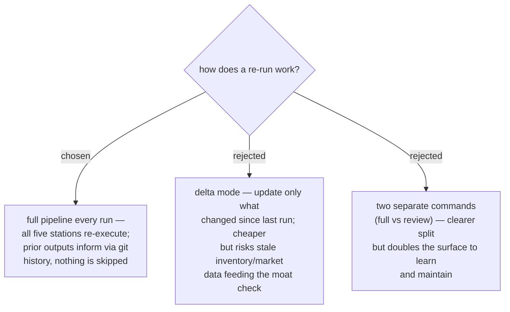

# ADR 0050 — every re-run executes the full five-station pipeline

- **Status:** Accepted
- **Date:** 2026-07-31

## Context

The market moves continuously, so the skill must be re-runnable (ADR 0048 rule 3
even consumes run-to-run deltas). The trade-off: a delta mode is cheaper per run
but adds mode logic and risks concluding from stale data; a full run is more
expensive but always current.

## Decision

**Every run is a full run.** All five stations (ADR 0045) re-execute each time,
including the INVENTORY interview and the live MARKET survey. The prior run's
outputs remain available through the career repo's git history (ADR 0049) and feed
the trend-delta comparison, but no station is skipped. `growth-state.md` still
tracks mini-project progress and a suggested next-review-due date (default
cadence: quarterly, user-adjustable); re-runs are always user-initiated — the
skill stays harness-neutral and never schedules itself.

## Consequences

- ➕ Zero staleness: the moat is re-argued against fresh evidence every time.
- ➕ One code path — no delta-mode conditionals to maintain or explain.
- ➖ Each run costs the full research budget (bounded per ADR 0047/0048); the
  quarterly cadence keeps total cost acceptable.
- ➖ The INVENTORY interview repeats each run; it should pre-fill from the previous
  `profile.md` so the user only corrects, not re-answers from scratch.
