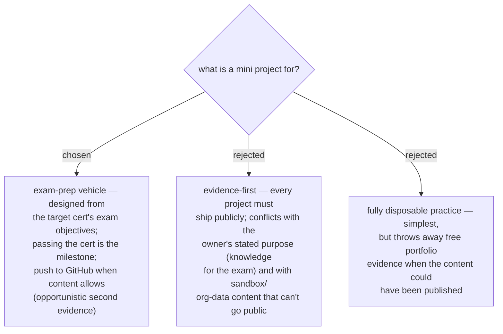

# ADR 0051 — PLAN is cert-driven: mini projects are exam-prep vehicles, published when feasible

- **Status:** Accepted
- **Date:** 2026-07-31

## Context

The owner defined the mini project's purpose explicitly: "ทำเพื่อหาความรู้ไปสอบ" —
build the knowledge to pass the target certificate's exam. Under ADR 0044 the
moat's public evidence (test 2) is already satisfied by the passed cert itself;
the open question was whether the project artifact must *also* be public.
Some exam-prep work happens in org sandboxes or against work data that cannot be
published.

## Decision

The PLAN station's guideline is **cert-driven**: for the chosen moat it selects
target certificates (live-verified per ADR 0048), and each **mini project is
designed backwards from that cert's exam objectives** — the project exists to
build the knowledge the exam tests, sized to fit the study window, with passing
the exam as the milestone. The skill **offers to publish** each project to a
public repo when the content allows (no org data, no sandbox lock-in), gaining a
second evidence layer — but publication is opportunistic, never a requirement.

## Consequences

- ➕ Matches how the owner actually studies (hands-on prep, cf. the existing D365
  study-method doc); the guideline has a natural pass/fail milestone per step.
- ➕ Cert = guaranteed evidence; published projects = bonus evidence.
- ➖ Skills with no matching certificate (niche combinations, soft skills) need a
  non-cert milestone — the guideline must define one per such item (e.g. a
  shipped artifact or a delivered piece of work) instead of a cert.
- ➖ Exam-objective mapping depends on the vendor's study guide being fetchable at
  run time (consistent with ADR 0048 rule 1).
