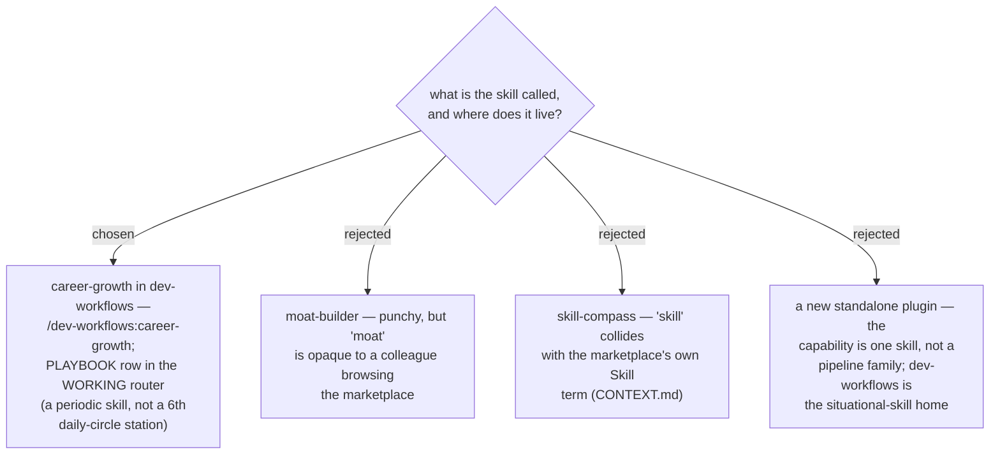

# ADR 0052 — the skill is named career-growth and lives in dev-workflows

- **Status:** Accepted
- **Date:** 2026-07-31

## Context

The skill needs a folder name (`skills/<name>/`), a command
(`/dev-workflows:<name>`), and a PLAYBOOK row (mandatory per the maintenance
rule). `skill-compass` was rejected because *skill* already has a reserved meaning
in this marketplace's glossary. It is quarterly-cadence work (ADR 0050), so it
belongs in the situational WORKING router, not the daily circle.

## Decision

The skill is **`career-growth`**, homed in the `dev-workflows` plugin:
`plugins/dev-workflows/skills/career-growth/SKILL.md`, invocable as
`/dev-workflows:career-growth`, with a thin command wrapper per convention. The
PLAYBOOK gains one WORKING-router row — "planning my own growth / quarterly career
review → career-growth" — in the same commit that adds the skill.

## Consequences

- ➕ Name states the job in plain words; no glossary collision.
- ➕ Follows every existing convention (skill folder, command wrapper, PLAYBOOK
  row, harness-neutral wording).
- ➖ None of note beyond one more row in an already-long router table.
