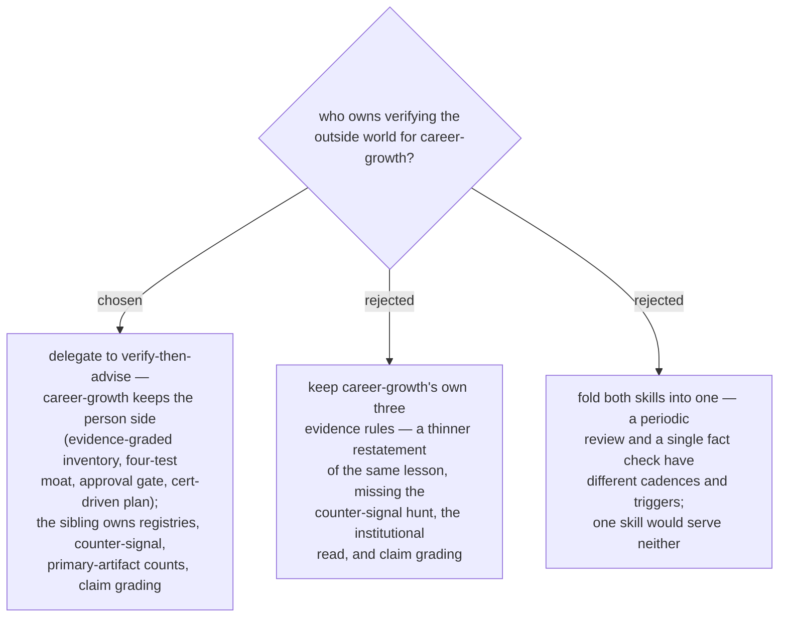

# ADR 0053 — career-growth delegates external-fact verification to verify-then-advise

- **Status:** Accepted
- **Date:** 2026-08-01
- **Amends:** ADR 0048 (MARKET evidence rules) — rules 1–3 now come from the sibling skill

## Context

`career-growth` (ADRs 0043–0052) and `verify-then-advise` were designed in the same
window from the **same originating session** — both cite the PL-600 retirement, the
counted job postings, and the salary aggregator disagreeing by 40%. They landed
independently: `verify-then-advise` was untracked on `main`, so the `career-growth`
worktree branched from a commit that did not contain it and the design session never
saw it.

The result was duplication where `career-growth` was the weaker copy. Its ADR 0048
gave three evidence rules; the sibling gives six stages plus a claim-grading scale,
and `career-growth` lacked the three the sibling calls most valuable — the
counter-signal hunt, the institutional-incentive read, and per-claim grading. Worse,
Station 2's instruction to survey "using **only** the bounded source list" made the
stronger method unrunnable: a counter-signal is by definition not in a curated list,
and neither is an employer's partner-program page.

Both skills also claimed the same triggers ("which certification should I take", job
market, career roadmap) with no precedence stated in either.

## Decision

**`career-growth` delegates every outside-world fact claim to `verify-then-advise`.**

- `career-growth` owns the **person side and the decision structure**: the
  evidence-graded skill inventory, the four-test moat definition (ADR 0044), the
  PRESENT approval gate (ADR 0045), and cert-driven mini-project design (ADR 0051).
- `verify-then-advise` owns the **outside world**: retirement registries, the
  counter-signal hunt, primary-artifact counts, the institutional-incentive read, and
  the four-grade claim scale. `market-sources.md` is reduced to the per-ring board
  list that bounds MARKET's research cost (ADR 0047) — the registry list and the
  trend-signal taxonomy live only in the sibling.
- ADR 0048's rules 1–3 stand as **consequences of running the sibling**, not as
  `career-growth`'s own re-derived rules. Rule 4 (personal data never enters the
  plugin or the current project; career-repo commits are assisted) has no sibling
  equivalent and remains `career-growth`'s own in full.
- **Precedence, stated in both skills:** reach for `career-growth` for the full
  periodic review; reach for `verify-then-advise` for a single verified
  recommendation or to check whether one named product/credential is still current.
- Version consequence: `verify-then-advise` ships as `0.26.0`, `career-growth` as
  `0.27.0`.

## Consequences

- ➕ One canonical home per concern; the market half of the analysis gets the stronger
  method (graded claims, counter-signal, institutional read) for free.
- ➕ The trigger collision is resolved in text a model actually reads, not only in
  PLAYBOOK.
- ➖ `career-growth` now has a **soft dependency on a second skill**. Unlike the
  `ado-backlog` dependency (ADR 0046) this one is not optional — without the sibling
  the MARKET station has no verification method. Both ship in the same plugin, so
  installation cannot separate them, but a future extraction of either skill must
  carry the other.
- ➖ Reading `career-growth` alone no longer tells the whole story; the delegation
  must stay explicit at every point it matters.
- **Process lesson:** a worktree branched from a commit that omits a sibling's
  uncommitted work designs blind to it. Before a design session, check the base
  checkout for untracked or uncommitted work in the same plugin.
