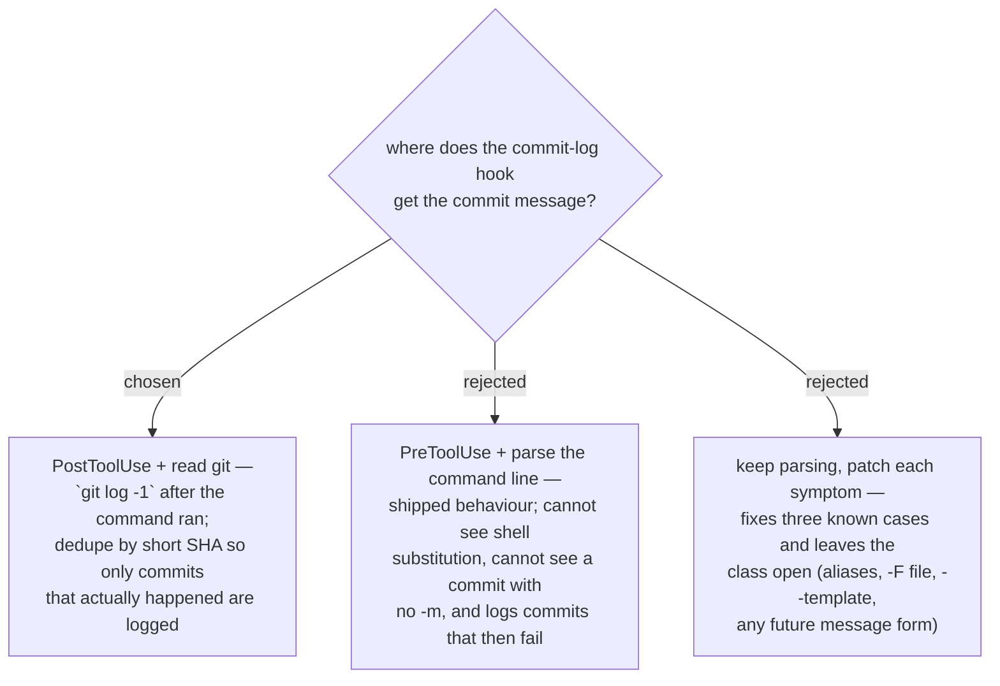

# ADR 0054 — the commit-log hook reads git after the fact, not the command line

- **Status:** Retired — the hook this ADR describes is no longer registered.
- **Date:** 2026-08-01
- **Retired 2026-08-15**, recording a change that landed in `e7839a8` on 2026-08-15
  without a banner. Backfilled here.

> **The hook is gone.** `plugins/dev-workflows/hooks/hooks.json` is `{"hooks": {}}` at
> `HEAD`. The `PostToolUse` registration this ADR designed was removed in **`e7839a8`**
> ("Refactor ADR numbering documentation and remove unused hooks"), whose only stated
> reason is *"no longer needed"*. **No ADR records why**, and this banner does not invent
> one — if the reason matters, it needs writing down.
>
> **What survives:** the design itself is untouched and still correct. `PostToolUse` plus
> `git log -1` — rather than parsing the command line — remains the right shape for any
> future commit-logging hook, for the reasons below. This ADR is retired, not refuted.
>
> **Two loose ends.** `plugins/dev-workflows/hooks/commit-log.py` (5.6 KB) is still in the
> tree and is now referenced by nothing — kept deliberately or orphaned, nobody can tell.
> And `hooks.json` is the same file
> [ADR 0073](0073-vendored-review-skills-live-inside-dev-workflows-not-a-plugin-of-their-own.md)
> designates for the `SessionStart` hook
> [ADR 0070](0070-host-sessionstart-hook-repoints-the-one-skill-the-upstream-hook-names.md)
> requires, so the file the vendoring design depends on is currently empty.

## Context

`commit-log.py` echoed every commit into the repo's `daily-state.md ## Log`. It ran
as a **PreToolUse** hook and reconstructed the message by parsing `-m` values out
of the Bash command string. That produced four classes of wrong entry, all
reproduced from real log data in this repo (damage dating to 2026-06-26):

- **Mojibake.** `json.load(sys.stdin)` decodes a pipe with the Windows ANSI
  codepage, so every non-ASCII character in a subject was mangled — an em dash
  logged as `—`, Thai text as `พั...`. The tell was that the hook's *own*
  hardcoded separator survived while characters from the payload did not.
- **Shell substitution logged raw.** `-m "$(cat <<'EOF' … EOF)"` is a literal
  token to `shlex`, so the log got the shell source instead of the message —
  and, being multi-line, it broke the `## Log` list structure. 14 such entries.
- **Content-free placeholders.** A commit with no `-m` (`--amend --no-edit`,
  editor form) fell back to the string `(commit)`. 7 such entries.
- **Phantom entries.** The guard `"git" in tokens and "commit" in tokens` fires on
  any command merely mentioning the word — `git log … # show last commit` logged
  an entry. And because PreToolUse runs *before* the command, a commit that then
  failed was logged as if it had succeeded.

Parsing the command line is the common cause: it infers the outcome from the
request instead of observing it.

## Decision

The hook moves to **PostToolUse** and reads the commit from **git itself** —
`git log -1 --format=%h%x00%s` — after the command has run. Entries are
**deduplicated by short SHA**, which is recorded in the log line.

Consequences of that shape, rather than rules bolted on:

- A failed commit never moves HEAD, so nothing is logged. No outcome inference.
- Any message form works — `-m`, `-F`, `--template`, editor, alias, heredoc — because
  the message is never parsed out of the command.
- A commit message **rewritten by another git hook** is logged as rewritten, which is
  the truth of the record (this repo has a documented case of an AI hook silently
  replacing commit messages).
- Re-firing on the same commit is a no-op, so the hook is idempotent.
- Non-ASCII is read as UTF-8 from `sys.stdin.buffer`, never through the locale codec.

The **hard contract is unchanged**: best-effort only, always exit 0, never write to
stdout, swallow every failure. A missing log line is acceptable; a blocked command is
not. `plugins/dev-workflows/scripts/test_commit_log.py` covers all four classes plus
the contract under malformed payloads.

## Consequences

- ➕ The log becomes a record of what git did, not of what an agent typed.
- ➕ The whole class is closed, not three instances of it.
- ➖ Two `git` subprocesses per Bash command whose text mentions a commit-creating
  verb (a substring pre-filter keeps every other call at zero).
- ➖ A commit created by a command that mentions none of those verbs is not logged;
  the next matching command backfills it, since dedupe is by SHA rather than by run.
- ➖ Log lines now carry a short SHA, so entries written before this change have a
  different shape. Existing corrupted entries are **not** rewritten by this ADR —
  repairing them is a separate, reviewable data migration.
