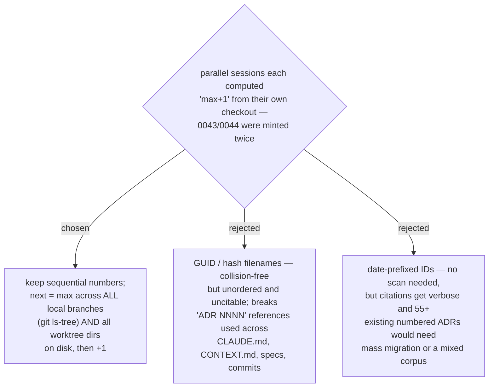

# ADR 0056 — ADR numbers are minted from the global max across all local branches and worktrees

- **Status:** Accepted
- **Date:** 2026-08-01
- **Relates to:** ADR 0053's process lesson (worktree designs blind to sibling work)

## Context

The `career-growth` session on `main` minted ADRs 0043–0053 while the `decision-map`
session in a worktree independently minted 0043/0044 — both computed "highest number
in `docs/adr/` + 1" from their own checkout, and git merged both files without
conflict because only the numbers collide, not the filenames (fixed manually by the
renumber commit `9472d1e`). `worktree.baseRef: "head"` cannot prevent this: it fixes
staleness *at worktree creation*, not divergence *after* it. The old rule in the
grilling skills' ADR-FORMAT.md ("scan `docs/adr/` for the highest existing number")
is the under-specification that allowed it.

## Decision

**Sequential numbering stays — the minting rule changes.** Before minting, compute
the highest existing number for the target ADR directory across **three** sources:

1. the committed tree of **every ref**, local *and* remote-tracking
   (`git for-each-ref refs/heads refs/remotes refs/stash` +
   `git ls-tree -r --name-only --full-tree <ref> -- <adr-dir>`);
2. the **index** (`git ls-files -- <adr-dir>`), which catches a number staged but no
   longer on disk; and
3. the **on-disk ADR directory of every worktree** (the value after the literal
   `worktree ` prefix in `git worktree list --porcelain`) — this catches ADRs not yet
   committed anywhere.

Then strip the leading zeros, increment, and re-pad to four digits. The rule is
per-ADR-directory (root `docs/adr/` and each plugin's `docs/adr/` are independent
sequences). Outside a git repo, list that one directory and say so.

Four details are load-bearing, each verified against this repo, and each fails
*silently* if dropped: `--full-tree` (without it `ls-tree`'s pathspec resolves against
the caller's cwd, so a shell in a subdirectory scans a different sequence at exit 0);
never word-splitting a worktree path (this repo's own path contains spaces, which
truncates the parse and makes source 3 contribute nothing); never globbing
`**/docs/adr` (it folds all four sequences and the nested worktree into one max); and
base-10 arithmetic (`$((0012+1))` is read as octal and yields 11, `$((0059+1))`
errors outright).

Canonical wording lives in the **Numbering** section of each grilling skill's
`ADR-FORMAT.md` — grill-then-plan in this repo, its standalone twin grill-with-docs
at the user level, and the Antigravity installs of both — kept byte-identical
everywhere, with no new reference file. It ships as a **runnable command block, not a
described algorithm**: prose is what let the previous one-line rule be implemented
three different wrong ways. The section is deliberately free of plugin-root tokens and
repo-specific paths so the copies *can* stay identical, and carries a
`numbering-rule v2` marker so drift is one `grep -rl` away. Repo-specific routing
(which directory new ADRs go in) lives in `CLAUDE.md` / `AGENTS.md`, not in the twins —
they are shared with unrelated repos that have their own ADR layouts.

## Consequences

- ➕ The collision window shrinks from "any two concurrent branches" to "two sessions
  minting in the same instant", which merge review catches.
- ➕ No migration: all 55+ existing ADRs and every `ADR NNNN` cross-reference stay
  valid; directory listing stays chronological.
- ➖ Minting costs one command block instead of a directory listing.
- ➖ The rule lives in **four** live copies, three of them outside this repo
  (`~/.claude/skills/grill-with-docs/`, `~/.agents/skills/grill-with-docs/`, and any
  Antigravity project install such as `C:\Repo2\testskill\.agents\`), so they must be
  updated in lockstep by hand. The `numbering-rule v2` marker makes the drift check
  mechanical: `grep -rl 'numbering-rule v2'` must list every copy at the same version.
- ➖ The rule cannot see an unpushed clone, an unfetched remote ref, or a session
  minting in the same second — hence the standing instruction to re-verify immediately
  before merging. It also cannot see gitignored numbered scratch such as
  `.superpowers/sdd/task-N-*.md`, which is outside this rule by construction.
- The same collision class applies to **plugin/marketplace versions**, and had already
  fired once (two branches independently bumped dev-workflows `0.25.9 → 0.26.0`). The
  convention bullet in `CLAUDE.md` / `AGENTS.md` therefore covers minted counters
  generally, not just ADR numbers.
- This ADR is the first minted under the new rule: `main`'s max was 0053, but a
  sibling branch already held higher numbers, so this file is **0056** — a number
  the current-checkout rule would have re-issued.
- A later renumber on that sibling branch (decision-map → 0057–0059) left **0055 as
  a permanent hole**. Holes are expected and harmless: the rule mints from the max,
  never from the first gap, so a hole can never become a collision.
