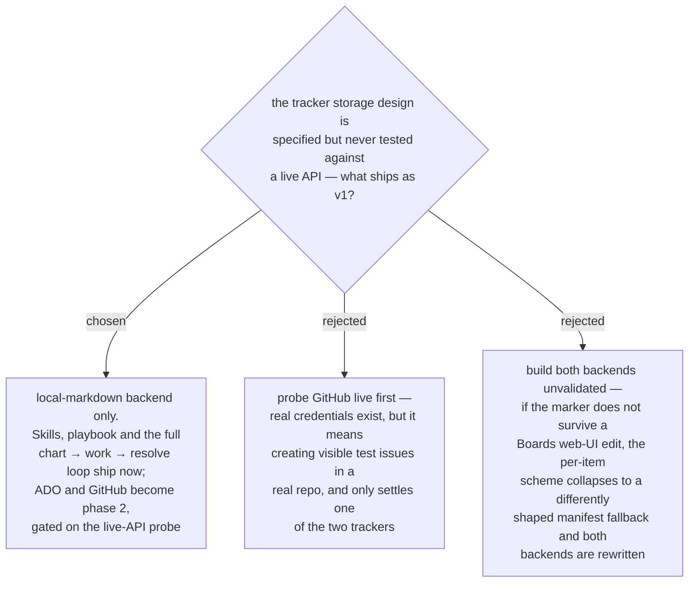

# ADR 0059 — v1 ships the local-markdown backend only; tracker backends deferred

- **Status:** Accepted — **gate half-cleared, see [ADR 0060](0060-marker-join-verified-on-github-ado-half-of-the-gate-still-open.md)**
- **Date:** 2026-08-01
- **Supersedes in part:** [ADR 0035](0035-decision-map-v1-supports-both-trackers-plus-local-fallback.md)

> The six-step probe this ADR gates on has since been **run against GitHub and
> passed** (2026-08-01). GitHub is cleared for phase-2 implementation; the ADO half —
> step 3, the Boards web-UI edit, where all the HTML risk lives — is still open. The
> "a probe would settle GitHub only" reasoning below held exactly.

## Context

ADR 0035 committed v1 to all three backends at parity. Implementation then went the
other way round from the plan: the local backend was built first as the reference, and
hardening it took five review rounds plus three contract rounds. Those rounds produced a
tracker storage design — five marker kinds (`key`, `gist`, `fog`, `scope`, `decisions`)
embedded in an ADO `System.Description` or a GitHub issue body — that is now precisely
specified and **entirely untested against a live API**.

The risk is concentrated in one check: ADO stores descriptions as HTML, and editing a
work item in the Boards web UI may rewrite or strip HTML comments. If it does, the
per-item marker scheme collapses to the map-item manifest fallback, which is a
*different shape* — both backends would be rewritten, not patched. The failure is also
silent in the worst way: a map whose markers were stripped re-charts in full and is
presented to the user as a page of ordinary, approvable `create` lines.

Validating it means creating real work items in a shared tracker. The environment has
`gh` authenticated and `az` logged in under a personal account with no `AZDO_ORG` set,
so a probe would settle GitHub only, and at the cost of visible test issues in someone's
repo.

## Decision

v1 ships the **local-markdown backend only**. The two flow skills, the `/daily` router
entry and the PLAYBOOK rows ship with it, so the complete
chart → claim → resolve → graduate loop is usable today on a backend with 73 tests
behind it. ADO and GitHub become **phase 2**, gated on running the contract's six-step
verification probe against a live tracker before any join code is written.

The contract keeps its tracker mappings — they are the specification phase 2 implements,
and the reasoning behind the key join is the most valuable output of the contract rounds.
What changes is what the plugin *claims*: the manifest, README and skill preflight must
not advertise tracker support that does not exist yet, and the preflight resolves to the
local backend while naming ADO and GitHub as planned.

## Consequences

- ➕ A working, well-tested plugin ships now instead of two backends built on a design
  whose central assumption is unverified.
- ➕ Phase 2 starts from a specification hardened by three contract rounds, with the
  probe and a fallback ladder already written down.
- ➖ The marketplace gains a plugin narrower than ADR 0035 promised; the manifest,
  README and preflight must be reworded or they misrepresent it.
- ➖ Teams whose maps belong on a shared board wait for phase 2 — the local map is
  committed to the repo, so it is per-repo and shared only through git.
- The `decision-map:map` / `decision-map:ticket` vocabulary stays reserved so phase 2
  does not renegotiate it.
