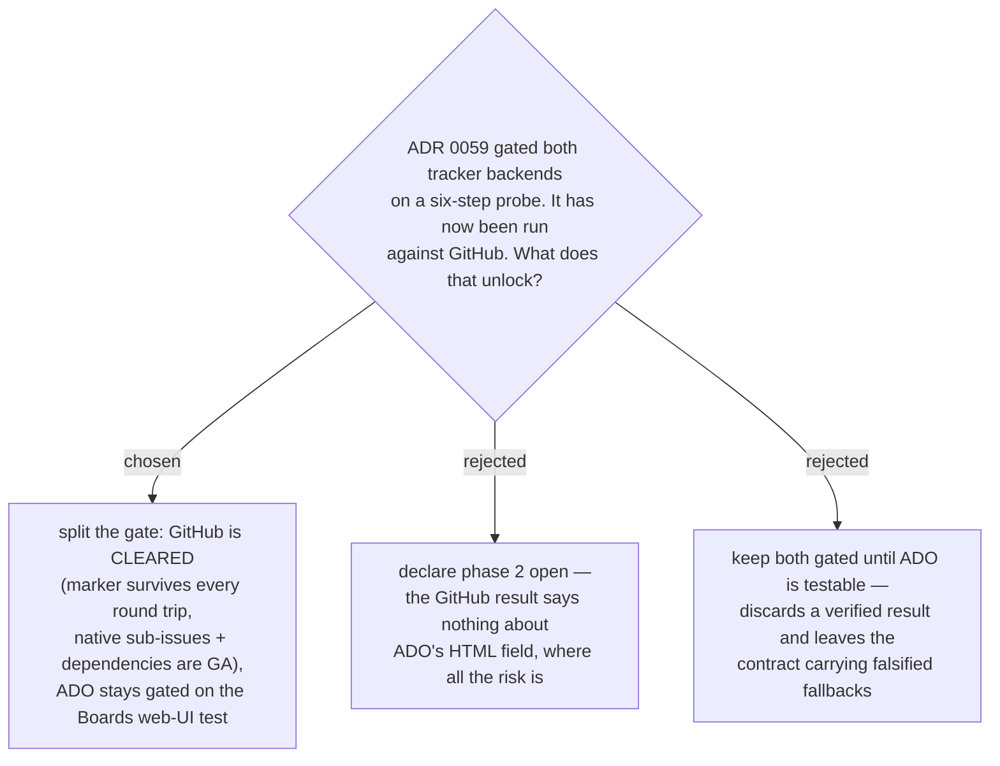

# ADR 0060 — The marker join is verified on GitHub; the ADO half of the phase-2 gate stays open

- **Status:** Accepted
- **Date:** 2026-08-01
- **Relates to:** [ADR 0059](0059-v1-ships-local-backend-only-tracker-backends-deferred.md) (which set the gate),
  [ADR 0057](0057-chart-is-additive-so-fog-graduation-needs-no-new-subcommand.md),
  [ADR 0058](0058-additive-chart-unions-blocked-by-on-existing-tickets.md)

## Context

ADR 0059 deferred both tracker backends behind a six-step probe of one bet: that a
`<!-- decision-map:key:<key> -->` marker written into an item's body survives round
trips through the tracker. Steps 1–5 are ADO-shaped, step 6 is GitHub.

The probe was run against GitHub on 2026-08-01, in a throwaway **private** repo so
nothing landed in a shared one. `plugins/decision-map/scripts/probe_marker_survival.py`
is the harness — both trackers, dry-run by default, `--phase setup/verify/cleanup`,
cleanup in a `try/finally`. It is committed so the result is reproducible rather than
anecdotal, and so the ADO half is one command plus one browser edit away.

Two verdicts are kept in `examples/`, and they say different things on purpose:

- `probe-verdict-github-human-step3.json` — the run where **a human really did edit
  the body in the browser**. This is the authoritative step-3 evidence.
- `probe-verdict-github-harness-run.json` — the harness's own end-to-end run
  (34 API calls, all steps but 3). It reports `markerSurvives: null` and refuses to
  pick a fallback rung, because *its* step 3 was skipped. That refusal is correct
  behaviour, not a failure: the harness will not infer survival from steps 1 and 4,
  and `--assume-edited` is the only way to record a human edit — it must never be
  passed unless one actually happened.

## Decision

**The gate splits.** GitHub is cleared for phase-2 implementation. ADO stays gated on
step 3 — editing a `System.Description` in the Boards web UI and re-fetching it.

Evidence for clearing GitHub:

- A 122-char body came back **byte-identical** after create → `GET`, and again after a
  close/reopen.
- After a human edited that body **in the web UI**, it came back as exactly the
  original plus what was typed — all three markers intact, no sanitiser. The edit
  happened to land *inside* a `decision-map:fog` region, which is the scenario the
  design most feared. Line endings survived as `\n` **on this path** (created via the
  API, then edited in the browser); see the line-ending caveat below, which is a
  separate matter.
- A key containing `--` survives the API verbatim. The format rule stays anyway: the
  local backend rejects such keys at mint time, and the rule exists for rich-text
  editors, which is ADO's problem, not GitHub's.
- Native **sub-issues** (GA 2025-04-09) and native **issue dependencies**
  (GA 2025-08-21) both write and read end to end.

Why ADO cannot ride on that result: GitHub stores issue bodies as literal Markdown,
so an HTML comment is inert text. ADO stores `System.Description` as **HTML**, and
Microsoft documents *nothing* about sanitisation of work-item HTML fields or comment
survival. The two trackers share a marker format, not a storage model, and the whole
reason ADR 0059 deferred was the editor that only ADO has.

## Consequences

- ➕ Phase 2 can start on GitHub against a verified design instead of a hoped-for one.
- ➕ The probe is a committed script, so the ADO half is one command plus one human
  browser edit away whenever an org is reachable — it does not need re-deriving.
- ➖ The contract now describes two trackers at different confidence levels; every
  GitHub row is evidence-backed and every ADO row is documentation-backed at best.
- The probe **falsified three things the contract asserted**, all now corrected: the
  task-list fallback for sub-issues (dead — native REST is GA), the conditional
  `blocked-by: #<n>` body-line fallback (dead — native dependencies are GA), and the
  GitHub `state_reason` rule (wrong — a closed issue can carry `state_reason: null`
  and the enum has grown). A fourth was confirmed by accident: `body` can be JSON
  `null`, seen on two live issues, so every body read must handle it.
- It also surfaced hard limits the contract never stated — **100 sub-issues per
  parent**, so a map cannot exceed 100 tickets; **50 dependencies per relationship
  type**; mutations keyed on the issue *database id* rather than its number; and an
  80-per-minute secondary write limit that paces a large `chart`.
- **Line endings are not normalised by the tracker, and the first read of this was
  wrong.** The single probe body round-tripped as `\n`, which was taken as "GitHub
  does not rewrite line endings" — a generalisation from one path. Both forms occur
  in real bodies: `cli/cli#14021` returns CRLF and `cli/cli#14031` LF, same repo, both
  with HTML comments intact. The submission path decides. Consequence, now in the
  contract: **every backend normalises to `\n` on read before parsing or comparing,
  and writes `\n`.** Without it a human's web-UI edit can flip a region to CRLF and
  the next `chart` reports every line as changed — the byte-identical no-op guarantee
  breaks on text nobody touched. The key marker is single-line and safe either way;
  region *content* is what this protects.
- **One gap is now concrete rather than theoretical:** the contract says generated
  regions are tool-owned but never says what happens when a human edits *inside* one.
  The probe's web-UI edit did exactly that, and the next `chart` would overwrite the
  line without warning. This is the same class of bug that took the local backend five
  review rounds to fix by moving to sentinel-delimited regions. Phase 2 must close it
  before writing join code.
