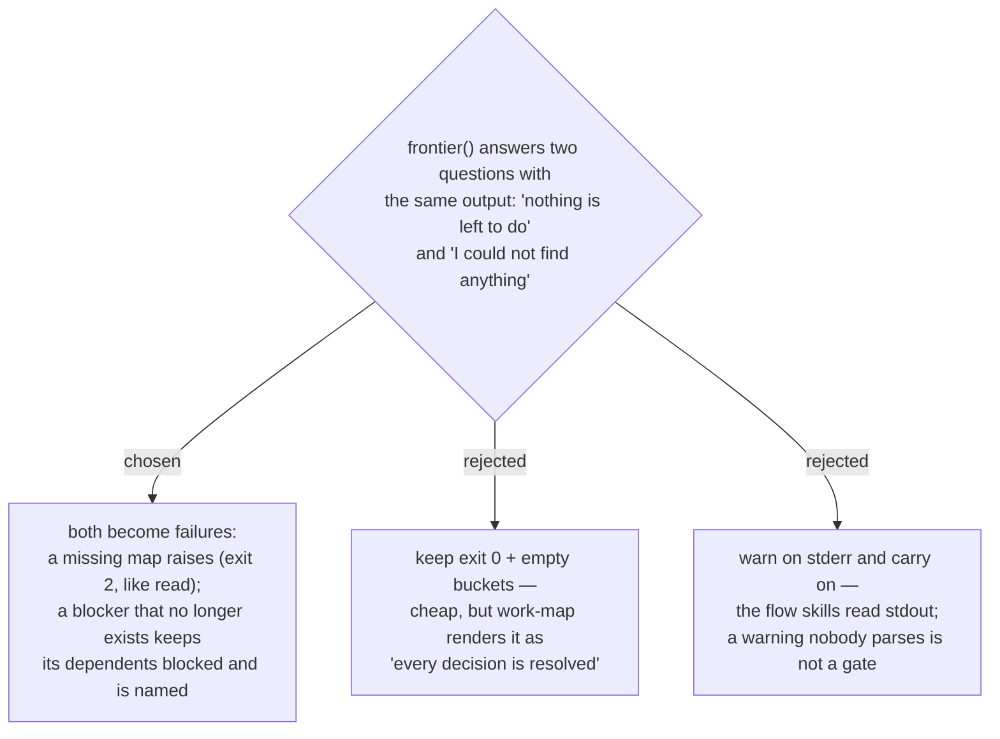

# ADR 0061 — A missing map and a deleted blocker must fail loudly, not read as "done"

- **Status:** Accepted
- **Date:** 2026-08-01
- **Relates to:** [ADR 0060](0060-marker-join-verified-on-github-ado-half-of-the-gate-still-open.md)
  (the audit that surfaced both), [ADR 0040](0040-frontier-view-lives-in-decision-map-only.md)

## Context

Auditing the shipping local backend against its own contract found two silent
failures in `frontier()`, both of which report *success* while hiding the truth.

**A map that does not exist returns three empty buckets and exit 0.** There was no
existence check: `_all_tickets()` on an absent directory simply yields nothing. That
output is byte-identical to a map whose every decision is resolved, and `work-map`
renders exactly that to the user. `read_map()` fails on the same input (exit 2), so
the two entry points disagreed about what "no such map" means.

**A blocker that no longer exists counted as satisfied.** The filter read
`if b in tickets and tickets[b]["status"] == "open"`, so a `blockedBy` key with no
surviving ticket file fell out of `open_blockers` and its dependents were promoted
onto the frontier. Meanwhile `map.json` kept the phantom key, so the two documents
disagreed. On the local backend deleting a ticket file is deliberate; on a tracker
items get deleted, moved and re-parented routinely, so this is the common case.

Both are the same shape: an *absence* was read as a *resolution*.

## Decision

**`frontier` asserts the map exists**, by reading `map.md` before reporting. It fails
the way `read_map` already fails — `OSError` → exit 2, empty stdout, one line on
stderr — so both entry points agree.

**A blocker that no longer exists still blocks.** It stays in `blockedBy`, and the
blocked entry gains a `missingBlockers` list naming what could not be found. The
safe side of this trade is unambiguous: wrongly holding a ticket back costs one
question to a human, while wrongly releasing it starts a session on work the map
says is not ready — and the `blockedBy` edge exists precisely because someone
decided the order mattered.

Rejected: dropping the phantom from `map.json` too, to make the documents agree the
other way. That destroys the record of a decision that was made, and it makes the
deletion unrecoverable — you can no longer see what the ticket was waiting for.

## Consequences

- ➕ The two documents now agree, and `frontier` can no longer report a map it did
  not find as a map with nothing left to do.
- ➕ `missingBlockers` gives the flow skills something to say to the user, rather
  than a silent difference in behaviour.
- ➖ A map can now deadlock: delete a blocker and its dependents stay blocked with
  no subcommand to clear the edge. That is the correct default — a human edits the
  ticket's `blocked_by` frontmatter — but a `--clear-blocked-by` flag is the obvious
  phase-2 follow-up if it bites.
- ➖ `frontier` now costs one extra file read on the local backend. On a tracker the
  map item is fetched anyway, so the check is free there.
- These are behaviour changes to a shipped plugin, not new code paths: a caller that
  relied on `frontier` returning empty buckets for an unknown slug now gets exit 2.
  Nothing in this repo did — `work-map` uses `read` as its existence check.
- Two regression tests guard them, both written failing first.
