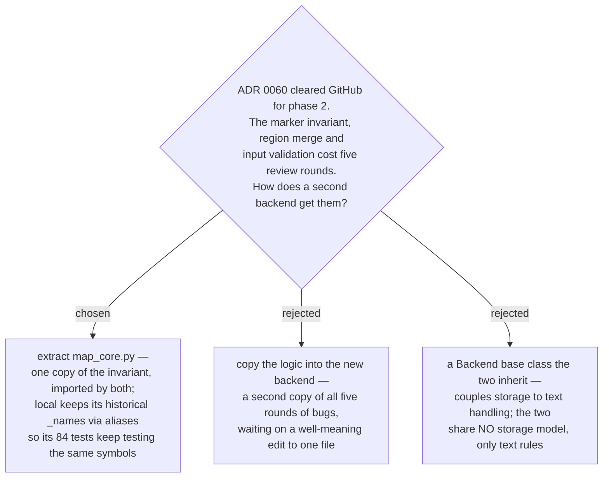

# ADR 0062 — The GitHub backend ships on a shared core, not a second copy

- **Status:** Accepted
- **Date:** 2026-08-01
- **Relates to:** [ADR 0059](0059-v1-ships-local-backend-only-tracker-backends-deferred.md) (set the gate),
  [ADR 0060](0060-marker-join-verified-on-github-ado-half-of-the-gate-still-open.md)
  (cleared the GitHub half), [ADR 0057](0057-chart-is-additive-so-fog-graduation-needs-no-new-subcommand.md) /
  [ADR 0058](0058-additive-chart-unions-blocked-by-on-existing-tickets.md) (additive `chart`),
  [ADR 0061](0061-a-missing-map-and-a-deleted-blocker-must-fail-loudly-not-read-as-done.md)
  (an absence is not a resolution)

## Context

ADR 0059 deferred both tracker backends behind a six-step probe. ADR 0060 ran it
on GitHub and cleared that half: the key marker survives create → `GET`, a
close/reopen, and a human editing the body in the web UI. Sub-issues (GA
2025-04-09) and native issue dependencies (GA 2025-08-21) both write and read.
So the GitHub backend could be built, and was.

The thing worth deciding was not *whether* — it was where the shared rules live.
The contract says "every backend must …" in a dozen places, and the local
backend's own docstrings record five review rounds behind them: append-only
duplicated blocks; a `## Resolution.*\Z` pattern deleted a user comment; a
lookahead orphaned a `--body-file`'s own sub-heading; markers alone still let
user text forge a marker; and escaping before flattening reconstituted a live
marker no escape ever saw. Every round passed the previous round's tests.

## Decision

**`map_core.py` holds every rule two backends must not disagree about**, and both
import it: the marker constants, `scrub`/`one_line`, `assert_regions`, the region
merge, `validate_chart_input`, `render_map_body`, `decisions_region`, the failure
classes and `key_of_body`. Nothing in it touches a filesystem or a network.

`local_map_ops.py` imports those under its historical `_name` spellings
(`scrub as _scrub`), so the file reads as it always did and its 84 tests keep
testing the same symbols. The extraction was verified behaviour-preserving two
ways: the suite stayed green, and charting → resolving → claiming → re-charting
the same input through the pre- and post-refactor code produced **byte-identical
files** and byte-identical stdout and stderr.

Rejected: a `Backend` base class the two inherit. It reads as the obvious
factoring and is the wrong one — the two share no storage model at all (files and
frontmatter versus issues, labels, sub-issues and native dependencies). What they
share is *text handling*, and a base class would have dragged storage into it.

**The join is one GraphQL round trip.** `subIssues` carries each child's body,
labels, assignees **and** its `blockedBy` edges, so the whole join is one
request; REST needs 1 + n, because the sub-issue listing carries bodies but not
dependencies. It **fails loudly on `hasNextPage`** rather than trusting GitHub's
100-sub-issue cap to hold for ever: a truncated join labels an existing child
`create`, which re-creates a ticket and shows that to the user as an ordinary
line to approve — the worst failure the contract names.

**Three parity gaps the contract left open are closed here:**

- **Ordering is key-ascending on every backend.** A tracker's natural order is
  creation order, so the two backends would otherwise emit different documents
  for the same logical state. Key-ascending is the only order that is a
  deterministic function of that state, and the local backend already had it by
  accident of globbing a directory. The fake returns children in *reverse*
  creation order specifically so any code that forgets to sort fails its test.
- **Label provisioning is in the dry-run plan**, as `create` entries with a
  `label:<name>` handle — not a preflight outside the gate. Creating three
  repository-wide labels is a write, and the rule is that nothing the run writes
  may be missing from the plan.
- **A key must not contain `--`, and that now applies to the map's own slug too.**
  On a tracker the slug is itself a key marker, so a slug the local backend
  accepts and a tracker cannot carry would make a map unmigratable. A
  backend-specific key rule is the same defect as no key rule.

**`missingBlockers` is reachable on GitHub, and distinguishing it from a foreign
edge is why the snapshot query fetches each edge target's body.** Two contract
rules point opposite ways for the same observation — "a blocker that no longer
exists still blocks" (ADR 0061) and "a dependency on an item that is not a child
of this map is ignored". They are different situations and the target's body
tells them apart: a target carrying a key marker *was* a ticket of this map, so
it keeps blocking and is named in `missingBlockers`; a target carrying none is a
cross-map edge a human added, which this design does not model, so it is ignored
— with a `warning:` line, because a silently dropped blocker reads to the user as
an unblocked ticket.

## Consequences

- ➕ One copy of the five rounds. A future rule change lands in one file and both
  backends get it.
- ➕ The transport is injected, so the backend is tested against an in-memory
  GitHub (`fake_github.py`, 71 tests) rather than needing a repo and a rate-limit
  budget. Every behaviour the fake asserts about the real API was verified live
  first, and `live_parity_notes()` lists them so they can be re-checked in one
  pass instead of re-derived.
- ➕ **A fake proves nothing on its own, so there is a live smoke test.**
  `smoke_github_live.py` charts a real map, exercises every subcommand and
  deletes what it made. Its load-bearing assertion is the one no fake can make:
  a re-chart against live GitHub round-trips **byte-identically**. 19/19 checks
  passed in 57 API calls on 2026-08-01.
- ➕ Two defects were found by writing the tests, not by reading the code.
  A GitHub re-chart reported a spurious `title` divergence **every time**,
  because the title lives in the issue's title field and was being compared
  against the body — a divergence for text nobody touched, which trains users to
  skip the list where the real ones appear. And `--force` never rewrote that
  title while claiming to regenerate the whole document, so the next additive run
  reported a divergence the user had already asked to apply.
- ➕ **An adversarial review then found 22 more, every one reproduced against the
  fake before it was accepted** — and all 22 passed the suite as first written,
  which is the most useful thing this ADR records. Three further claims were
  refuted on the same standard. The eight root causes, and why each mattered:

  | root cause | the harm |
  |---|---|
  | **`gist_of` collapsed whitespace with `str.split()`**, while the writer flattens with `str.splitlines()`, which does not break on TAB | the escape-order rule broken on the READ side. A gist of `<!--⇥decision-map:decisions:end -->` was stored verbatim (scrub needs a space to see a marker) and came back **live**. In the map's index that left the region unpaired, so the next `resolve` died *after* posting its comment and closing its ticket — and every later `resolve` failed identically, leaving the index unrecoverable by any non-destructive path. With no tab at all, an ordinary double space made `resolve`'s "gist as stored" a value `read` would never return |
  | **map membership was keyed on the `decision-map:map` label** | the worst failure this design names, reintroduced for the *map* after the ticket join had been written specifically not to: strip the label and the slug resolved to nothing, so `chart` concluded the map was absent and created a **second** one while labelling every existing ticket `create` |
  | **`try_snapshot` caught every `MapNotFoundError`** | three non-absences — two maps claiming one slug, an issue that is not a map, and a 404 that may be a permission failure — all read as "not there", each producing the duplicate-map outcome above |
  | **edge decisions compared key *strings*** | `blockers_of` deliberately reports a re-parented ticket's key so `missingBlockers` can name it, so a stale edge read as a live one: `block` and additive `chart` skipped a genuine new edge and reported success, and `--force` silently failed to remove the stale edge it had announced as reset, permanently quarantining the ticket |
  | **the join keyed on the bare issue number** | numbers restart per repository, and a sub-issue may live in another repo of the same owner — which this contract says. A cross-repo ticket's `claim`, `comment` and `resolve` were addressed at the map's repo and landed on whatever unrelated issue shared its number |
  | **`chart` read `inp["target"]["slug"]` before validating** | a malformed `map_input.json` exited 1 with a traceback where the local backend exits 2 with one stderr line, for the same file |
  | **`id` could not be passed back to `--ticket`** | the contract says that is what `id` is *for*. `map.json` reported the issue number while every lookup was keyed by key, so `--ticket 1235` failed for a ticket just reported as id 1235 — and `frontier.json` reported a *different* `id` again for the same ticket |
  | **the decisions index linked `[title](#2)`** | inside an issue body that is a same-page fragment, so every entry in the index a human is meant to click went nowhere |

  Two smaller ones came with them: the throttle counted "a call with a payload"
  as a write, so the payload-less DELETE on the `--force` path was neither paced
  nor logged; and `--dry-run` skipped the `--map` check, so
  `claim --map ../../evil --dry-run` exited 0 where the real call exits 2.

- ➕ **A create that lands with a link that does not now fails loudly, naming the
  orphan.** It used to leave an issue carrying a key marker but parented nowhere;
  the join only sees children, so a plain re-run created a *second* issue with
  the same key, and the run after that failed the duplicate-key check on a map
  nobody could chart again. This is a limitation made safe rather than solved:
  the run cannot repair it, so it refuses to leave the trap set.
- ➕ The fake was strengthened by the same review: it keys issues on
  `(repo, number)` so a cross-repo write genuinely misses, counts any non-GET as
  a write, and **refuses a `_SNAPSHOT_QUERY` that stops selecting a field it
  returns** — a fake that answers a query it never reads cannot catch a query
  asking for the wrong thing.
- The pattern across all eight is one thing said three ways: **an identity
  compared as a string is not an identity.** The label stood in for the map, the
  key string stood in for the issue, and the bare number stood in for
  `(repo, number)`. Each substitution reads fine and fails silently.
- ➖ `map.json` for GitHub carries **two** handles per ticket, `id` (the issue
  number, what a human reads and `--ticket` takes) and `dbId` (what every
  sub-issue and dependency mutation is keyed on — an unrelated value). Carrying
  one costs an extra resolve call per write; carrying both is a shape the local
  backend does not have.
- ➖ The per-subcommand call budget is now written down, and it says the thing
  the earlier cost analysis missed: **`resolve` is the expensive subcommand**
  (comment + ticket PATCH + map PATCH + the snapshot), not the cheapest.
- ➖ **The ADO half of ADR 0059's gate is still open**, and this ADR does not
  touch it. `System.Description` is HTML, Microsoft documents nothing about
  sanitisation of work-item HTML fields, and the contract's escaping rule (escape
  last, transform nothing afterwards) is in direct conflict with HTML-encoding
  user text. `map_core` is the right shape for a third backend, but the evidence
  for one does not exist yet.
- The two backends now differ in one visible way beyond handles: GitHub pins
  ordering deliberately, whereas the local backend gets it from `sorted()` on a
  glob. Both emit key-ascending; only one of them would notice if that changed.
- **Amendment (2026-09-04).** "Byte-identical regions on both backends" now
  reads *every region both backends write*: the `graph` region is written by
  the local backend only (ADR 0171), and the Map pointer is a file only the
  GitHub backend writes (ADR 0173). `map_core` still holds both renderers.
