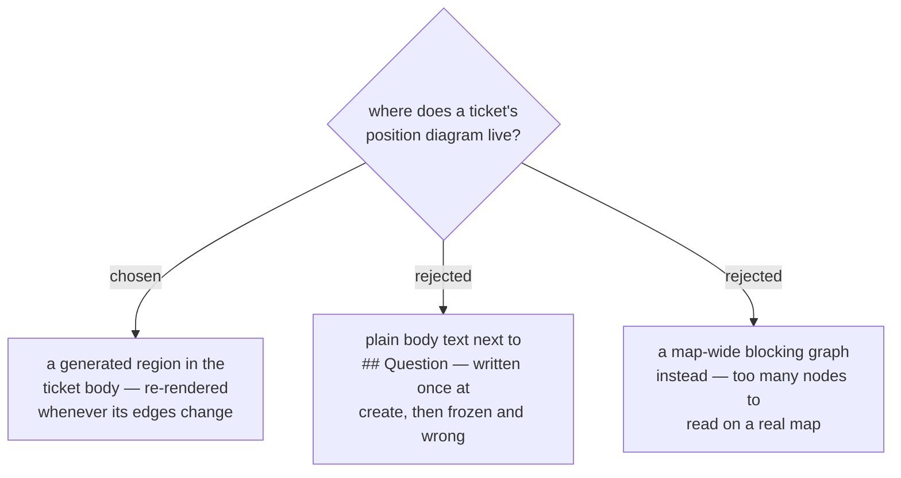

# A ticket's position diagram is a generated region, not plain body text

Every Decision ticket gets one small `graph TD` of its immediate neighbourhood —
its blockers, itself, and the tickets it unblocks. Three levels, nothing further:
a map-wide graph was considered and dropped, because a map may legally hold 100
tickets and even the 24-ticket GlassHull map renders unreadably against Rule 1's
~15-node guidance.

It is a **generated region**, not plain body text, for two reasons the code
already settles. `block()` loads a ticket's body and writes it back untouched, so
a diagram sitting loose in the body would never be re-rendered when an edge
arrives — it needs a marker span something can find and replace. And
`_save_ticket` runs `_assert_regions` on every write from every subcommand, so a
region added to `TICKET_REGIONS` inherits the marker invariant for free, while
loose text inherits nothing.

The cost is that ADR 0058's guarantee weakens in wording: a ticket gaining a
blocking edge no longer changes *exactly one line*, it changes the frontmatter
line plus the diagram region. The guarantee that matters — nothing recorded is
removed, reordered or overwritten, and an identical re-run is byte-identical —
survives untouched, but the test that pins the one-line claim must be updated
rather than deleted.
