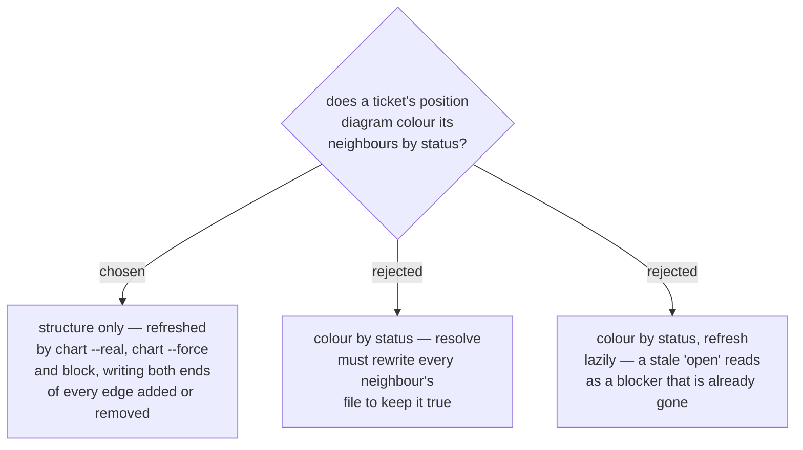

# The position diagram shows structure only, never status

A ticket's position diagram names its blockers, itself and what it unblocks, and
says nothing about whether any of them is open, claimed or closed. Only
`chart --real` and `block` re-render it, because those are the only subcommands
that change a ticket's edges; `resolve` keeps touching exactly one file, as it
does today.

An edge is drawn at both of its ends, so `block(A, B)` rewrites two ticket
files: A gains a parent node and B gains a child node. The dry-run plan must
therefore carry a `merge` entry for each of them, and the assertion in
`test_additive_chart_unions_a_new_edge_into_an_existing_ticket` that every
other ticket stays byte-identical is now pinning something this design
deliberately changes.

Status was rejected twice over. Kept true, it forces a fan-out write — closing
one ticket would rewrite every neighbouring ticket file, turning the cheapest
subcommand into the widest one. Kept lazily, it goes stale in the one direction
that misleads: a diagram still showing a blocker as open, after that blocker
closed, tells the reader they cannot pick the ticket up when they can. That is
the same shape ADR 0061 exists to prevent — an absence or a staleness read as a
fact — and it would be reintroduced by a decoration.

**Amendment (2026-08-03, same change as the implementation).** "The only
subcommands that change a ticket's edges" was wrong as written, and the error was
in the word *change*: `chart --real` and `block` are the only ones that ADD an
edge, but `chart --force` REMOVES them — it resets an OVERWRITE'd ticket's
`blocked_by` / `blockedBy`, which is documented and intended, while the matching
line at the other end of each deleted edge is not its to reset. The result
reproduced this ADR's own harm class in both directions: `--force` on a blocker
destroyed its child line while the edge stayed live on the other ticket (a fact
missing from the picture), and `--force` on the blocked ticket left its blocker
drawing an edge that no longer existed anywhere (a picture of a dead edge). Both
were permanent, because a later additive `chart` and a later `block` each
correctly no-op on an edge whose state already matches. The decision is unchanged
— structure only, both ends, no status. What changed is the set of writers: both
backends now re-render the OVERWRITE'd ticket *and* any blocker that lost a child
(`map_core.force_orphaned_blockers`, shared so the two cannot disagree), and the
dry-run plan announces the second as a `merge` with a non-null detail so the
ADR-0039 gate shows it before the user approves the `--force`.

Nothing is lost, because status is already answered authoritatively elsewhere:
`frontier` computes open blockers on every read and `work-map` renders it at
session start. The diagram answers *what is this ticket wired to*; the frontier
answers *can I take it right now*.

**Amendment (2026-09-04).** Local backend only from here on. The GitHub backend
writes no position diagram at all (ADR 0171) and strips the ones an earlier
version wrote on its next `chart` (ADR 0172); this ADR's reasoning stands
unchanged for `tickets/<key>.md`.
