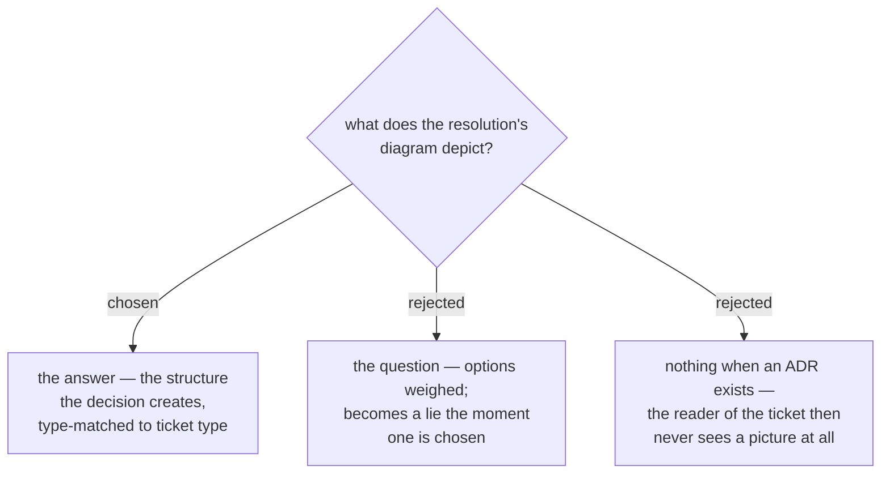

# The resolution carries a diagram of the answer

Every resolution's **body** opens with one Mermaid diagram of **the answer**: the
shape the decision creates, not the options that were weighed and not the process
that reached it. A reader who opens a closed ticket should be able to see what was
decided before reading a word of it — which is the whole complaint that started
this: a 470-word single-paragraph resolution that is correct, complete, and
unreadable.

The body, precisely, because `resolve` renders the block as gist → `Detail:` line
→ `--body-file` content, so the body is the only slot that can hold a fenced
block at all. "The resolution opens with a diagram" is therefore two claims, and
only one of them is literally true: the diagram is the first thing *in the body*,
and the two one-liners above it are what a reader passes on the way.

The type is matched to the ticket's own `type`, so no new vocabulary is
introduced: `grilling` → `flowchart TD`, `research` → `graph TD` or `erDiagram`,
`prototype` → `sequenceDiagram`, `task` → `graph TD`.

**A ticket whose answer is an ADR draws one too**, and it does not duplicate the
ADR's. The two have different subjects: the ADR's Rule 3 diagram is *chosen
versus rejected*, the ticket's is *what the chosen answer changes*. Split that
way they cannot drift into contradicting each other, and neither reader is sent
to the other document to see a picture.

**So there is no `--link`-alone resolution shape any more.** An earlier draft of
this ADR asked for a diagram on that path while scoping the rule to `--body-file`
in the same page — a contradiction that resolved, in practice, to no diagram at
all on the commonest path there is. `work-map`'s shape 1 now passes `--link` AND
`--body-file`, and the body file may be nothing but the diagram.

This is enforced in `work-map`'s SKILL.md, not in the ops scripts. The scripts
cannot author content — they never see the answer, only the string the agent
hands them — so the rule lives where the author is.
