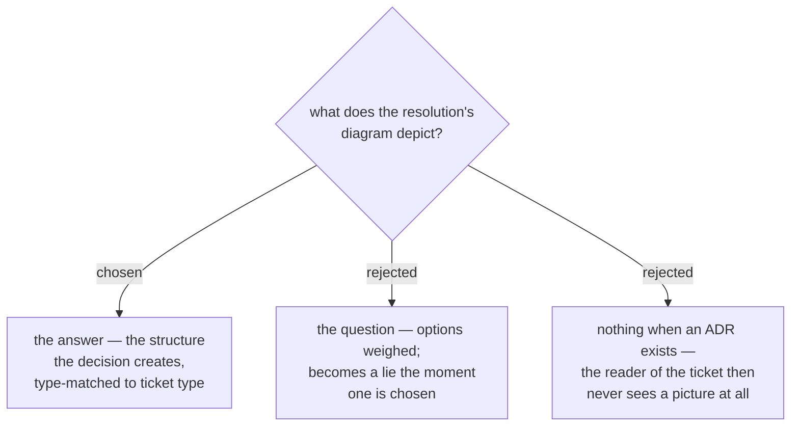

# The resolution carries a diagram of the answer

Every resolution written through `--body-file` opens with one Mermaid diagram of
**the answer**: the shape the decision creates, not the options that were weighed
and not the process that reached it. A reader who opens a closed ticket should be
able to see what was decided before reading a word of it — which is the whole
complaint that started this: a 470-word single-paragraph resolution that is
correct, complete, and unreadable.

The type is matched to the ticket's own `type`, so no new vocabulary is
introduced: `grilling` → `flowchart TD`, `research` → `graph TD` or `erDiagram`,
`prototype` → `sequenceDiagram`, `task` → `graph TD`.

**A ticket that resolves with `--link` alone still draws one**, and it does not
duplicate the ADR's. The two have different subjects: the ADR's Rule 3 diagram is
*chosen versus rejected*, the ticket's is *what the chosen answer changes*. Split
that way they cannot drift into contradicting each other, and neither reader is
sent to the other document to see a picture.

This is enforced in `work-map`'s SKILL.md, not in the ops scripts. The scripts
cannot author content — they never see the answer, only the string the agent
hands them — so the rule lives where the author is.
