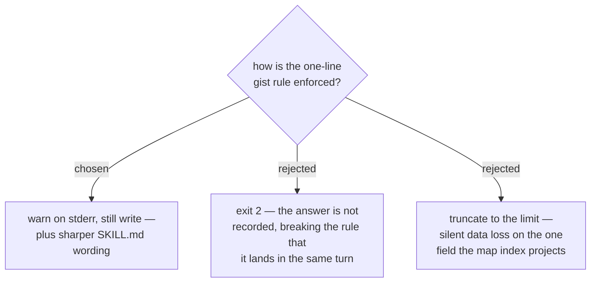

# An over-long gist warns, it does not fail the resolve

> **Amended by [ADR 0068](0068-the-gist-budget-is-reported-per-map-not-enforced-per-ticket.md).**
> The decision below stands — an over-long gist still warns and still writes.
> What does not stand is the closing claim that "stderr warnings in this
> codebase already carry real weight": a real map was later measured carrying
> **41** over-long gists, every one of them warned about at write time. ADR 0068
> adds the corpus-level `gist-budget` finding rather than reversing this one.

`resolve` prints a warning to stderr when the flattened `gist` exceeds the
length a single index line can carry, and writes it anyway. `work-map`'s Step 4
wording is sharpened at the same time — *one sentence, not one paragraph* —
because the current phrasing already says "one line" and every session has
written an essay against it.

Failing the resolve was the tempting option and is wrong: the answer would not be
recorded, and Step 4's rule is that an answer which lives only in the
conversation is lost when the session ends. A tool that discards a hard-won
decision to enforce a formatting rule has its priorities inverted. Truncating is
worse still — the gist is the field the map's "Decisions so far" index projects,
so a silent trim edits the map's only summary of a decision.

This is knowingly the weaker enforcement. It is chosen because the failure it
guards against is a readability regression, not a correctness one, and because
stderr warnings in this codebase already carry real weight — the same channel
names a skipped ticket file and an unapplied divergence.
