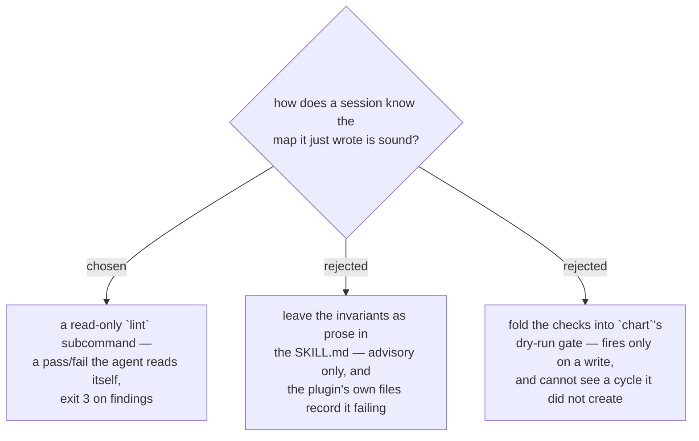

# The map's own health is checked by a runnable `lint`, not by prose

`lint --map <slug>` reads a map, writes nothing, and reports every violated
invariant as a structured finding. It is the only subcommand that answers a
question about the **map** rather than about the call being made, which is what
makes it usable unattended: without a check the agent can run, "looks done" is
the only signal it has, and every mistake waits for a human to notice it.

Prose was the status quo and it does not hold. Both flow skills already state
these invariants — delete the graduated fog line by hand, always pass a real
`--user`, open the resolution with a diagram — and the plugin's own files record
them being missed anyway: `work-map` carries a dated note about a session that
drove two further tickets to completion unclaimed and unrecorded with the rule
written directly above it, and another about twenty-four tickets closed against
compile gates while the first session to actually open a browser found the
runbook wrong in six ways. Instructions are advisory; this is the deterministic
half of the same rules. Folding them into `chart`'s dry-run gate was the cheaper
idea and is wrong on two counts: the gate only fires when something is being
written, so a map degraded by the hand edits the skills *instruct* is never
re-examined, and a blocking cycle is invisible to it because every edge in a
cycle is valid on its own.

Findings exit **3**, not 2 and not 1. Both were already spoken for and the
distinction is load-bearing for exactly the callers this exists to serve: a Stop
hook, a CI step, or a session grading its own work has to tell *your map has
problems* (act on the findings) from *the call was wrong* (`2`, fix the
arguments) from *this tool is broken* (`1`, read the traceback). Collapsing them
makes an unattended run treat a crash as a dirty map, or a dirty map as a broken
tool. Severity does not soften it either: any finding, warning included, means
`clean: false` and exit 3, because a tool that hides half the list behind a zero
has made the caller's decision for it.

A backend that cannot evaluate a rule must **name** it, in `notChecked`. The
GitHub backend returns `["resolution-without-diagram"]` because there the
resolution body is a native comment the single snapshot does not hold, and
walking every ticket's comments to reach it would cost one API call per ticket —
on the command whose entire value is being cheap enough to run after every
session. Declaring the gap is not politeness: a rule that was never run reads
exactly like a rule that passed, and a lint whose silence cannot be trusted is
worse than no lint. For the same reason the local backend returns an empty
`notChecked` rather than omitting the key, so one flow reads either backend
without branching (ADR 0062).

The known soft spot is `fog-line-graduated`, the one heuristic rule: it matches
significant words between a fog line and a ticket title, so it can in principle
miss a rephrasing or flag a coincidence. Its thresholds are set deliberately
strict — at least three shared words, and those words being most of the shorter
side — on the same reasoning as above: a warning nobody trusts trains the reader
to skip the errors sitting next to it. Every other rule is exact.
