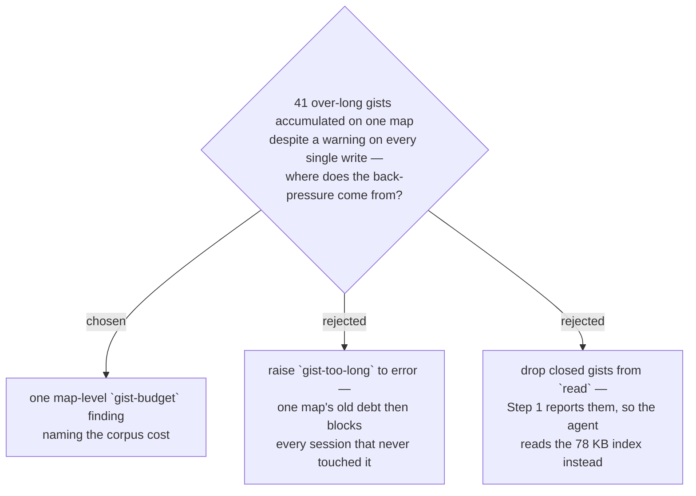

# The gist budget is reported per map, not enforced per ticket

`lint` emits one `gist-budget` warning per map, not per ticket, when the map's
gists collectively run more than `GIST_BUDGET_SLACK` past `GIST_MAX`. It names
three numbers: how many gists are over, the size of the whole gist corpus, and
how many characters are recoverable.

[ADR 0066](0066-an-over-long-gist-warns-it-does-not-fail-the-resolve.md) chose to
warn and write anyway, closing with the claim that "stderr warnings in this
codebase already carry real weight". Measurement refutes that claim. On a real
map of 65 tickets, **41 of the 45 closed ones carry a gist over the limit** —
averaging 1,610 characters against a limit of 200, the longest 3,977 — and
63,574 characters are over budget. Every one of those was warned about at write
time and lint reports every one of them today. Nobody acted, across dozens of
sessions.

0066's *decision* survives; only its rationale was wrong, and this ADR does not
reverse it. Failing a `resolve` to enforce a formatting rule still has its
priorities inverted. What changed is the diagnosis of why warning is not enough:
not that the warning is too quiet, but that **it names the wrong unit**. The cost
of an over-long gist is not local to its ticket. `read` returns every stored
gist, so the overage is re-read in full by every session that opens the map —
here roughly 16k tokens, on a session whose actual work is one ticket. Told 41
times, one ticket at a time, that reads as 41 formatting nits. Told once, as a
corpus total, it reads as what it is: a recurring tax with a one-time fix.

**Raising `gist-too-long` to an error was rejected.** `work-map` Step 6 requires
errors be fixed before the session stops, so a map that already carries this debt
would block every future session on cleanup work that session did not create —
turning a readability rule into a denial of service against the map it protects.

**Removing closed tickets' gists from `read` was rejected**, and is a regression
rather than a saving. `work-map` Step 1 reports "decisions so far, one gist each"
straight out of `read`'s output, and skips the map document's `## Decisions so
far` section *because* `read` already carries them. Withhold them and the agent
must read that section instead — the same text, 78 KB of it, out of a larger
file. Net worse.

The threshold is expressed as `GIST_MAX * 5` rather than a round number so it
tracks the limit it is derived from. It exists so the rule does not cry wolf: a
map one gist and a few hundred characters past the limit has a nit, which the
per-ticket warning already names, and a check nobody trusts trains the reader to
skip the errors beside it. Verified against three real maps — it fires on the one
carrying 63,574 characters of overage and stays silent on the two that do not.
