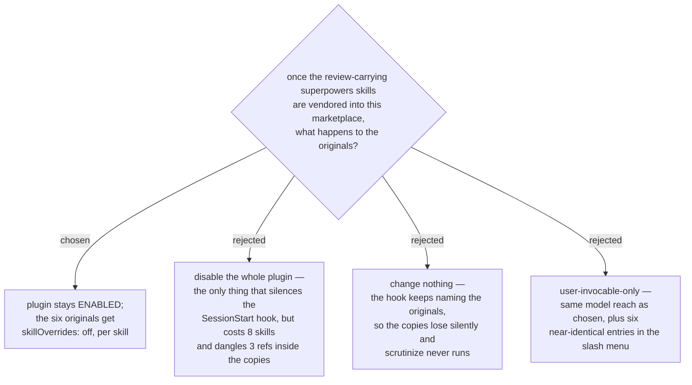

# The upstream superpowers plugin stays enabled; its six review skills are switched off one by one

The `superpowers` plugin (obra/superpowers, MIT, vendored here from
`b36e0829c6d0`) stays installed and enabled. The six skills whose review steps
this effort redirects — `brainstorming`, `writing-plans`,
`requesting-code-review`, `subagent-driven-development`, `receiving-code-review`,
`executing-plans` — are removed from the model's reach individually, with the
`skillOverrides` settings key set to `off` for each. The other eight skills in
the plugin stay live and are **not** copied.

The question reads like a preference between "two copies of everything" and "own
the whole thing", and it is not. Two facts in the plugin source decide it, and
neither is about the description-trigger contest the question assumed.

**The plugin ships a SessionStart hook, and no per-skill control can reach it.**
`hooks/hooks.json` registers `hooks/run-hook.cmd session-start` on
`startup|clear|compact`; it injects the `using-superpowers` text, which names
`superpowers:brainstorming` and `superpowers:systematic-debugging` by qualified
name, as an instruction carrying more authority than any skill description.
`skillOverrides` is a per-skill *listing* control — it governs what the model can
see and invoke, not what a hook writes into the session. So disabling the whole
plugin is the only thing that silences the hook, and that is the entire case for
the rejected option B. It is not enough of a case. Doing it removes eight skills,
breaks three references in this marketplace (`problem-description` →
`systematic-debugging`, plus `writing-skills` and
`finishing-a-development-branch`), and dangles three more references *inside the
copies themselves*.

**The copies are not a closed set.** Three of the six point, by hardcoded
qualified name, at two skills outside the six: all of `writing-plans`,
`subagent-driven-development` and `executing-plans` reference
`superpowers:using-git-worktrees`, and the latter two also reference
`superpowers:finishing-a-development-branch`. Keeping the plugin enabled is what
lets those handoffs keep resolving against upstream. Disabling it would force the
copy job from six skills to eight — 2407 lines to 2799 — and that growth buys
nothing the effort wants, since neither of those two skills carries a review
step.

Option C, changing nothing, is the failure this whole effort exists to prevent
and deserves naming precisely: it produces no error and no warning. The work
completes, the copies sit in the marketplace, and the next session that says
"let's build X" is routed by the hook to `superpowers:brainstorming` — the
original — so the specification is reviewed by the built-in reviewer and
`scrutinize` never runs. Silence is the whole problem; there is no signal that
would tell you.

Option D, `user-invocable-only`, is equivalent to the chosen option for model
reach and differs only in leaving the six originals typable. The A/B comparison
that buys is already available by reading the plugin cache, which is how resync
has to work regardless, and the cost is six entries in the slash menu whose names
differ from the copies' by a plugin prefix.

**This decision knowingly leaves one hole.** The hook still fires and still names
`superpowers:brainstorming`, which is now off. The likely degradation is benign —
the model cannot find that skill and reaches for the copy — but that is inference,
not observation, and it is tracked as its own decision ticket rather than assumed
away. A second, larger hole follows from the mechanism: a plugin cannot ship a
settings key. `skillOverrides` lives in `settings.json`, so on any machine where
those six entries are absent this decision silently degrades into option C. How
the overrides reach a colleague — and what the Antigravity equivalent is — is the
open question that most threatens this one, and it is tracked as a ticket too.

Measured for this decision: the plugin at `b36e0829c6d0` carries 14 skill
directories; the six review-carrying ones total 2407 Markdown lines and the two
they depend on total 392. This repo at `29ff84c` on `main`, tracked files only
and excluding `docs/decision-map/`, holds three references to non-review
superpowers skills.
