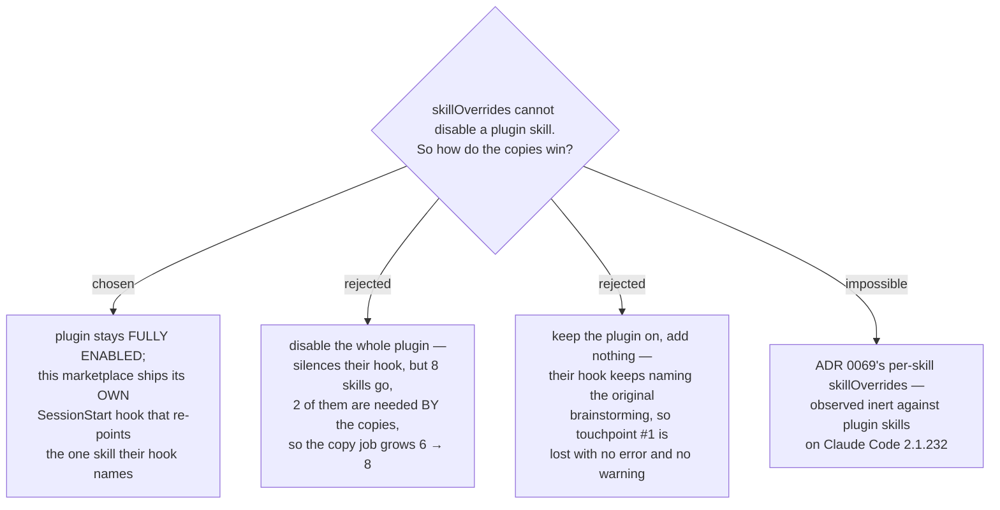

# The upstream plugin stays fully enabled; a host SessionStart hook re-points the one skill its hook names

- **Status:** Accepted
- **Date:** 2026-08-14
- **Replaces the mechanism of** [ADR 0069](0069-the-upstream-plugin-stays-enabled-its-review-skills-go-off-per-skill.md),
  whose per-skill `skillOverrides` switch was observed not to exist for plugin
  skills. That ADR's *position* — keep the plugin enabled — survives; only its
  lever changes.

The `superpowers` plugin stays installed and **fully** enabled — all 14 skills, its
SessionStart hook included. This marketplace ships its **own** SessionStart hook,
whose injected text names the vendored copies for the requests that the upstream
hook routes to originals. Nothing is switched off, and no settings key is required
on a colleague's machine.

## Why the question changed

ADR 0069 chose to switch the six review-carrying originals off individually with
`skillOverrides`. That control does not reach a plugin skill. Measured on Claude
Code **2.1.232**: with `superpowers:brainstorming` set to `off` the session still
lists 211 skills and 253 commands, byte-for-byte the control's numbers; the bare
key `brainstorming` behaves the same; the identical payload against a non-plugin
skill drops the list to 210/252. The resolver returns `"on"` as soon as it sees
`e.source==="plugin"`, before the override map is read. Evidence and reproduction
are on the `skilloverrides-live-check` ticket.

That left the two options ADR 0069 had rejected. Exploring them turned up a third,
and rewrote the cost of both.

## The upstream hook forces one skill, not six

Their hook injects `skills/using-superpowers/SKILL.md` verbatim. That text names
exactly two skills by qualified name: `superpowers:brainstorming` and
`superpowers:systematic-debugging`. Only the first is one of the six being copied.
The second is one of the eight that stay live, so their hook naming it is not a
problem — it is the behaviour we want.

The chain past that point is not forced either. `brainstorming` contains **no**
qualified reference to any skill; it hands off in prose, *"invoke writing-plans
skill"* — a bare name the model resolves from the skill list, where a copy competes
on equal footing. The qualified handoffs begin one step later: `writing-plans` names
`superpowers:executing-plans` and `superpowers:subagent-driven-development`, and
`subagent-driven-development` names `superpowers:requesting-code-review`. So option
C's whole exposure is **one forced loss plus one contestable seam** — and losing the
seam cascades to four more originals.

## The chosen mechanism was tested, not assumed

A stand-in host hook was written to contradict the upstream text on exactly one
point, then run against it. Five `claude -p` runs, same prompt, same cwd:

| session | prompt | answer |
|---|---|---|
| upstream hook only (control) ×2 | "build a new feature — name the ONE skill you would invoke first" | `superpowers:brainstorming`, twice |
| upstream hook + host hook ×3 | same | `superpowers:writing-plans`, three times |

The control matters as much as the test: it confirms their hook really does steer,
which is the premise ADR 0069 asserted and never measured. All three registered
SessionStart hooks fire in the same session (ours, theirs, and a user-level one) and
both texts arrive in **one merged attachment**.

One detail is worth recording because it cuts against the obvious reading: in the
merged attachment our text landed **first**, ahead of theirs. It won anyway. The win
therefore came from being more specific and more emphatic, not from being last —
which is the more durable property, but also the reason the hook's wording must not
rely on position. Word it to name the conflict outright.

## Why not disable the plugin (option B)

Its cost is real but smaller than ADR 0069 recorded, and still not worth paying.
Measured on `24a4b64`, tracked files under `plugins/` only: 11 qualified references
point into superpowers across 4 files, and **10 of them name `superpowers:writing-plans`**
— one of the six being vendored, so they will resolve to the copy and do not break.
Exactly **one** live reference names a non-review skill: `problem-description/SKILL.md:100`,
and it is a *"use X instead"* pointer rather than a handoff. ADR 0069's other two
(`writing-skills`, `finishing-a-development-branch`) are prose in a June plan
document and in ADR 0013 — nothing executes them.

What does not shrink is the cost inside the copies. Three of the six name
`superpowers:using-git-worktrees` and `superpowers:finishing-a-development-branch`
across five distinct handoffs. Option B removes both, so both must be vendored too,
taking the copy job from six skills to eight. It also removes the
`using-superpowers` discipline text altogether, which this marketplace would then
have to re-ship to get back. Paying all of that to silence a hook that forces one
skill is the wrong trade.

## Why not leave it alone (option C)

Because its failure is silent, and it is the failure this whole effort exists to
prevent. You ask for a feature, a spec is written, a reviewer reviews it, and the
built-in reviewer does the work instead of `scrutinize`. There is no error and no
warning. The only tell is that the review reads differently than expected, and only
if you remember to expect it. Touchpoint #1 is lost by force under C — it is the one
place their hook genuinely wins — so C is not a null option, it is a guaranteed
one-touchpoint loss.

## What this decision does not settle, and what it risks

This is **steering, not a gate**. The upstream hook's authority is displaced by a
more specific instruction, and the outcome is model judgement rather than an
enforced switch. Three of three is not a proof; it is a strong signal from a small
sample, and the mechanism should be treated as defence-in-depth alongside the
copies' own descriptions rather than as a lock. The bare `"writing-plans skill"`
seam is still won on description quality, which keeps `skill-naming` load-bearing.

Two follow-on risks belong to `resync-path`: upstream may add a qualified reference
inside `brainstorming` — which would convert the contestable seam into a forced one
— or rename the skills the host hook names, which would silently turn the hook into
a no-op. Both are cheap to detect and neither is detectable by a compile gate, so
the resync procedure has to check them by name.

Measured for this decision: Claude Code **2.1.232**; superpowers at
`b36e0829c6d0` (14 skill directories, the six review-carrying ones totalling 2407
Markdown lines, the two they depend on 392); this repo at **`24a4b64`** on `main`.
