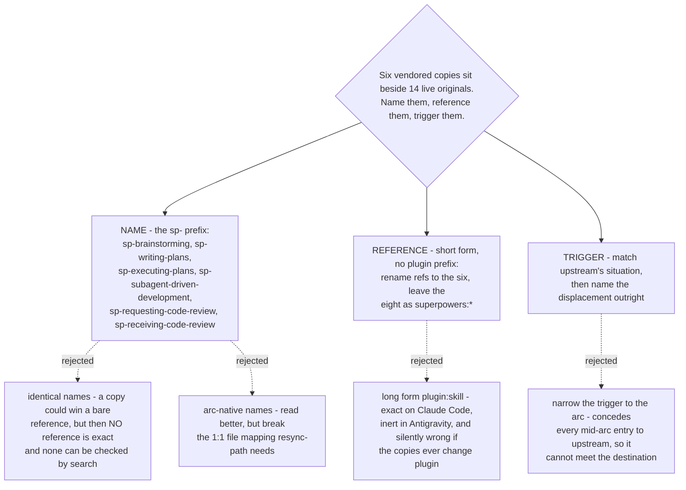

# Vendored review skills take the `sp-` prefix, reference each other by short name, and displace upstream by description

- **Status:** Accepted
- **Date:** 2026-08-14
- **Builds on** [ADR 0070](0070-host-sessionstart-hook-repoints-the-one-skill-the-upstream-hook-names.md),
  which keeps the upstream plugin fully enabled and steers `brainstorming` with a host
  SessionStart hook. That ADR left the naming and the description wording open and
  called `skill-naming` load-bearing. This settles it.

## Context

The upstream `superpowers` plugin stays fully enabled — all 14 skills (ADR 0070). Six
of them carry a review step and are vendored into this marketplace. So six copies and
fourteen originals are live in the same session, and three separate mechanisms can
decide which one runs: the host hook's text, a reference inside whichever skill is
already running, and the `description` field. This ADR fixes what the copies are
called and how each mechanism is written.

Measured for this decision: superpowers **6.3.0** (`b36e0829c6d0`), this repo at
**`7badbd2`** on `main`, Claude Code **2.1.232**.

## Decision 1 — the names take an `sp-` prefix

The six copies are `sp-brainstorming`, `sp-writing-plans`, `sp-executing-plans`,
`sp-subagent-driven-development`, `sp-requesting-code-review` and
`sp-receiving-code-review`.

Identical names were the real alternative, and they buy one thing: a copy can win a
reference that names no plugin. Upstream's `brainstorming/SKILL.md` holds **7**
mentions of `writing-plans` and **0** of them are qualified, so that reference is
decided entirely by the skill list — an identically-named copy could take it on
description quality.

It is not worth it. Identical names make *every* reference probabilistic, including
the ones this marketplace writes itself, and a probabilistic reference cannot be
verified. A distinct name can be checked with a text search. Determinism that a search
can prove beats a likely win that nothing can.

The prefix is not new here: `sp-grill-with-doc` already carries it. That skill is
**not** a vendored copy — it is this marketplace's own skill built on the superpowers
workflow — so `sp-` means *"belongs with superpowers"*, not *"is a copy of
superpowers"*. `CONTEXT.md` records that distinction, because otherwise a search for
`sp-` reads as a list of copies and returns one skill that is not one.

Arc-native names (`plan-from-spec`, `spec-from-idea`) were rejected for a different
reason: they destroy the one-to-one mapping between a copy and its upstream file, and
`resync-path` needs that mapping to stay a plain per-file diff.

## Decision 2 — references use the short form, and only the six get renamed

A reference inside a copy is written **without** a plugin prefix:
`Load the sp-writing-plans skill through your harness's skill mechanism.`

The long form (`dev-workflows:sp-writing-plans`) is more exact on Claude Code and was
rejected anyway, because the destination requires Antigravity too. The Antigravity
installer stages skills **flat** — `plugins/dev-workflows/.antigravity/install-antigravity.py`
maps `${CLAUDE_PLUGIN_ROOT}/skills/` to `<dest>/` — so no plugin namespace exists
there, and the installer rewrites file paths only, never skill references. A long-form
reference would be dead on arrival in the second harness. `CLAUDE.md` already forbids
it in principle by requiring harness-neutral skills; all of `dev-workflows` holds only
3 qualified references today, and the idiom names the action first.

The short form is unambiguous because the prefix is unique: no upstream skill name
begins with `sp-`.

It also decouples this decision from `host-plugin`. A short name contains no plugin, so
the copies can be written before that ticket resolves and do not need rewriting after it.

**The 14 qualified references inside the six copies split two ways**, and the split is
the testable part of this ADR:

| Reference target | Count | Treatment |
|---|---|---|
| one of the **eight** non-copied skills — `superpowers:finishing-a-development-branch` (5), `superpowers:using-git-worktrees` (3) | 8 | **unchanged** — those skills stay live upstream and the copies must still reach them |
| one of the **six** copies — `superpowers:subagent-driven-development` (3), `superpowers:executing-plans` (2), `superpowers:requesting-code-review` (1) | 6 | rewritten to the short `sp-` name |

Plus the 7 bare `writing-plans` mentions in `brainstorming`, which become
`sp-writing-plans`.

Two checks follow, and both are one command:

- a search for `superpowers:` inside the copies must return **only** names from the
  group of eight;
- a search for any of the six upstream short names, unprefixed, must return nothing.

## Decision 3 — descriptions match upstream's situation and name the displacement

Each copy's `description` keeps the situation upstream describes, then states plainly
that it replaces the upstream skill and that review goes to `scrutinize`. For
`sp-writing-plans`:

> You MUST use this, and not the upstream superpowers writing-plans skill, when you
> have a spec or requirements for a multi-step task. The plan review goes to the
> scrutinize skill.

The description only decides the outcome in one situation — entering the arc in the
middle, where the user already holds a spec and asks for a plan. The hook covers the
start of the arc and short-form references cover the steps after it.

Narrowing the trigger to the arc (*"use when sp-brainstorming has produced an approved
spec"*) was rejected because it concedes exactly that situation to upstream, and the
destination requires all seven touchpoints to reach `scrutinize`.

The wording follows the one measured lesson in ADR 0070: the host hook's text won three
runs out of three even though it landed **first** in the merged attachment, so
specificity wins and position does not. A description that names the situation *and*
the displacement out-specifies one that names the situation alone. Upstream uses the
same device — its `brainstorming` description opens *"You MUST use this"* — so this
answers it in its own voice.

## Consequences

- **The host hook's text can now be written.** It names the copies, and ADR 0070
  records that a later rename turns the hook silently into a no-op. The hook text and
  these six names change together or not at all.
- **`resync-path` gains two named checks**, neither of which a compile gate can see:
  upstream adding a qualified reference inside `brainstorming` (which would convert the
  contestable seam into a forced one), and upstream renaming any of the six.
- **Six PLAYBOOK.md rows** are due, one per copy, in the commit that adds them.
- **This does not make the copies win everywhere.** Three commands in the user's own
  home directory — `/brainstorm`, `/write-plan`, `/execute-plan` — each name a
  `superpowers:` skill directly, and all three name skills on the copy list. A command
  bypasses the hook and the description together. That gap is out of this ticket's
  question and is charted separately.

## Verified live — 2026-08-15 (`short-ref-resolution`)

Decision 2 was tested on Claude Code **2.1.232** and **stands**. Told this ADR's own
sentence with a bare `sp-` name whose skill exists, the model self-qualified it and
launched the plugin skill — a `Skill` tool call byte-identical to the long-form control.
The uniqueness argument holds, and the listing confirms why it has to do the bridging:
plugin skills are surfaced **only** as `plugin:skill`, never bare.

What the argument does **not** cover, measured 2/2 in the same run: when the copy is
**absent**, the same sentence does not fail. It launches the nearest live twin —
`sp-writing-plans` reached **`superpowers:writing-plans`**, with no error and no warning.
A bare name with no twin at all (`sp-zzz-nonexistent`) is refused cleanly, so the
substitution happens *only* where a twin exists — which the `sp-` prefix convention
guarantees for all six copies, and for no other skill. Nothing on this map guards it yet.
Evidence and reproduction:
[`short-ref-resolution`](../decision-map/superpowers-review-to-scrutinize/tickets/short-ref-resolution.md).
