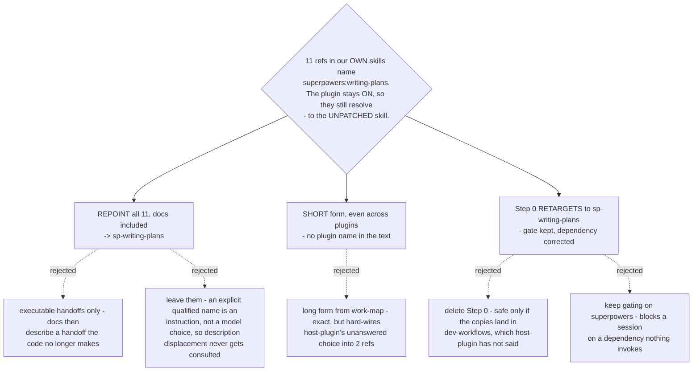

# Arc handoffs name `sp-writing-plans` in short form, and grill-then-plan's preflight retargets to it

- **Status:** Accepted
- **Date:** 2026-08-14
- **Builds on** [ADR 0070](0070-host-sessionstart-hook-repoints-the-one-skill-the-upstream-hook-names.md),
  which keeps the upstream plugin fully enabled, and
  [ADR 0071](0071-vendored-review-skills-take-the-sp-prefix-and-displace-upstream-by-description.md),
  which fixed the `sp-` names and the short reference form *inside* the copies. This
  settles the references that point **into** the copies from this marketplace's own
  arc skills.

## Context

Measured on **`252f338`** (`main`), tracked files only. Eleven qualified references
into superpowers survive in this marketplace's own shipped surfaces, and **all eleven
name the same skill**, `superpowers:writing-plans`:

| surface | refs |
|---|---|
| `plugins/dev-workflows/skills/grill-then-plan/SKILL.md` (incl. the frontmatter `description`) | 5 |
| `plugins/dev-workflows/README.md` | 3 |
| `plugins/decision-map/skills/work-map/SKILL.md` | 2 |
| root `README.md` | 1 |

Two premises the `arc-rewiring` ticket carried are false, and were measured false
before anything was decided:

- **`PLAYBOOK.md` and the `daily` router hold zero superpowers references.** Both
  index *this repo's* arc skills; neither has ever named a superpowers skill. There
  is nothing in either to repoint.
- **`problem-description/SKILL.md:100` named `superpowers:systematic-debugging`** —
  not one of the six copies, and a *"use X instead"* pointer rather than a handoff.

Because ADR 0070 keeps the upstream plugin **fully enabled**, a reference left alone
does not error. It resolves — to the unpatched skill, whose plan-review step
(touchpoint #2, `plan-document-reviewer-prompt.md`) reaches the built-in reviewer
instead of `scrutinize`. No error, no warning. That is precisely the silent failure
ADR 0070 rejected option C to avoid.

## Decision 1 — all eleven are repointed, the two READMEs included

Every one of the eleven becomes `sp-writing-plans`. The four prose lines in the two
READMEs are rewritten in the same change as the seven executable ones.

Repointing only the executables was the real alternative, and it fixes the behaviour.
It was rejected because it leaves the documentation describing a handoff the code no
longer makes, and the next reader repairs the *code* to match the *docs* — restoring
the bypass this ADR exists to close.

## Decision 2 — short form, including across plugins

Every repointed reference is written **without** a plugin prefix, as ADR 0071
Decision 2 requires of the copies' internal references.

That ADR's stated ground was Antigravity: the installer stages skills flat, so no
plugin namespace exists there and a long-form reference is dead on arrival. **That
argument does not reach `work-map`.** Only `dev-workflows` ships an `.antigravity/`
installer, so `decision-map` is Claude-Code-only, and `work-map` writes all three of
its existing cross-plugin references in long form today —
`dev-workflows:grill-then-plan`, `dev-workflows:sp-grill-with-doc`,
`superpowers:writing-plans`.

Short form wins anyway, for a different reason: **it contains no plugin name, so these
eleven lines can be written before `host-plugin` resolves and need no rewrite after
it.** Long form would hard-wire an answer that ticket has not yet given, into the two
references most awkward to revisit, and ADR 0071 already recorded that failure mode —
*"silently wrong if the copies ever change plugin"*. One rule for one skill name also
beats two opposite rules split by plugin, which is what the mixed option produced.

The cost is real and accepted: `work-map` loses its local convention of qualifying
cross-plugin references. The prefix is what keeps this unambiguous — no upstream skill
name begins with `sp-`.

## Decision 3 — `grill-then-plan`'s Step 0 is retargeted, not deleted

Step 0 keeps its six-step structure, its refusal to start a session it cannot finish,
and its two-harness install guidance. Only the **target** changes: it gates on
`sp-writing-plans` being available, not on the superpowers plugin being installed. The
frontmatter's `Requires the superpowers plugin.` changes with it.

No plugin name enters the detection. Step 0 already detects by *skill availability*
("check whether the skill appears in your surfaced skill list or can be loaded"),
which is both harness-agnostic and plugin-agnostic — so like Decision 2, this survives
`host-plugin` landing either way.

**Superpowers is no longer a functional dependency of this handoff.** Measured on the
vendoring source (superpowers **6.3.0** / `b36e0829c6d0`), `writing-plans` holds
exactly one reference to a non-copied skill — `superpowers:using-git-worktrees` at
`skills/writing-plans/SKILL.md:16` — and it is a passive context note, *"If working in
an isolated worktree, it should have been created via …"*, never an invocation. Its
other four qualified references name `executing-plans` (2) and
`subagent-driven-development` (2), both of which are copies.

Deleting Step 0 outright was the real alternative. If the copies land in
`dev-workflows`, `grill-then-plan` and `sp-writing-plans` ship in the same plugin, the
dependency cannot fail, and the gate is dead weight. It was rejected because
`host-plugin` has not said that: if the copies get their own plugin, a colleague can
enable one and not the other and hit the wall at handoff — the exact outcome Step 0
exists to prevent. Keeping gating on superpowers was rejected as provably wrong.

## Deliberately not decided here

- **PLAYBOOK rows for the six copies.** `CLAUDE.md` requires one row per skill, so six
  are owed — but that is an *addition*, not a repoint of an existing handoff, and it
  is already `convention-compliance`'s question. It also needs `copy-granularity`
  first: a row cannot be written for a skill whose shape is undecided.
- **`problem-description/SKILL.md:100`.** The working tree already changes it from
  `superpowers:systematic-debugging` to `debug-mantra`. Recorded here so the next
  session does not re-derive it, but **not owned by this decision**:
  `systematic-debugging` carries no review touchpoint, is not one of the six copies,
  and stays live upstream. Swapping that pointer for this repo's own `debug-mantra` is
  a separate editorial call.

## Verification

Both checks are one command each, and both must hold after the change:

- a search for `superpowers:writing-plans` across tracked files under `plugins/` and
  the two READMEs returns **nothing**;
- a search for `sp-writing-plans` returns **11** hits across the four files above,
  none of them carrying a plugin prefix.

## Verified live — 2026-08-15 (`short-ref-resolution`)

Decision 2 was tested on Claude Code **2.1.232** and **stands**: a bare `sp-` reference
does reach the plugin skill, the model supplying the `dev-workflows:` prefix itself. The
Antigravity premise this ADR inherits from ADR 0071 was re-checked statically and also
holds — `install-antigravity.py` maps `${CLAUDE_PLUGIN_ROOT}/skills/` to `<dest>/`, so
skills stage flat and a bare name is the exact directory name there.

The caveat recorded on [ADR 0071](0071-vendored-review-skills-take-the-sp-prefix-and-displace-upstream-by-description.md)
applies to all eleven repointed references equally: while a copy is **missing**, its
short-form reference resolves silently to the upstream twin rather than failing. Every one
of these eleven lines names `sp-writing-plans`, whose twin `superpowers:writing-plans` is
live in the same session today. Evidence:
[`short-ref-resolution`](../decision-map/superpowers-review-to-scrutinize/tickets/short-ref-resolution.md).
