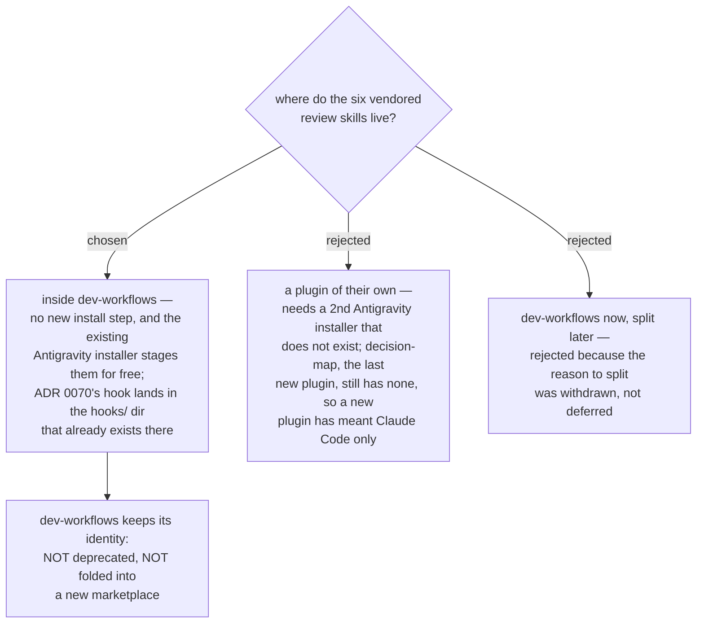

# The vendored review skills live inside `dev-workflows`, not a plugin of their own

- **Status:** Accepted
- **Date:** 2026-08-14

The six vendored copies (`sp-brainstorming`, `sp-writing-plans`, `sp-executing-plans`,
`sp-subagent-driven-development`, `sp-requesting-code-review`,
`sp-receiving-code-review` — [ADR 0071](0071-vendored-review-skills-take-the-sp-prefix-and-displace-upstream-by-description.md))
land in `plugins/dev-workflows/skills/`. No sixth plugin is created; the marketplace
keeps five entries and `dev-workflows` takes a version bump.

The SessionStart hook that [ADR 0070](0070-host-sessionstart-hook-repoints-the-one-skill-the-upstream-hook-names.md)
requires goes in `plugins/dev-workflows/hooks/hooks.json` — the same plugin, which is
not a convenience but a correctness condition (below).

## Why the destination decides this, and not tidiness

The destination line requires the copies to run **in both Claude Code and
Antigravity**. Antigravity has exactly one route into this marketplace:
`plugins/dev-workflows/.antigravity/install-antigravity.py`. That script is
plugin-local by construction — `PLUGIN_ROOT` is the parent of its own `.antigravity/`
directory and its shared support folder is hard-coded to `.dev-workflows-shared` — and
it finds skills by iterating `PLUGIN_ROOT/skills` for any directory holding a
`SKILL.md`.

So the two options are not symmetric:

| | Claude Code | Antigravity |
|---|---|---|
| inside `dev-workflows` | already installed; the copies arrive with the next version | `discover_skills()` picks up all six with **zero** installer changes |
| its own plugin | one `/plugin install` per machine | needs a **second** installer, written from scratch |

And the evidence that the second installer does not get written is in this repo:
`decision-map` was created as the fourth plugin on 2026-07-31 and **still has no
`.antigravity/` directory at all**. A new plugin has so far meant "Claude Code only",
which is the one outcome the destination forbids.

## Why the two precedents point the same way once the ambiguity is gone

The repo has decided this fork twice, in opposite directions, and the tie-break is
whether the thing has an identity of its own:

- [ADR 0002](0002-repo-as-single-source-of-skills.md) rejected a separate plugin for
  **copied** skills — *"`dev-workflows` already is the general-purpose workflow plugin;
  a fourth plugin adds an install step with no boundary benefit."*
- [ADR 0033](0033-decision-map-as-fourth-plugin.md) chose a new plugin for
  `decision-map`, because putting it in `dev-workflows` *"forces anyone who wants only
  the map to install the whole arc."*

The six copies are not a capability someone would want *instead of* the arc. They are
the review step of the arc, routed to `scrutinize`, which itself lives in
`dev-workflows`. Nobody installs the copies and skips the arc; splitting them out buys
a boundary that no user is on the other side of. ADR 0002 governs.

## The hook makes co-location a correctness condition

ADR 0070 has this marketplace shipping its own SessionStart hook to re-point the one
skill the upstream hook names. Plugin hooks ship with their plugin, and
`dev-workflows` is the **only** plugin in this marketplace with a `hooks/` directory.

Split the hook from the copies across two plugins and a colleague can enable one
without the other. Enable the hook alone and it steers the model at `sp-brainstorming`,
a skill that is not installed — a silent miss, which is the exact failure class this
whole effort exists to remove. Co-locating them makes that state unreachable rather
than merely unlikely.

## What the alternative actually cost, stated fairly

A separate plugin's real benefit was provenance: its own version could track the
upstream sha, its own README could carry the MIT notice, and a resync would touch one
plugin. That benefit is smaller than it looks, because ADR 0071 already bought most of
it — the `sp-` prefix sorts the six into one visible block in `skills/`, and
`CONTEXT.md` already defines **Vendored Skill** and warns that `sp-` means *"belongs
with superpowers"* rather than *"is a copy of"*. What remains unbought is that
`dev-workflows`' git log and version now cover both authored and vendored change. That
is accepted, and `attribution` and `resync-path` are the tickets that carry it.

The cost this decision does pay is real and worth naming: anyone who installs
`dev-workflows` for `/daily` also receives 2,407 lines of vendored Markdown, and —
pending `copy-granularity` — `brainstorming/scripts/` is 1,432 lines of Node, HTML and
shell implementing a visual-companion web server. `dev-workflows`' `scripts/` is Python
only today, so that would be a new dependency class inside the daily-arc plugin.
`copy-granularity` may well decline to vendor those scripts; this ADR does not decide
that, and does not depend on it either way.

## Why "later" was not left open

"Land it in `dev-workflows` now, split it out if the mixed provenance hurts" was
considered and rejected, because the premise that made a split plausible was
**withdrawn, not postponed**. The grilling opened on a live possibility that
`dev-workflows` was being deprecated and folded into a new marketplace — which would
have made option A a 2,400-line deposit into a plugin on its way out. Asked directly,
the owner settled it: *"งั้น dev-workflows ไม่ deprecate เก็บไว้ในdev-workflows เลย."*
With the plugin's future confirmed, a deferred split is not a hedge against anything; it
is an open question the map would carry forever.

## Consequences

- ➕ Zero install friction, and both harnesses work with no new tooling.
- ➕ `antigravity-install` shrinks to a check rather than a build: discovery is
  automatic, so its remaining question is only whether the copies introduce a
  `${CLAUDE_PLUGIN_ROOT}` shape outside the three `rewrite_plugin_root()` handles.
- ➖ `dev-workflows` grows 25 → 31 skills and roughly +60% in skill Markdown; its
  version and history mix authored and vendored change.
- ➖ **The 23 `dev-workflows` skills vendored into `menunest`'s `.agents/skills/` are
  now in the copies' blast radius.** That distribution is out of this map's scope, so
  it will simply be stale — recorded here so it is a known gap rather than a surprise.
- **[ADR 0072](0072-arc-handoffs-name-sp-writing-plans-in-short-form-and-the-preflight-retargets.md)'s
  Step 0 preflight can no longer fail.** It kept a presence check on
  `sp-writing-plans` explicitly because *"`host-plugin` has not said that"*; now it has,
  and `grill-then-plan` ships in the same plugin as the skill it gates on, in both
  harnesses. Whether to delete the gate or keep it as documentation is a live question
  this ADR raises and does not settle.
- No new `.claude-plugin/marketplace.json` entry is needed — only a version bump on the
  existing `dev-workflows` entry, kept in sync with its `plugin.json` per `CLAUDE.md`.
  That half of the fog line about minting is answered here; the other half was already
  answered by ADR 0056's global-max rule.

## Measured for this decision

This repo at **`2ef9dd1`** on `main`; `dev-workflows` at **0.34.0** committed, **0.35.0**
in the working tree (both files in sync). `dev-workflows` holds **25** skill
directories totalling **3,979** SKILL.md lines, is the only plugin with a `hooks/`
directory, and is the only plugin with an `.antigravity/` directory. The six vendoring
targets at superpowers `b36e0829c6d0`: **21 files**, **2,407** Markdown lines, plus
**1,432** non-Markdown lines under `brainstorming/scripts/` and **127** under
`subagent-driven-development/scripts/`. The marketplace is registered as a **directory
source** — `~/.claude/plugins/marketplaces/` holds no `workflow-daily-work` entry — so
editing this working tree is the deploy. `menunest` carries **23** of the 25
`dev-workflows` skills under `.agents/skills/`.
