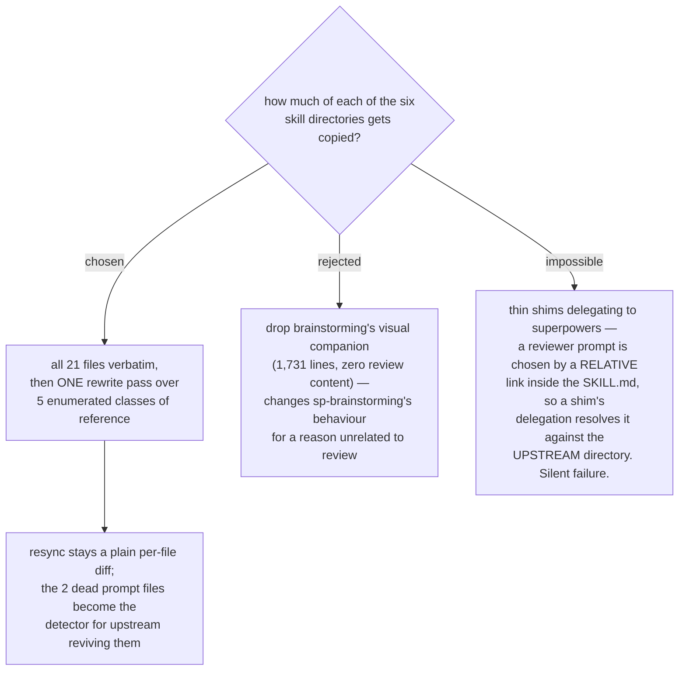

# The six skills are vendored whole — all 21 files verbatim, then one rewrite pass

- **Status:** Accepted
- **Date:** 2026-08-14
- **Corrects a premise of** [ADR 0070](0070-host-sessionstart-hook-repoints-the-one-skill-the-upstream-hook-names.md)
  (see the amendment dated 2026-08-14 on that ADR): touchpoints #1 and #2 are not
  reviewer dispatches. ADR 0070's decision stands; only its account of what option C
  costs changes.

Every file in the six vendored directories is copied **verbatim** — 21 files, 2,407
Markdown lines plus 1,559 non-Markdown — and behaviour is changed only by an explicit
rewrite pass over five enumerated classes of reference. Nothing is trimmed, including
two files this ADR proves are dead upstream.

## Why a shim cannot work

This is the finding that removes the ticket's second option entirely, so it is recorded
before the decision's own reasoning.

A reviewer prompt is not selected by a skill *name*. It is selected by a **relative
markdown link inside the SKILL.md**, resolved against the skill's own directory:

| site | the reference |
|---|---|
| `requesting-code-review/SKILL.md:34` | `filling the template at [code-reviewer.md](code-reviewer.md)` |
| `subagent-driven-development/SKILL.md:352` | `Template: [task-reviewer-prompt.md](task-reviewer-prompt.md)` |
| `subagent-driven-development/SKILL.md:398` | `[re-review-prompt.md](re-review-prompt.md)` |
| `subagent-driven-development/SKILL.md:454` | `[code-reviewer.md](../requesting-code-review/code-reviewer.md)` |

So a thin `sp-requesting-code-review` that says *"load `superpowers:requesting-code-review`"*
hands control to text that resolves `code-reviewer.md` against the **upstream**
directory. The built-in reviewer runs; there is no error and no warning. That is
precisely the silent failure this whole effort exists to remove, so the shim option is
not a cheaper alternative — it is a non-functional one. **Only a copied and edited
SKILL.md can redirect a dispatch.**

## What the review touchpoints actually are

The chart recorded seven touchpoints. Measured against the vendoring source, four of the
seven are not reviewer dispatches, and two of those four name files that nothing
references:

| # | recorded as | measured |
|---|---|---|
| 1 | `brainstorming/spec-document-reviewer-prompt.md` | **dead file.** Referenced nowhere outside `docs/` and `RELEASE-NOTES.md`. The live step is inline: *"Fix any issues inline. No need to re-review — just fix and move on."* (`SKILL.md:219`) |
| 2 | `writing-plans/plan-document-reviewer-prompt.md` | **dead file.** `SKILL.md:143` states it: *"This is a checklist you run yourself — **not a subagent dispatch**."* |
| 3 | `requesting-code-review` (SKILL.md + `code-reviewer.md`) | real dispatch |
| 4 | `subagent-driven-development/task-reviewer-prompt.md` | real dispatch |
| 5 | `subagent-driven-development/re-review-prompt.md` | real dispatch |
| 6 | `receiving-code-review/SKILL.md` | dispatches nothing — it teaches how to *take* feedback |
| 7 | `executing-plans/SKILL.md` | dispatches nothing — the agent reviews the plan itself at Step 1 |

Plus a fourth real dispatch inside `subagent-driven-development` — the final reviewer via
`../requesting-code-review/code-reviewer.md`. **Three prompt files carry all four reviewer
dispatches, and both of the skills holding them are in the copy set.**

The set of six is unchanged by this, but its justification is not what the chart recorded.
Four of the six are copied for their **qualified handoffs**, not for a review step of their
own: `writing-plans` names `superpowers:executing-plans` and
`superpowers:subagent-driven-development`, and `subagent-driven-development` names
`superpowers:requesting-code-review`. Leave any of those upstream and the chain re-enters
the originals one step later. That is the same chain analysis ADR 0070 performed; this ADR
only removes the belief that #1, #2, #6 and #7 were reviewers.

## The rewrite pass, enumerated

Verbatim copies plus five classes of edit. Everything not on this list is byte-identical
to upstream:

1. **The three live reviewer prompts** — `code-reviewer.md`, `task-reviewer-prompt.md`,
   `re-review-prompt.md` — are routed to `scrutinize`. *How* a dispatched subagent runs a
   frozen, human-facing `scrutinize` is `reviewer-invocation`'s question, not this one.
2. **Cross-skill relative paths, which break on the `sp-` rename in both harnesses.**
   `subagent-driven-development` → `../requesting-code-review/code-reviewer.md` at three
   places becomes `../sp-requesting-code-review/…`. `executing-plans:14` →
   `../using-superpowers/references/` points at a skill that stays upstream, so it must
   become a qualified `superpowers:` mention or be dropped. Untouched, both are dead links:
   Antigravity stages skills flat, and Claude Code has no such sibling under
   `plugins/dev-workflows/skills/`.
3. **The plugin-root-relative path** at `brainstorming/SKILL.md:250`,
   `skills/brainstorming/visual-companion.md`, becomes the skill-relative
   `visual-companion.md` — which is what `CLAUDE.md` requires for a skill's own files.
4. **Qualified handoffs among the six** become short `sp-` names
   ([ADR 0071](0071-vendored-review-skills-take-the-sp-prefix-and-displace-upstream-by-description.md),
   [ADR 0072](0072-arc-handoffs-name-sp-writing-plans-in-short-form-and-the-preflight-retargets.md)).
5. **Frontmatter** `name` and `description` per ADR 0071, each description naming the
   upstream skill it displaces.

## Why the two dead files are copied anyway

They are 98 lines, and they are the cheapest available detector for the one upstream
change that would silently defeat this whole effort. Those two files are the remains of a
January **document-review system** that upstream moved away from — from a subagent
dispatch to an inline checklist. If upstream ever wires them back up, that is two new
review touchpoints appearing with no announcement. Copied, they show up as an ordinary
per-file diff on the next resync. Dropped, resync has nothing to compare and the change
is invisible. ADR 0071 already required the one-to-one copy↔upstream file mapping for
exactly this reason; trimming dead files is the first thing that would erode it.

## Why the visual companion is copied

Dropping `brainstorming/visual-companion.md` (299 lines) and `brainstorming/scripts/`
(1,432 lines of Node, HTML and shell) was the real alternative, and
[ADR 0073](0073-vendored-review-skills-live-inside-dev-workflows-not-a-plugin-of-their-own.md)
flagged its cost: it is a dependency class `plugins/dev-workflows/scripts/` has never
carried, and it arrives for everyone who installs the plugin for `/daily`.

It is copied because dropping it buys a smaller plugin at the price of the two properties
that make this vendoring maintainable. It would make `sp-brainstorming` behave differently
from upstream **for a reason unrelated to review** — the browser companion simply
disappears from a skill the owner already uses — while `scrutinize` is frozen precisely so
that the copies adapt and nothing else moves. And it turns resync from a per-file diff
into a diff carrying a deliberate deletion that every future pull must re-apply. The
1,731 lines are inert: no `scripts/` file runs unless the user accepts the companion.

## Consequences

- ➕ Resync stays a plain per-file diff against a known sha, with the rewrite pass as the
  only intentional delta. `resync-path` inherits a checkable procedure rather than a
  judgement call.
- ➕ Both skills that dispatch reviewers are copied whole, so all four dispatch sites are
  reachable and editable.
- ➖ `plugins/dev-workflows/` gains 1,432 lines of Node/HTML/shell, a dependency class it
  has not carried. Inert unless the companion is accepted, but present in every install.
- ➖ Two provably dead files ship. Recorded here so a future reader does not "clean them
  up" and delete the detector.
- **The rewrite pass must be re-appliable.** It is five mechanical classes over 21 files,
  and every upstream pull re-runs it. Whether it is a documented checklist or a runnable
  script belongs to `resync-path`, which this decision unblocks.
- `receiving-code-review` is now known to dispatch nothing at all, which sharpens the fog
  line about it into its own ticket.

## Measured for this decision

Superpowers **`b36e0829c6d0`** (byte-identical to 6.3.0). The six directories hold **21
files**: **2,407** Markdown lines, plus **1,432** non-Markdown lines under
`brainstorming/scripts/` (`frame-template.html` 213, `helper.js` 167, `server.cjs` 723,
`start-server.sh` 209, `stop-server.sh` 120) and **127** under
`subagent-driven-development/scripts/` (`review-package` 46, `sdd-workspace` 40,
`task-brief` 41). `grep` for `spec-document-reviewer|plan-document-reviewer` across the
whole upstream tree returns hits only under `docs/` and in `RELEASE-NOTES.md` — no
`skills/`, `hooks/` or `scripts/` file names either one. This repo at **`9302737`** on
`main`.
