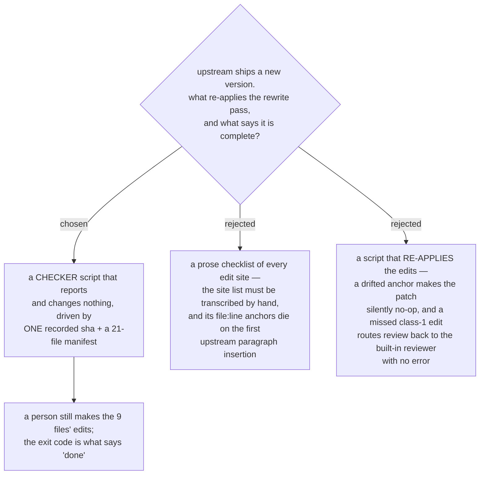

# Resync is a checker script and one recorded sha — not a checklist and not a rewriter

- **Status:** Accepted
- **Date:** 2026-08-14
- **Corrects a measurement of** [ADR 0074](0074-the-six-skills-are-vendored-whole-then-one-rewrite-pass.md)
  (see the amendment dated 2026-08-14 on that ADR): rewrite class 2's cross-skill path
  occurs at **four** sites in `subagent-driven-development/SKILL.md`, not three. ADR
  0074's decision is unaffected; the miscount is evidence for this one.

Pulling a newer `obra/superpowers` into the **Vendored Skills** is driven by a checker
script that **reports and changes nothing**. The repo records **one** upstream sha for
the whole copy set, plus a manifest of the 21 files. A person or an agent makes the
edits the checker names, then re-runs it until it exits `0`.

## What the copies record

One file, machine-readable, holding exactly two things:

1. The upstream url and **one sha** covering all 21 files.
2. The 21 files, each marked `verbatim` or `edited`, each with a content hash taken at
   vendoring time.

**One sha for the whole set, never per-file.** A partial resync — pulling the two
`brainstorming` files because upstream fixed only those — leaves the copy set spread
across several shas, and the checker can no longer answer the only question that
matters: *is this file different because we edited it, or because upstream moved?* It
would first have to establish which sha governs which file, and a wrong answer there is
silent. Re-copying all 21 files is cheap because 12 of them are byte-identical and the
checker settles them in one pass.

**No per-file provenance headers.** An MIT notice or an "upstream: sha" comment injected
into each copied file makes every one of the 21 differ from upstream, which destroys the
plain per-file diff that [ADR 0074](0074-the-six-skills-are-vendored-whole-then-one-rewrite-pass.md)
was chosen to preserve. That is a constraint this decision places on the still-open
`attribution` ticket, not a resolution of it.

## The two modes

The per-file hashes give the checker a useful offline mode:

| mode | network | the question it answers |
|---|---|---|
| **local** (default) | no | Has anything changed **our** copies since they were vendored? |
| **`--upstream`** | yes | Has **upstream** moved, and which of the 21 files changed? |

Local mode catches a fault nothing catches today: a well-meant edit inside a copy that
breaks its route to `scrutinize`. It is instant, so it stays usable as a routine check.

## Why not a checklist

A prose checklist has to name each edit site, and a site is a file plus a line. Upstream
inserts a paragraph and every line number below it is wrong while still looking correct.

The stronger objection is that hand-transcription of this particular list is **already
known to fail**. ADR 0074 enumerated the rewrite pass with the files open and recorded
class 2's cross-skill path as occurring at three sites. It occurs at four —
`subagent-driven-development/SKILL.md` lines 88, 117, 118 and 454, the first three inside
the DOT diagram's node labels. The site list has to be computed, not written down.

## Why not a rewriter

A script that re-applies the five classes would be faster when it works. Its failure mode
is the one this repo has been bitten by most: a multi-file patch whose anchor has drifted
either no-ops silently or lands on the wrong line. Here a silent no-op on a class-1 edit
means `code-reviewer.md` still points at the upstream prompt — the built-in reviewer runs,
with no error and no warning. That is precisely the defect the whole effort exists to
remove, so automating the re-application trades the goal for the convenience.

The asymmetry that settles it: the checker only has to be right about **where to look**,
while a rewriter has to be right about **what to write** in prose upstream has since
reworded. Nine files is a small manual job; being wrong about them silently is not.

## The three upstream traps the checker asserts

[ADR 0070](0070-host-sessionstart-hook-repoints-the-one-skill-the-upstream-hook-names.md)
and ADR 0074 each assigned an invisible-failure check to this ticket. All three become
assertions in `--upstream` mode, because none of them shows up as a broken link or a
failed build:

1. **`brainstorming` still hands off by bare name.** `grep -o "superpowers:[a-z-]*"` over
   `skills/brainstorming/` must stay **empty**. A qualified reference appearing there turns
   the contestable prose seam into a forced one, and the host hook stops winning it.
2. **The skills the host hook names still exist.** `grep -o "superpowers:[a-z-]*"` over
   `skills/using-superpowers/SKILL.md` must return exactly `superpowers:brainstorming` and
   `superpowers:systematic-debugging`. A rename upstream makes our hook a silent no-op; a
   **third** name appearing means the hook's coverage is incomplete from that moment. Assert
   the count, do not eyeball it.
3. **The two dead prompt files stay dead.** `spec-document-reviewer-prompt.md` and
   `plan-document-reviewer-prompt.md` are referenced by nothing outside `docs/` and
   `RELEASE-NOTES.md`. Upstream wiring either one back up is two new review touchpoints
   arriving unannounced. ADR 0074 copies them for exactly this reason; this is the check
   that turns the copies into a detector.

## Where it lives, and who runs it

| | |
|---|---|
| the program | `plugins/dev-workflows/scripts/check_vendored_superpowers.py` |
| the procedure | `plugins/dev-workflows/references/resync-superpowers.md` — the five classes and the three traps, with **no line numbers**; the program finds those |
| the manifest | one file beside the copies, read only by the program |
| the runner | whoever does the resync. The exit code says when to stop |

The program follows the convention `check_doc_provenance.py` already sets in that same
directory: report by default, `--strict` to fail, exit `0` clean / `1` findings / `2`
cannot run, with a paired `test_*.py`.

**No hook, and no CI.** This repo has no `.github/workflows` at all, so nothing can run
this on a schedule — the runner is a session, by hand. A hook was considered and rejected
for now: `--upstream` needs the network, which is too slow and too noisy for every session
start. Local mode is cheap enough to become a hook later if copies are found to drift, and
that is a separate decision.

## Consequences

- ➕ The edit-site list is computed from the files, so it cannot rot the way ADR 0074's
  hand-count already did.
- ➕ Local mode gives the copies a drift check they do not have today, offline and instant.
- ➕ The three invisible upstream changes become assertions instead of things a future
  reader is trusted to remember.
- ➖ Nothing notices that upstream moved. On-demand means a version can sit unnoticed
  indefinitely; the gap is recorded as fog on the map, not closed here.
- ➖ A one-file upstream fix still costs a 21-file re-copy. Accepted: 12 of the 21 are
  proved byte-identical in one step.
- The manifest's file list follows the copy set, which `receiving-code-review-role` can
  still change from six skills to five.

## Measured for this decision

Upstream `obra/superpowers` **HEAD is `b36e0829c6d0140e93cfef2ca599b1b07d4a7797`** as of
2026-08-14, read with `git ls-remote` — identical to the sha the official marketplace pins
for superpowers 6.3.0, so the copies start level with upstream. The `6.3.0` cache dir is
byte-identical to the `b36e0829c6d0` cache dir apart from cache bookkeeping (`.in_use`,
`.orphaned_at`).

**The cache directory is not a durable anchor.**
`…/plugins/cache/claude-plugins-official/superpowers/b36e0829c6d0/` already carries an
`.orphaned_at` marker, and the only real git clone on this machine
(`…/plugins/marketplaces/superpowers-dev`, remote `obra/superpowers`) sits at `44c9b2d`
from 2026-07-27 and **does not contain `b36e0829` at all**. The sha must be resolved from
GitHub, which is why it is recorded in this repo rather than pointed at on disk.

**Rewrite surface, measured over the 21 files:** 9 files need edits (the six `SKILL.md`
plus the three live prompt files, 503 lines), **12 are byte-identical**. Class 2 is 5
sites — `../requesting-code-review/…` ×4 in `subagent-driven-development/SKILL.md` (88,
117, 118, 454) and `../using-superpowers/references/` ×1 at `executing-plans/SKILL.md:14`.
Class 3 is 1 site (`brainstorming/SKILL.md:250`). Class 4 is 6 sites — the qualified refs
naming skills **inside** the copy set (`writing-plans` → `executing-plans` ×2 and
`subagent-driven-development` ×2; `executing-plans` → `subagent-driven-development` ×1;
`subagent-driven-development` → `requesting-code-review` ×1). The other **8** qualified
refs name `finishing-a-development-branch` (×5) and `using-git-worktrees` (×3), which stay
upstream and must be **left alone** — a rewriter pattern matching `superpowers:` broadly
would break all eight. `implementer-prompt.md` carries no reference of any class and is
fully verbatim. This repo at **`871e5f3`** on `main`.
