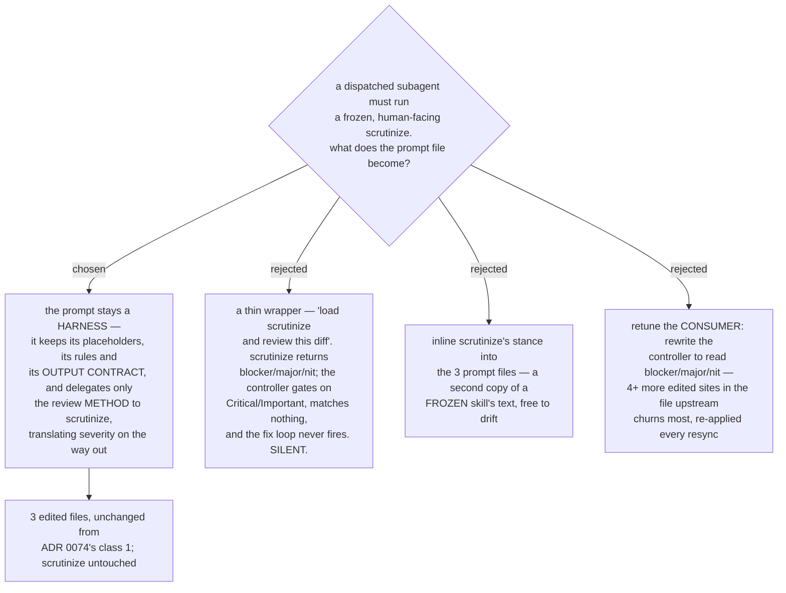

# The reviewer prompt is the harness, scrutinize is the engine — severity is translated at the boundary

- **Status:** Accepted
- **Date:** 2026-08-14
- **Answers a question left open by** [ADR 0074](0074-the-six-skills-are-vendored-whole-then-one-rewrite-pass.md),
  whose rewrite class 1 routes the three live reviewer prompts to `scrutinize` but
  deliberately did not say *how*.

Each of the three live reviewer prompts keeps everything it has except the review
*method*. It still supplies the per-touchpoint context, it still states the operational
rules, and it still fixes the output format the controller reads. What it no longer
carries is its own reviewer stance and checklist: those are delegated to `scrutinize`.
On the way out, the prompt **translates** `scrutinize`'s severity words into the ones the
controller already gates on.

## Why a thin wrapper cannot work

This is the finding that removes the ticket's first option, so it is recorded before the
decision's own reasoning.

`scrutinize` reports **blocker / major / nit** and closes with a verdict of
**ship / fix-then-ship / rework / reject**. The upstream reviewer prompts report
**Critical / Important / Minor** and close with **Ready to merge** or
**Task quality: Approved | Needs fixes**.

Those are not decoration. The controller reads them:

| site | the gate |
|---|---|
| `subagent-driven-development/SKILL.md:356` | *"The loop triggers when the review reports spec ❌, any **Critical or Important** finding…"* |
| `:401` | *"New **Critical/Important** breakage in the fix diff joins the open…"* |
| `:442` | *"Never move to the next task while the review has open **Critical/Important** issues…"* |
| `:361`, `:364` | *"Record **Minor** findings in the progress ledger"* |

A prompt that only says *"load `scrutinize` and review this diff"* returns a report whose
worst finding is labelled `blocker`. The gate at line 356 looks for `Critical` or
`Important`, matches neither, and **the fix loop never fires** — with no error and no
warning. That is the same class of silent failure ADR 0074 found in the shim option, and
it is exactly what this effort exists to remove.

Inlining `scrutinize`'s stance into the three files is rejected for the reason the whole
map is built on: `scrutinize` is frozen so there is **one** source for the stance, and a
second copy of that text in three prompt files is free to drift from it.

## The translation

Three rows, fixed here so the checker can assert them:

| `scrutinize` emits | the prompt reports | because |
|---|---|---|
| `blocker` | `Critical (Must Fix)` | both trigger the fix loop |
| `major` | `Important (Should Fix)` | both trigger the fix loop |
| `nit` | `Minor (Nice to Have)` | both are ledger-only, never a gate |
| `reject` / `rework` | `Ready to merge: No` / `Task quality: Needs fixes` | |
| `fix-then-ship` | `Ready to merge: With fixes` | |
| `ship` | `Ready to merge: Yes` / `Task quality: Approved` | |

## Why translate rather than retune the consumer

Rewriting the controller to read `blocker/major/nit` would need no translation at all. It
is rejected on resync cost, which [ADR 0075](0075-resync-is-a-checker-script-and-one-recorded-sha.md)
made a first-class constraint: every edited line is re-applied and re-verified on every
upstream pull. Translating touches only the three prompt files, which ADR 0074 already
class-1 edits — the edited set does not grow. Retuning the consumer adds at least four
more sites inside `subagent-driven-development/SKILL.md`, plus the worked examples at
`:529` and `:545` that use the same words, in the file upstream churns most. Missing one
of them on a future pull leaves a gate that silently never fires — the very failure being
designed out.

## The Strengths section is dropped

The upstream format opens with `### Strengths`, and its calibration section asks the
reviewer to *"acknowledge what was done well"*. `scrutinize` will not do that: **"No
flattery, no hedging"** is one of its operating rules, and it has no such section.

The heading is therefore dropped from the three vendored prompts rather than refilled.
`scrutinize` does state what it traced and checked — but its rule makes that
**conditional on finding nothing**, so keeping the heading would mean asking the subagent
for a coverage line *in addition to* running `scrutinize`. Nothing downstream reads the
section: the controller parses severity words only, and `SKILL.md:529` uses `Strengths`
in a worked example of a ledger entry, not in a gate. Dropping it adds nothing, copies
nothing, and breaks nothing.

## What still carries the per-touchpoint context

Unchanged — this is the harness half, and it is why the prompt files survive at all
rather than collapsing into a one-line reference:

| prompt | what it must still supply |
|---|---|
| `code-reviewer.md` | `[DESCRIPTION]`, `[PLAN_OR_REQUIREMENTS]`, `[BASE_SHA]`, `[HEAD_SHA]` |
| `task-reviewer-prompt.md` | `[MODEL]`, `[BRIEF_FILE]`, `[GLOBAL_CONSTRAINTS]`, `[REPORT_FILE]`, `[BASE_SHA]`, `[HEAD_SHA]`, `[DIFF_FILE]` |
| `re-review-prompt.md` | `[BRIEF_FILE]`, `[FINDINGS]`, `[REPORT_FILE]`, `[FIX_BASE_SHA]`, `[HEAD_SHA]`, `[DIFF_FILE]` |

The operational rules stay with the harness too — read-only on the checkout, *"You Do Not
Dispatch Subagents"*, *"Do Not Trust the Report"*, and the scoping rules. `scrutinize` says
nothing about any of them, because it was written for a human-facing session rather than
for a dispatched subagent.

`task-reviewer-prompt.md` additionally keeps its **Spec Compliance** part (`✅/❌/⚠️`),
which `scrutinize` has no concept of and which the controller gates on at `:356`
alongside severity.

## Consequences

- ➕ `scrutinize` is untouched, and stays the single source of the review stance.
- ➕ The edited-file set stays at the nine ADR 0074 already named. Resync does not grow.
- ➕ The mapping is three rows, so ADR 0075's checker can assert it is present rather
  than trusting a future editor to remember it.
- ➖ The report the user reads is `scrutinize`'s findings wearing upstream's severity
  labels. Anyone comparing a dispatched review against a `/scrutinize` run by hand will
  see different words for the same judgement.
- ➖ Reviews lose the `Strengths` section they have today.
- **Unverified.** `scrutinize` declares `effort: max` in its frontmatter. Whether a
  dispatched subagent inherits that is not known and was not assumed here. It needs a
  live check; `short-ref-resolution` is the ticket that already owns live checks of this
  kind.

## The escape hatch, recorded

Set by the owner during this grilling, and added to the map notes: **`scrutinize` is
never edited. If a change to it is genuinely required, the change goes into a NEW skill
that is a copy of it.**

That option was live here and was not taken. A dispatch-tuned copy of `scrutinize` would
remove the translation layer entirely by emitting the controller's vocabulary directly.
It is rejected for this ticket because the map's destination routes the touchpoints to
*the existing* `scrutinize`; a copy is not that skill, so choosing it would change the
destination rather than resolve a ticket under it.

## Measured for this decision

Upstream superpowers **`b36e0829c6d0`** (the `6.3.0` cache dir). `scrutinize` is
`plugins/dev-workflows/skills/scrutinize/SKILL.md`, **74 lines**, one file, `effort: max`.
The controller's severity gate was read at `subagent-driven-development/SKILL.md` lines
**356, 401, 442**, with ledger handling at **361** and **364** and worked examples at
**529** and **545**. The three prompt files are **503 lines** total (`code-reviewer.md`
181, `task-reviewer-prompt.md` 207, `re-review-prompt.md` 115).

**Precedent in this repo:** `review-pr/SKILL.md:34` already does the harness job for a
human-facing run — *"### 3. Judge — REQUIRED SUB-SKILL: scrutinize"*, supplying the scope
(`git diff <base>...pr-<n>`) and the claims to verify, and explicitly instructing that
`scrutinize` *"owns the intent-questioning, the end-to-end trace, and the findings report
— do not duplicate or dilute it here."* This ADR applies the same split to a dispatched
subagent, and adds the output translation that a human-facing caller does not need. This
repo at **`dc1721d`** on `main`.
