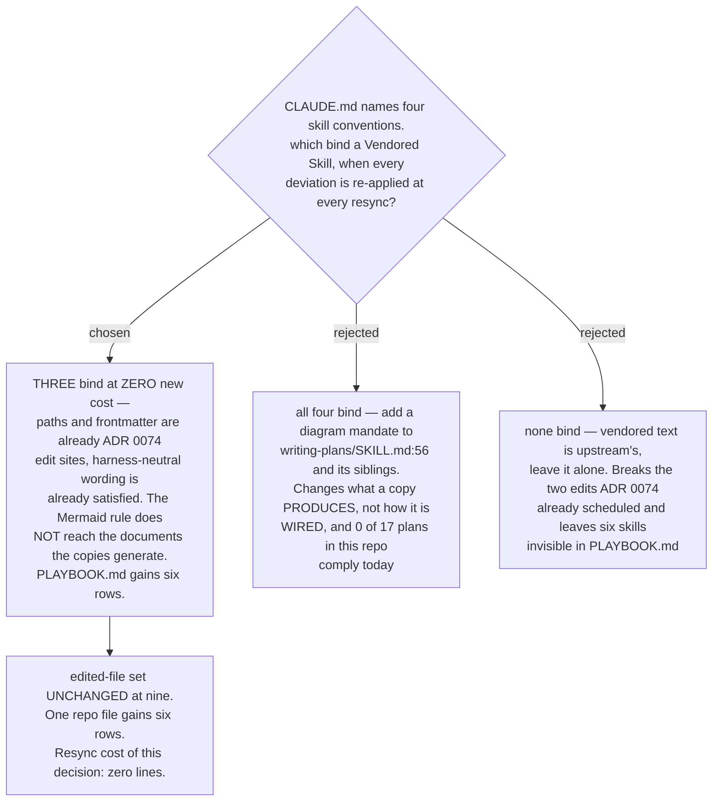

# Three conventions bind the vendored copies; the Mermaid rule does not reach what they generate

- **Status:** Accepted
- **Date:** 2026-08-14
- **Resolves** `convention-compliance` on the *route every superpowers review step to
  scrutinize* decision map.
- **Constrained by** [ADR 0075](0075-resync-is-a-checker-script-and-one-recorded-sha.md):
  every deviation from upstream text is re-applied and re-verified on every pull, so the
  question is not "is this convention good?" but "what does it cost, forever?"

## The verdict, per convention

| convention | verdict | cost to resync |
|---|---|---|
| `${CLAUDE_PLUGIN_ROOT}` / skill-relative paths | **binds — already scheduled** | none: [ADR 0074](0074-the-six-skills-are-vendored-whole-then-one-rewrite-pass.md) class 3, one site |
| frontmatter `name` + `description` | **binds — already scheduled** | none: ADR 0074 class 5, per [ADR 0071](0071-vendored-review-skills-take-the-sp-prefix-and-displace-upstream-by-description.md) |
| harness-neutral wording | **binds, and is ALREADY SATISFIED** | none: measured, **0** files convert |
| opening Mermaid diagram on generated documents | **does NOT bind** | none: nothing is edited |
| one PLAYBOOK.md row per skill | **binds — all six** | none: `PLAYBOOK.md` is this repo's own file |

Three of the four bind at zero *new* cost, because the two that touch upstream text edit
lines ADR 0074 was already going to edit. The fourth would have been the only one to add a
line, and it is the one that does not bind.

## Why the Mermaid rule does not reach the vendored copies

The convention in `CLAUDE.md` is that *"every skill-generated Markdown document opens with
one overview Mermaid diagram"*. Applied to the six copies it does not mean *add a diagram
to `SKILL.md`* — those are not generated documents. It means *make `sp-writing-plans`
instruct every plan it writes to open with a diagram*, and the same for specs and reports.
That is rejected, for four reasons, in the order they were put to the owner:

1. **The repo already works this way.** `docs/superpowers/plans/*.md` is **17** files and
   **0** of them open with a diagram. Mandating it would not codify existing practice; it
   would invalidate every plan the repo has.
2. **ADR 0074 already rejected this class of change.** It refused to drop the visual
   companion because that would make the copy *"behave differently from upstream for a
   reason unrelated to review"*. A diagram mandate is the same move, pointed the other way:
   it changes brainstorming and planning output for a reason that has nothing to do with
   routing a review step.
3. **The convention's scope is the artifact we author.** A Vendored Skill's output format
   is upstream's design, not this repo's house style. The map vendors these skills to
   change *where their review step goes*, and nothing else.
4. **It is the only one of the four that changes what a copy PRODUCES.** The other three
   change how a copy is **wired** — its paths, its frontmatter, its harness references —
   and wiring is the entire point of the effort. Output-shaping is a different kind of
   deviation, and it is the kind that compounds: upstream churns `writing-plans` and
   `subagent-driven-development` most, so a mandate inside them is re-applied against
   moving text every pull.

The rejected option's real edit site, for the record:
`writing-plans/SKILL.md:56`, `**Every plan MUST start with this header:**` → *"…, then one
Mermaid overview diagram:"*.

The owner answered **"ไม่บังคับ"** — not binding.

## What the exemption does NOT cover

The exemption is narrow, and this paragraph exists so that a future reader does not widen
it by accident:

- It covers **the six vendored copies and the documents they generate**. It does not touch
  this repo's own skills, which continue to follow
  `plugins/dev-workflows/references/diagram-convention.md` in full.
- It does not exempt **this ADR**, or any decision-map ticket resolution. Those are
  documents this repo authors.
- **The escape hatch, if the owner later wants diagrams on plans anyway:** it becomes a
  `dev-workflows` house rule applied when a *person* writes the plan — not prose baked into
  the vendored copy. That keeps the diagram preference and the resync bill separate, which
  is the whole reason the mandate was rejected.

A corollary worth stating plainly: a future contributor reading a vendored `SKILL.md` and
noticing it has no diagram instruction is looking at a **deliberate** absence, not an
oversight to be fixed.

## PLAYBOOK.md gets six rows, in one new grouped section

All six copies get a row. This was put to the owner rather than assumed, because it is
additive in cost but novel in kind, and the owner answered **"ok"** to the grouped-section
recommendation.

Measured: `PLAYBOOK.md` carries **22 skill rows across two tables**, and
`grep -niE 'superpowers|sp-'` returns **nothing**. There is no row today for brainstorming,
writing-plans, executing-plans, or any code-review skill. So six rows cost zero resync
lines — `PLAYBOOK.md` is this repo's file, never compared against upstream — but they
introduce a class the playbook does not currently have.

One new grouped section, rather than six rows scattered into the existing *WORKING —
situational router* table, for two reasons: the six are a **set** that arrived together and
resyncs together, and the existing table routes by *situation* ("something broke", "second
opinion") while these route by *pipeline stage*. Mixing them would make the router's
question inconsistent row to row.

This satisfies the standing convention that a skill missing from the playbook is invisible
([ADR 0001](0001-playbook-plus-daily-router.md)), and the maintenance rule in `PLAYBOOK.md`
itself. Six rows land in the same change that lands the six copies.

## Correction: harness-neutral wording costs zero files

This is recorded because the working assumption going into the grilling was the opposite,
and the wrong figure would have made this convention look like the expensive one.

The assumption was that upstream *"names Claude Code tools in prose throughout the six
skills"*, which would convert part of ADR 0074's **12 verbatim files** into the edited set
permanently. **Measured, it is wrong.** The literal `Claude Code` appears at only three
sites across the six skill directories:

| site | what it is | verdict |
|---|---|---|
| `brainstorming/visual-companion.md:62` | the heading `**Claude Code:**` of a per-platform launch block that also carries `**Codex:**` | already the "commands for both harnesses" shape `CLAUDE.md` asks for |
| `brainstorming/visual-companion.md:68` | `run_in_background: true` on the Bash tool — **inside** that Claude Code subsection | naming the tool inside a per-harness block is correct, not a violation |
| `executing-plans/SKILL.md:14` | already names five harnesses (Claude Code, Codex CLI, Codex App, Copilot CLI, Gemini CLI) | already plural, **and already an ADR 0074 class-2 edit site** |
| `subagent-driven-development/scripts/sdd-workspace:11` | a rationale comment on why the workspace sits in the working tree | a comment to a reader, not an instruction to an agent |

The pervasive wording is *"dispatch a subagent"* — roughly twenty sites across
`writing-plans`, `subagent-driven-development`, `requesting-code-review` and the three
prompt files. That names an **action**, which is the rule's own test: `CLAUDE.md` asks for
*"load the skill via your harness's mechanism"* rather than *"call the Skill tool"*. It
passes as written.

**Net: 0 of the 12 verbatim files convert to the edited set.**

## Consequences

- ➕ The edited-file set stays at the **nine** ADR 0074 named. This decision adds no
  upstream deviation at all, so it adds nothing to ADR 0075's resync bill.
- ➕ The twelve verbatim files stay verbatim, which keeps the resync checker's per-file
  comparison meaningful for the majority of the copy set.
- ➕ Six PLAYBOOK rows make the copies discoverable, closing the gap that
  `grep -niE 'superpowers|sp-'` currently shows.
- ➖ The repo now has a documented exception to a `CLAUDE.md` convention. That is a thing a
  future reader can trip over, which is why the scope limit above is written out rather
  than left implied.
- ➖ Plans and specs produced by `sp-writing-plans` and `sp-brainstorming` will keep looking
  different from this repo's own generated documents. That difference is intentional and is
  now on the record.

## Measured for this decision

Upstream read at `~/.claude/plugins/cache/claude-plugins-official/superpowers/6.3.0/skills/`
— ADR 0075 established this is byte-identical to the `b36e0829c6d0` directory apart from
cache bookkeeping. This repo at **`bdf0dba`** on `main`.

**`${CLAUDE_PLUGIN_ROOT}` appears zero times in the six skill directories.** The convention
binds through the bare repo-relative path at `brainstorming/SKILL.md:250`
(`skills/brainstorming/visual-companion.md`), which the rewrite turns into the
skill-relative `visual-companion.md`. That is exactly ADR 0074 class 3 — one site, already
in the edited set.

**Upstream prescribes no diagram anywhere in the six skills.**
`grep -riE 'mermaid|diagram'` over the six directories, excluding `scripts/`, returns only
`brainstorming`'s offer text for the visual companion (`SKILL.md:235`, `237`, `238`, `244`;
`visual-companion.md:3`, `12`, `15`). Nothing instructs a generated document to carry a
diagram.

**This repo's own superpowers-generated documents:**

| | total | no Mermaid at all | Mermaid within the first 20 lines |
|---|---|---|---|
| `docs/superpowers/plans/*.md` | 17 | 8 | **0** |
| `docs/superpowers/specs/*.md` | 17 | 6 | 9 |

The nine plans that do carry Mermaid have it deep in the body — first occurrence at lines
41, 62, 79, 102, 115, 170, 216, 885 and 1190 — inside task content, never as an opening
overview. Specs are the opposite habit, and neither is a plan.

**`PLAYBOOK.md`:** 22 data rows across two tables; `grep -niE 'superpowers|sp-'` returns
nothing, and there is no row for brainstorming, writing-plans, executing-plans or any
code-review skill.

**The 12 verbatim files** (the nine edited are the six `SKILL.md` plus `code-reviewer.md`,
`task-reviewer-prompt.md` and `re-review-prompt.md`): `brainstorming/` —
`scripts/frame-template.html`, `scripts/helper.js`, `scripts/server.cjs`,
`scripts/start-server.sh`, `scripts/stop-server.sh`, `spec-document-reviewer-prompt.md`,
`visual-companion.md`; `writing-plans/plan-document-reviewer-prompt.md`;
`subagent-driven-development/` — `implementer-prompt.md`, `scripts/review-package`,
`scripts/sdd-workspace`, `scripts/task-brief`.
