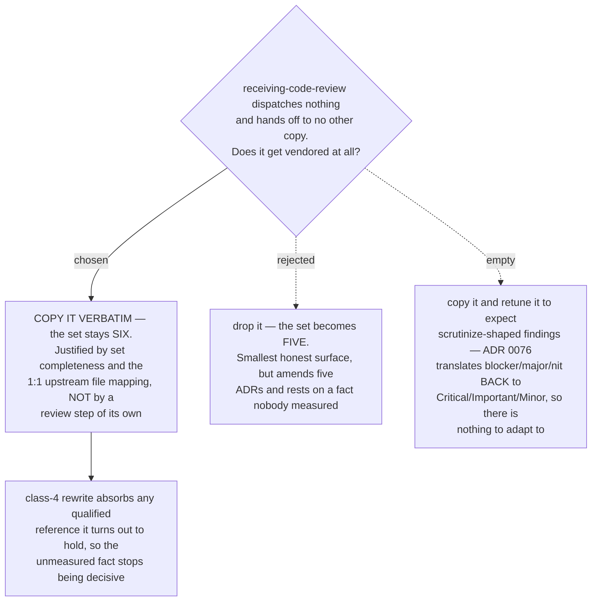

# `sp-receiving-code-review` is copied for set completeness, not for a review step

- **Status:** Accepted
- **Date:** 2026-08-15
- **Resolves** `receiving-code-review-role` on the *route every superpowers review step to
  scrutinize* decision map.
- **Builds on** [ADR 0074](0074-the-six-skills-are-vendored-whole-then-one-rewrite-pass.md),
  which measured that touchpoint #6 dispatches no reviewer, and
  [ADR 0076](0076-reviewer-prompt-is-the-harness-scrutinize-is-the-engine.md), whose
  severity translation removes the only edit this copy could plausibly have needed.
- **Confirms, does not amend,** [ADR 0071](0071-vendored-review-skills-take-the-sp-prefix-and-displace-upstream-by-description.md)'s
  six-name set and [ADR 0075](0075-resync-is-a-checker-script-and-one-recorded-sha.md)'s
  21-file manifest.

## Context

Five of the six vendored skills earn their place. `brainstorming` is named by upstream's
SessionStart hook, so touchpoint #1 is lost without it (ADR 0070). `requesting-code-review`
holds `code-reviewer.md`; `subagent-driven-development` holds the other three dispatch
sites. `writing-plans` and `executing-plans` are the qualified-handoff chain that ADR 0070
showed must be vendored together or the arc re-enters the originals one step later.

`receiving-code-review` is the sixth, and ADR 0074 left it with no reason at all. It
dispatches nothing — it teaches how to *take* feedback — and it is the one skill of the six
with no qualified handoff into another copy. ADR 0075 recorded the consequence plainly:
the manifest's file list follows the copy set, "which `receiving-code-review-role` can
still change from six skills to five."

The ticket offered three options. One of them is already empty, and that is worth
recording before the decision, because a future reader will reach for it again.

## Why "retune it for scrutinize-shaped findings" is not an option

The ticket asked whether the copy gets "edited to expect scrutinize-shaped findings". It
cannot, because there are none to expect.

ADR 0076 made the Reviewer prompt the *harness* and `scrutinize` the *engine*, and had the
prompt translate on the way out: `blocker` → `Critical (Must Fix)`, `major` →
`Important (Should Fix)`, `nit` → `Minor (Nice to Have)`. That translation exists so the
controller gates in `subagent-driven-development` keep matching. Its side effect is
decisive here — **a routed review emits exactly upstream's vocabulary**. A skill that
teaches a human how to receive `Critical/Important/Minor` findings is correct, unedited,
whether the findings came from `scrutinize` or from the built-in reviewer.

So the copy is byte-identical to upstream apart from ADR 0074's mechanical rewrite classes.
That is not an oversight to be fixed later; it is what ADR 0076 bought.

## Decision

**`receiving-code-review` is vendored, verbatim. The copy set stays at six.**

Its justification in the manifest changes, and this ADR is the record of that change. It is
not copied because it carries a review step — it does not. It is copied for the two
properties the vendoring depends on:

1. **Set completeness.** ADR 0069 removes all six review-carrying originals from the
   model's reach. A skill removed with no copy behind it is a capability the marketplace
   silently loses, and `receiving-code-review` is the skill a person reaches for at exactly
   the moment a routed review has just produced findings.
2. **The 1:1 upstream file mapping.** ADR 0071 required it and ADR 0075 built the checker
   on it. Every hole in that mapping is a file upstream can change without the resync
   check noticing.

This is the same trade ADR 0074 already made for the two provably dead prompt files, and
for the same stated reason: a copy that changes nothing still keeps the diff honest.

## Why not five

Dropping it is the smaller, more honest surface — nothing ships that changes nothing — and
it was rejected on cost and on risk.

**Cost.** It amends five accepted ADRs: 0069's six-skill off-list, 0071's six-name set,
0074's copy set and file count, 0075's manifest, and 0077's six PLAYBOOK rows. None of
those amendments buys any behaviour. It also lands mid-flight: `override-distribution` is
open and claimed by another session at the time of writing, and that ticket's whole subject
is how six override entries reach a colleague's machine.

**Risk, and the fact nobody has measured.** The question that would settle it on the merits
is whether upstream `receiving-code-review/SKILL.md` holds a **qualified** reference to any
of the other five. If it does, leaving it upstream re-enters an original one step later —
precisely the chain failure ADR 0070 vendored five skills to prevent, and precisely the
kind of failure that is silent. That measurement was **not taken for this decision**: the
superpowers plugin cache is not present on the machine this ticket was resolved on, and
ADR 0074 measured what the skill *dispatches*, never what it *names*.

Choosing to copy makes the gap harmless rather than leaving it open, which is the real
argument for this option. ADR 0074's rewrite class 4 already turns *any* qualified handoff
among the six into a short `sp-` name, mechanically, wherever it appears. So if the
reference exists, the copy absorbs it; if it does not, the class-4 pass finds nothing and
costs nothing. **The unmeasured fact changes the work by zero either way** — which is only
true on this branch of the decision. On the five-skill branch it is load-bearing and
unknown.

## Consequences

- ➕ ADRs 0069, 0071, 0074, 0075 and 0077 stand unamended. The six-name set, the 21-file
  manifest and the six PLAYBOOK rows are confirmed rather than disturbed.
- ➕ The one fact this decision could not measure is rendered non-decisive by rewrite
  class 4, instead of being carried forward as risk.
- ➕ No collision with the in-flight `override-distribution` ticket, which is building
  against six.
- ➖ The marketplace ships a Vendored Skill whose content is functionally identical to the
  original it displaces. A reader who finds it and asks "why is this here?" is asking a
  fair question — this ADR is the answer, and `sp-receiving-code-review`'s description must
  not claim a review-routing behaviour it does not have.
- ➖ The qualified-reference measurement is still untaken. It is no longer blocking, but a
  resync that ever finds class 4 rewriting sites *inside* this copy is evidence the
  five-skill option was never viable, and that is worth noticing rather than passing over.
- If upstream ever gives `receiving-code-review` a real reviewer dispatch, this copy stops
  being justified by set completeness and starts being justified the ordinary way. ADR
  0075's checker surfaces that as a per-file diff.

## Measured for this decision

This repo at **`936a229`** on `claude/decision-mapping-7307sy` (identical to `main` at the
time of writing). ADR 0076's translation table was read at
`docs/adr/0076-reviewer-prompt-is-the-harness-scrutinize-is-the-engine.md` lines 60–62; the
touchpoint measurements are ADR 0074's, taken on superpowers `b36e0829c6d0` and not re-run
here. The vendored copies do not exist in the tree yet — `plugins/dev-workflows/skills/`
holds `sp-grill-with-doc` and no `sp-` copy — so this decision costs no code today.

**Not measured:** whether upstream `receiving-code-review/SKILL.md` holds a qualified
reference to any of the other five. The superpowers plugin cache is absent from the machine
this was resolved on. See "Why not five" for why the decision does not turn on it.
