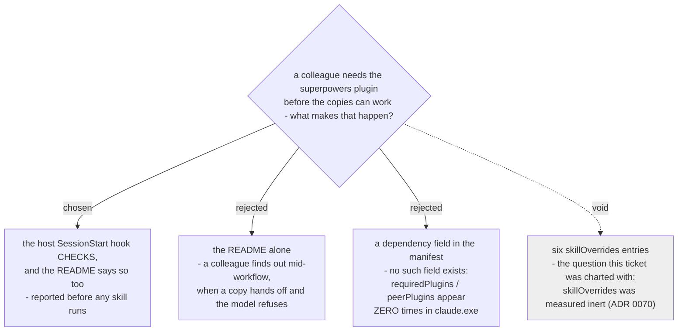

# The superpowers prerequisite is checked by the host hook, not only documented



The six Vendored Skills make **eleven references** out to upstream skills that are *not*
being copied, and nothing tells a colleague to install the plugin those skills live in.
The host SessionStart hook that ADR 0070 already requires gains one check: if
`superpowers` is absent, say so at session start. The README gains the prerequisite line
in the same change.

## The re-scope, recorded

This ticket was charted as *"how do the six `skillOverrides` entries reach a colleague's
machine?"* **That question is void.** `skilloverrides-live-check` measured that
`skillOverrides` cannot reach a plugin skill by either key form on Claude Code 2.1.232,
and [ADR 0070](0070-host-sessionstart-hook-repoints-the-one-skill-the-upstream-hook-names.md)
replaced the lever with a host SessionStart hook that ships inside `dev-workflows`. There
are no entries to distribute, and ADR 0070 says outright that *"no settings key is
required on a colleague's machine."*

Three separate sessions left that warning on the ticket before this one. The ticket was
re-scoped rather than closed, because a real distribution question survives underneath it
and no other ticket owns it — `user-command-entry` owns `~/.claude/commands/`, and
`antigravity-install` owns the Antigravity installer.

**The surviving question:** *what makes sure a colleague has `superpowers` installed
before the copies need it?*

## What made it a real question rather than a tidy-up

Three things were measured, not assumed.

**1. The copies do not stand alone.** Counted against the vendoring source
(`b36e0829c6d0`), the six carry eleven references out to three skills on the *not-copied*
list:

| upstream skill, not copied | references from the six | where |
|---|---|---|
| `finishing-a-development-branch` | 7 | `executing-plans` (2), `subagent-driven-development` (5) |
| `using-git-worktrees` | 3 | `writing-plans`, `executing-plans`, `subagent-driven-development` |
| `using-superpowers` | 1 | `executing-plans` |

The map's out-of-scope list already called two of these *"load-bearing for the copies"*.
The count puts a number on it.

**2. Nothing tells a colleague to install it.** `README.md`'s *"Install (each colleague,
once)"* lists Claude Code, Azure CLI, .NET 10 and Python as prerequisites, then four
`/plugin install` lines. None of the four is `superpowers`, and no prerequisite mentions
it.

**3. The harness cannot express the dependency.** `requiredPlugins` and `peerPlugins`
appear **zero** times in `claude.exe`, and this marketplace's `plugin.json` files carry
only `name` / `displayName` / `version` / `description` / `author` / `homepage` /
`repository` / `license` / `keywords`. There is no manifest field to declare it with, so
the answer had to be documentation or a runtime check.

## Decision — the hook checks, and the README says so

The SessionStart hook ADR 0070 requires does not exist yet. At `e7839a8` the plugin's
`hooks.json` is `{"hooks": {}}` — the `PostToolUse` commit-log hook was removed and no
`SessionStart` hook has been added. So this decision adds a requirement to a file that has
to be written anyway; it does not create new machinery.

The hook reports when `superpowers` is absent. The README gains the prerequisite line and
one install line in the same change:

```text
/plugin install superpowers@claude-plugins-official
/plugin install dev-workflows@workflow-daily-work
```

Both, not either. The README line is nearly free and is the only thing that helps a
colleague who has not installed this marketplace yet — at which point no hook of ours can
fire.

## Why not the README alone

It was a defensible option and it was rejected on timing, not on cost.

A colleague who skips the step does find out: with `superpowers` absent there is no
upstream twin for the model to reach for, so a bare reference is refused cleanly rather
than silently substituted — measured on
[`short-ref-resolution`](../decision-map/superpowers-review-to-scrutinize/tickets/short-ref-resolution.md).
The failure is **loud**. But it arrives when a copy hands off, which is the middle of
someone's work, and the eleven references sit in `executing-plans` and
`subagent-driven-development` — the late steps of the arc, after the expensive part.

A session-start line costs one file read and moves that discovery to before anything has
been done. This map has twice been wrong about *"a person will just do the documented
step"*; the check does not depend on that.

## Consequences

- **`antigravity-install` unblocks.** It was blocked on this ticket alone.
- The hook now has two jobs — re-point the request ADR 0070 was written for, and report a
  missing prerequisite. That is a wider job than ADR 0070 described, and whoever builds it
  should treat the report as advisory: it must never stop a session, because a colleague
  who genuinely wants the copies without upstream is not doing anything wrong, only
  losing eleven handoffs.
- **The Antigravity half of this question is not answered here.** No hook mechanism was
  established for that harness, and `install-antigravity.py` must still be run by hand.
  That belongs to `antigravity-install`, which now also carries the licence-file finding.
- The check is only as good as the fact it reads. Whoever builds it should read the
  installed-plugins state rather than infer from a skill listing, and should expect the
  answer to be *absent* rather than *error* when the file is missing entirely.
