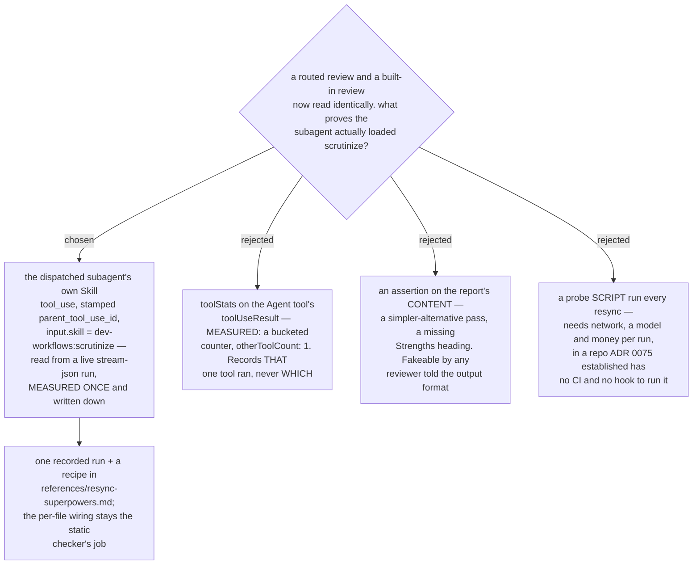

# The routing proof is the dispatch stream's `Skill` record, measured once — `toolStats` cannot see it

- **Status:** Accepted
- **Date:** 2026-08-15
- **Resolves** `review-acceptance-check` on the
  [superpowers-review-to-scrutinize](../decision-map/superpowers-review-to-scrutinize/map.md) map.
- **Corrects the scope of a fact recorded by**
  [`short-ref-resolution`](../decision-map/superpowers-review-to-scrutinize/tickets/short-ref-resolution.md) §6.
- **Closes the observability hole opened by**
  [ADR 0076](0076-reviewer-prompt-is-the-harness-scrutinize-is-the-engine.md), whose
  translation layer makes a routed review and a built-in review report in the *same*
  vocabulary, so the labels can no longer tell them apart.



The acceptance signal is a **record the harness writes and the model cannot author**: the
`Skill` tool_use the dispatched reviewer subagent makes, carried in the dispatching run's
event stream and joined to that dispatch by `parent_tool_use_id`.

```json
{"type":"assistant","parent_tool_use_id":"toolu_01Qf5521pWeARctm8sc9VvjA",
 "message":{"content":[{"type":"tool_use","name":"Skill",
                        "input":{"skill":"dev-workflows:scrutinize"}}]}}
```

The harness answers it with its own string — `"Launching skill: dev-workflows:scrutinize"`
— back into the subagent's turn.

Three properties make it the signal rather than merely *a* signal:

1. **It names the skill.** Not "a skill was loaded" — the qualified name, so a review that
   silently bridged to an upstream twin reads as a **wrong name** rather than as absence.
   That matters here more than anywhere: `short-ref-resolution` §3 measured that a missing
   `sp-` name does not fail, it launches `superpowers:*` instead, and the `sp-` convention
   guarantees every copy has such a twin one hop away.
2. **The model does not write it.** It authors neither the `parent_tool_use_id` linkage nor
   the harness's result string. Prose is free; a tool_use record is not.
3. **A faking reviewer leaves it empty.** Measured below.

## Why `toolStats` cannot do it

`short-ref-resolution` §6 told later tickets to reach for the `Agent` tool's
`toolUseResult` "whenever a future ticket needs to observe subagent behaviour", naming
`toolStats` among its fields. That is **true of usage and false of identity**, and this is
the ticket that needed identity.

A subagent that loaded `dev-workflows:scrutinize` and stopped returned:

```json
{"readCount":0,"searchCount":0,"bashCount":0,
 "editFileCount":0,"linesAdded":0,"linesRemoved":0,"otherToolCount":1}
```

`toolStats` is a **bucketed counter**. Every tool that is not a read, a search, a bash or
an edit lands in `otherToolCount`, so it cannot separate a `Skill` call from a `WebFetch`,
let alone say which skill. The rest of `toolUseResult` — `agentId`, `resolvedModel`,
`totalTokens`, `totalDurationMs`, `usage` — is exactly as §6 described and remains the
right place for *usage* questions, including the `effort: max` thinking-token evidence §4
built on. It is the wrong place for *this* question.

## The constraint that shapes everything else: the signal does not persist

The `Skill` record exists **only in a live `--output-format stream-json --verbose` run**.
It is not written to the session log: `~/.claude/projects/**/*.jsonl` keeps the parent's
`Agent` tool_use and the `toolUseResult` that answers it, and **nothing** of the subagent's
own turns. That confirms `short-ref-resolution` §4's finding from the other direction —
§4 established subagent turns reach no session file; this establishes that the live stream
is where they do go.

The consequence is not a detail. **There is no way to audit a review a developer already
did.** A routing failure cannot be discovered after the fact from an ordinary interactive
session, no matter how suspicious the report looks. Proof has to be *arranged in advance*,
by driving the review under a probe harness.

That is why the check is **a run, not a gate**. A standing gate would need the harness
present on every real review, which is not how anyone reviews.

## Why not a content assertion

The obvious cheap check is to read the report: `scrutinize` mandates a simpler-alternative
pass, refuses rubber-stamps, and ADR 0076 drops the upstream `Strengths` heading. A
routed review should therefore *look* different.

It is rejected because it is **fakeable by exactly the failure it must catch**. The
reviewer that has not loaded `scrutinize` is still a capable model holding the prompt
file's output contract; asked for findings by severity with a verdict, it produces them.
The negative control below did precisely that. A check that a competent impostor passes
is not a check.

The content channel is not worthless — it is simply owned elsewhere. ADR 0075 already
assigns the three translation rows (`blocker`→`Critical`, `major`→`Important`,
`nit`→`Minor`) to the static checker as a presence assertion on the prompt files.

## Why one run, not three

Three Reviewer prompts dispatch reviews (`code-reviewer.md`,
`task-reviewer-prompt.md`, `re-review-prompt.md`), and each is separately edited, so
three probes look prudent. They are not:

| what varies per prompt | how it is checked |
|---|---|
| whether the class-1 edit naming `scrutinize` is present | **static** — `check_vendored_superpowers.py`, offline, free, every resync |
| whether a dispatched subagent loading a skill emits an observable `Skill` record | **live** — harness behaviour, identical across all three |

The live run establishes the mechanism once. Scaling to three files is the static
checker's job, which is what it is for and what it costs nothing to do. Running the
expensive probe three times measures the same harness fact three times.

## Antigravity is unobservable by construction, and that is recorded rather than implied

Antigravity ships **no CLI** (`short-ref-resolution` §5), so there is no headless run, no
event stream, and therefore no `Skill` record to read. This signal binds **Claude Code
only**.

The map's destination is not narrowed by this: what is narrower is the *evidence*, and
saying so is the point. The precedent is §5 itself, which recorded Antigravity's skill
resolution as unobserved with the reason, rather than inferring it from the Claude Code
result. A check silently presented as covering both harnesses would be the same class of
untrue-and-quiet claim this map exists to remove.

## The recipe

Recorded in `plugins/dev-workflows/references/resync-superpowers.md` rather than shipped
as a script — the choice made in this ADR's rejected option D. Run it once when the six
copies land, and again on any resync that touches a class-1 edit.

```bash
# 1. make the copies reachable to a headless run
claude plugin marketplace add "$(git rev-parse --show-toplevel)"
claude plugin install dev-workflows@workflow-daily-work

# 2. drive one dispatch and keep the stream
env -u CLAUDE_EFFORT -u CLAUDE_SESSION_ID claude -p "<the reviewer dispatch>" \
  --permission-mode acceptEdits --output-format stream-json --verbose > run.log

# 3. the assertion: a Skill tool_use, under the dispatch, naming scrutinize
python3 - <<'PY'
import json
for line in open('run.log'):
    if not line.strip().startswith('{'): continue
    d = json.loads(line)
    if d.get('type') == 'assistant' and d.get('parent_tool_use_id'):
        for c in d['message']['content']:
            if c.get('type') == 'tool_use' and c['name'] == 'Skill':
                print(d['parent_tool_use_id'], c['input'])
PY
# PASS: input == {"skill": "dev-workflows:scrutinize"}
# FAIL, silent-bridge: input names superpowers:* or any other skill
# FAIL, no routing:    nothing printed
```

`env -u CLAUDE_SESSION_ID` is not optional. Without it the child reuses the parent's
session id and writes into the parent's own log file. `-u CLAUDE_EFFORT` is inherited from
§4's methodology so the parent's effort cannot skew the child.

## Consequences

- ➕ The proof is a harness-authored record, so it cannot be produced by a reviewer that
  merely writes well. That was the ticket's explicit bar.
- ➕ It discriminates the *silent-bridge* failure specifically, by naming the skill rather
  than counting a load.
- ➕ Nothing new ships. No script, no hook, no CI — consistent with ADR 0075's finding that
  this repo has none to run.
- ➖ **The proof is not repeatable for free.** Every re-verification costs a live model run,
  so in practice it happens at landing and at a class-1 resync, not routinely.
- ➖ **No real review can be audited retroactively.** The record does not persist, so a
  routing failure in daily use stays invisible until someone runs the probe again.
- ➖ **Antigravity's half is unproven and stays that way** until that harness grows a
  headless mode.
- ➖ The probe drives a *dispatch*, not the controller's full loop, so it proves the reviewer
  loaded `scrutinize` — not that the fix loop then fired. That gate is ADR 0076's
  translation, asserted statically by ADR 0075's checker.

## Measured for this decision

Claude Code **2.1.233**, Linux container, `dev-workflows` installed from this repo via
`claude plugin marketplace add` + `claude plugin install`. This repo at **`7217b1b`** on
`claude/decision-map-lv0nbx`. Three `claude -p` dispatches, `env -u CLAUDE_EFFORT
-u CLAUDE_SESSION_ID` throughout.

| run | the subagent was told to | `Skill` tool_use under the dispatch |
|---|---|---|
| **A** | load `dataviz`, then stop | `{"skill":"dataviz"}` |
| **B** | load `scrutinize`, then stop | **`{"skill":"dev-workflows:scrutinize"}`**, result `"Launching skill: dev-workflows:scrutinize"` |
| **C** *(negative control)* | review a change **without loading any skill**, reporting `blocker/major/nit` and a `ship/fix-then-ship/rework/reject` verdict | **none** — 3 × `Bash`, zero `Skill`; review-shaped prose returned |

Run A is the disambiguator: it shows the record carries whatever skill was actually
loaded, bare name included, so B's qualified name is a reading and not an artifact. Run C
is the fake: the text channel filled, the tool_use channel stayed empty.

`toolStats` for B came back `otherToolCount: 1` with every named counter at `0`.
`usage.output_tokens_details.thinking_tokens` was `0` on B, because the subagent stopped
immediately — the `effort: max` gap §4 measured needs a subagent that actually reviews,
which is why effort is a corroborator here and not the signal.

Persistence was checked directly against
`/root/.claude/projects/<probe-slug>/*.jsonl`: the `Agent` tool_use rows are present, and
no `Skill` tool_use row exists in any of them.
