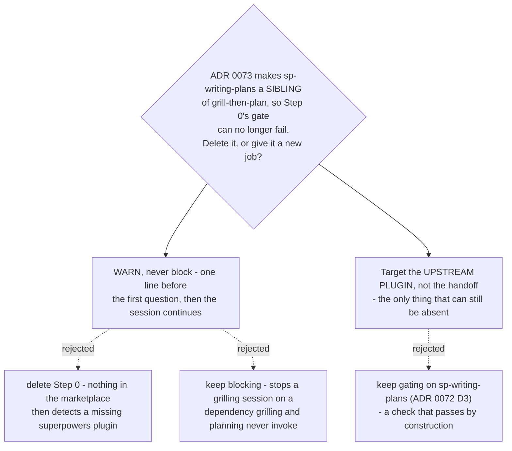

# `grill-then-plan`'s preflight warns about the upstream plugin, and stops blocking

- **Status:** Accepted
- **Date:** 2026-08-15
- **Supersedes Decision 3 of** [ADR 0072](0072-arc-handoffs-name-sp-writing-plans-in-short-form-and-the-preflight-retargets.md),
  which kept Step 0 as a blocking gate and pointed it at `sp-writing-plans`.
- **Builds on** [ADR 0073](0073-vendored-review-skills-live-inside-dev-workflows-not-a-plugin-of-their-own.md),
  which put the Vendored Skills in `dev-workflows` and so removed the last way that
  gate could fail.

## Context

ADR 0072 Decision 3 kept `grill-then-plan`'s Step 0 preflight and retargeted it from
the superpowers plugin onto `sp-writing-plans`. It said so conditionally, and named
the condition: *"Deleting Step 0 outright was the real alternative. If the copies land
in `dev-workflows` … the dependency cannot fail, and the gate is dead weight. It was
rejected because `host-plugin` has not said that."*

`host-plugin` has since said it. ADR 0073 puts the six Vendored Skills in
`dev-workflows`, alongside `grill-then-plan`. Four measurements follow, all taken on
tracked files at `e7979ee`.

**1. The retargeted gate cannot fail on either harness.** On Claude Code a plugin
installs whole, so both Skills arrive together. On Antigravity,
`plugins/dev-workflows/.antigravity/install-antigravity.py:50-52` — `discover_skills()`
— enumerates *every* directory under `skills/` that holds a `SKILL.md`. There is no
allowlist and no per-skill flag, so one run stages both or neither. And
`skilloverrides-live-check` measured on Claude Code 2.1.232 that `skillOverrides`
cannot reach a plugin skill by either key form, so it cannot switch one of the pair
off. There is no path to "`grill-then-plan` present, `sp-writing-plans` absent".

**2. The upstream plugin is still a functional dependency — two hops later.** ADR 0072
measured `writing-plans`' single upstream reference as passive, which is correct and is
why the *handoff* is safe. But the arc that handoff opens is not. ADR 0075 counts, at
`871e5f3`, **8** qualified references in the copies that stay pointed upstream on
purpose: `superpowers:finishing-a-development-branch` (×5) and
`superpowers:using-git-worktrees` (×3). Per ADR 0069 they sit in `writing-plans`,
`subagent-driven-development` and `executing-plans` — so the plan `sp-writing-plans`
produces is executed by a Skill that does invoke superpowers.

**3. Step 0 is the only executable superpowers check in the marketplace.** A search
across `plugins/`, root `README.md` and `PLAYBOOK.md` finds the rest are prose or
metadata: `plugins/dev-workflows/README.md:59` states the requirement in a blockquote,
`.antigravity/INSTALL.md:71` in a parenthesis, `reflect/SKILL.md:127` in a memory note,
and `plugin.json:19` lists `superpowers` as a **keyword**, not a dependency. Nothing
else detects, and nothing else stops.

**4. The plugin can genuinely be absent.** No manifest declares it, and on Antigravity
the port is a separate manual install — `install-antigravity.py` stages only this
plugin's own skills. The failure is the one this whole effort exists to prevent: a
colleague installs the marketplace, runs a design session, approves a spec and receives
a plan, all clean, and the gap appears days later when someone executes that plan.

## Decision 1 — the blocking gate goes

Step 0 stops refusing to start. Its six-step structure, its install-command guidance
and its "wait for the user to confirm, then re-verify" loop all go with it, because
each of those exists to serve a stop that no longer happens.

Keeping the block was the real alternative, and it is the safest reading of Step 0's
own stated purpose. It was rejected because grilling and planning do not invoke
superpowers — ADR 0072 measured that and it still holds. A block would stop a session
that was going to succeed, on behalf of a step the user may never take, and
`grill-then-plan`'s output (a spec, then a plan) is useful on its own.

## Decision 2 — Step 0 becomes a one-line warning about the upstream plugin

What remains is a single non-blocking notice, emitted before the first grilling
question, when the superpowers plugin is not detected. It names the two Skills the arc
still reaches upstream (`finishing-a-development-branch`, `using-git-worktrees`), says
plainly that the spec and the plan will be written normally, and says the gap appears
at execution. Then the session continues without waiting.

Detection stays exactly as ADR 0072 left it — by **skill availability**, harness-
agnostic and plugin-agnostic. Only the subject changes back: the upstream plugin, not
`sp-writing-plans`.

Deleting Step 0 outright was the other real alternative, and it is what measurement 1
alone would justify. It was rejected on measurement 3: the check is the marketplace's
only one, so deleting it leaves the requirement stated exclusively in documentation
that nobody reads while working. The cost of keeping it is one line and no wait.

**This warning is a courtesy, not a guarantee.** It fires where the arc *starts*, not
where the dependency *bites*, and a user who dismisses it has been told once and
nothing more. It is strictly better than the silence Decision 1 would otherwise leave,
and strictly weaker than a check at the point of use — which belongs to
`sp-executing-plans`, not here.

## Consequences

- The frontmatter's `Requires the superpowers plugin.` becomes accurate for the first
  time: it is required for the arc, not for this Skill. Reword rather than delete.
- `plugins/dev-workflows/README.md:59` and `.antigravity/INSTALL.md:71` currently state
  the requirement flatly. Both should say *where* it bites, so prose and behaviour
  agree.
- Nothing here is implemented. This is a Decision map; the rewrite lands with ADR
  0072's other ten repointed references, in the build that follows.

## Verification

Both are one command each, and both must hold after the change:

- `grill-then-plan/SKILL.md` contains **no** instruction that stops or waits — no
  "STOP", no "wait for the user to confirm", no "do not start grilling";
- it names `finishing-a-development-branch` and `using-git-worktrees` at least once
  each, which is what distinguishes the warning from the gate it replaces.
