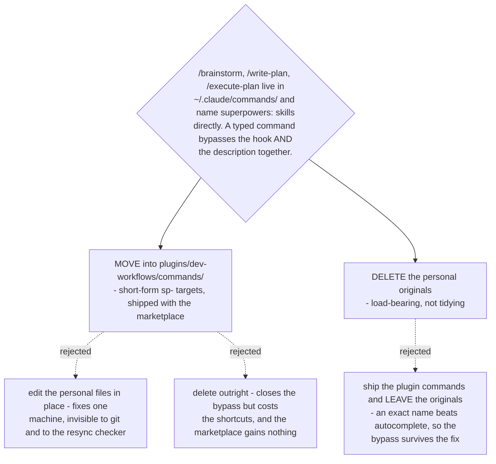

# The three personal commands become plugin commands, and the originals are deleted

- **Status:** Accepted
- **Date:** 2026-08-15
- **Closes the gap charted by** [ADR 0071](0071-vendored-review-skills-take-the-sp-prefix-and-displace-upstream-by-description.md),
  whose Consequences recorded that three commands in the owner's home directory bypass
  both the host hook and description displacement, and left it "charted separately".
- **Follows** [ADR 0002](0002-repo-as-single-source-of-skills.md), which made this repo
  the single source of truth for daily-arc tooling by consolidating personal copies into
  it.

## Context

ADR 0071 measured the gap and deferred it: `/brainstorm`, `/write-plan` and
`/execute-plan` each name a `superpowers:` skill directly, and all three name skills on
the copy list (`brainstorming`, `writing-plans`, `executing-plans`). A typed command
carries more authority than a skill description and never consults the host hook, so
every touchpoint in those three skills is lost whenever a command is used — silently,
with no error and no warning. That is the same silent-failure shape ADR 0070 rejected
option C to avoid.

Two facts decided the shape, both measured on tracked files:

**Moving into the plugin does not cost the typed shortcut.** `PLAYBOOK.md:4` records
that `/daily` is *installed* as `/dev-workflows:daily`, and that typing the bare
`/daily` finds it through autocomplete. So a plugin command keeps its short spelling in
practice, and the muscle-memory objection to moving these three does not hold.

**The marketplace already has the shape.** `CLAUDE.md` fixes it: a command is a thin
wrapper at `plugins/<plugin>/commands/<name>.md` with `description` and
`argument-hint` frontmatter, handing off to a skill via `$ARGUMENTS`, with the logic in
the skill. Four plugins ship commands this way already. Nothing new is invented here.

**Not measurable from this session.** The three files live in the owner's home
directory, outside the repository and outside this container, so their bodies were not
read. This decision rests on ADR 0071's measurement of what they name, which is the only
property the decision turns on.

## Decision 1 — the three become plugin commands in `dev-workflows`

They ship as `plugins/dev-workflows/commands/{brainstorm,write-plan,execute-plan}.md`,
each naming its Vendored Skill in **short form** — `sp-brainstorming`,
`sp-writing-plans`, `sp-executing-plans` — per ADR 0071 Decision 2 and ADR 0072
Decision 2. `dev-workflows` is the host because ADR 0073 put the Vendored Skills there;
a command and the skill it wraps ship together or the pair can be half-installed.

Editing the three files in place was the real alternative, and it is strictly faster: it
closes the bypass on the owner's machine today with no repo change at all. It was
rejected because it fixes exactly one machine. The files are outside the marketplace, so
nothing about them is version-controlled, reviewable, or shippable, and ADR 0075's
resync checker — which is driven by a manifest of repo files — cannot see them. The day
upstream renames one of the six, the checker reports clean and the three commands rot
unnoticed.

Deleting them outright was the other alternative. It closes the bypass at the lowest
cost of all, and it was rejected only because the shortcuts have value the marketplace
can now carry for everyone rather than for one person.

## Decision 2 — the personal originals are deleted, and that deletion is load-bearing

Shipping the plugin commands **without** removing `~/.claude/commands/brainstorm.md`
and its two siblings does not close the bypass. A personal command is an exact name
match; the plugin one is reached through autocomplete. The old file keeps winning, and
the fix looks applied while the silent failure continues — the worst of the three
outcomes, because it also removes the motive to look again.

So the deletion is part of the decision, not cleanup after it.

## What this does and does not distribute

The ticket asked how a repoint reaches a colleague's machine. Decision 1 *is* that
answer: the commands become part of the marketplace, so they install with the plugin
like everything else.

Decision 2 does not distribute, and cannot. Removing a file from someone's home
directory is not something a plugin install can do. For the owner it is one manual step,
recorded here. For any colleague who has authored their own `/brainstorm`, nothing in
this marketplace will find it or warn about it — see the fog line this decision adds.
That gap is the same *shape* as `override-distribution`'s question but a different
artifact: this is about files that must be **removed** from a machine, not settings that
must be **added** to one.

## Consequences

- The three commands need PLAYBOOK visibility alongside the six Vendored Skill rows
  already owed under ADR 0071 and ADR 0077.
- `plugin.json` and the marketplace entry must stay version-synced when these land
  (`CLAUDE.md`), as with any other addition to `dev-workflows`.
- Nothing here is implemented. This is a Decision map; the three files land in the build
  that follows, with ADR 0072's repointed references and the vendoring itself.

## Verification

Three checks, all one command each:

- `plugins/dev-workflows/commands/` contains `brainstorm.md`, `write-plan.md` and
  `execute-plan.md`;
- none of the three contains the string `superpowers:`;
- each names its `sp-` target once, with no plugin prefix.
