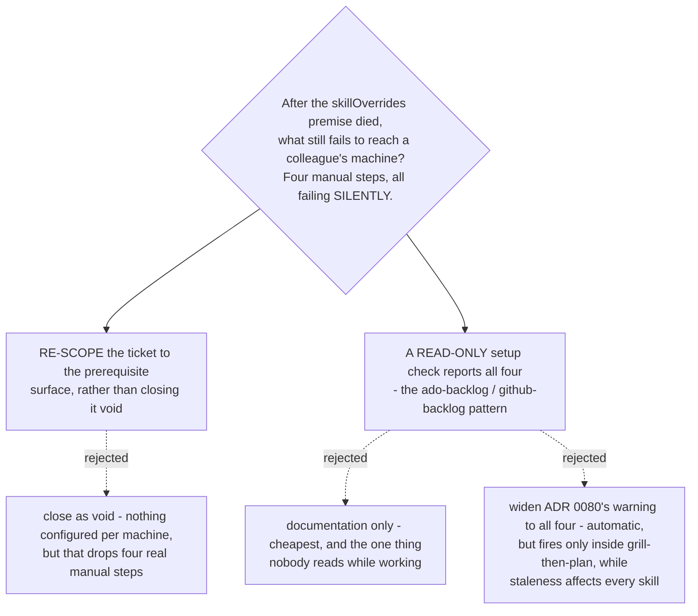

# A read-only setup check reports the four manual steps the marketplace cannot ship

- **Status:** Accepted
- **Date:** 2026-08-15
- **Re-scopes** the `override-distribution` ticket, whose original question — *"how do
  the six `skillOverrides` entries reach a colleague's machine?"* — has no subject:
  `skilloverrides-live-check` measured `skillOverrides` inert against plugin skills on
  Claude Code 2.1.232, and [ADR 0070](0070-host-sessionstart-hook-repoints-the-one-skill-the-upstream-hook-names.md)
  replaced that lever with a hook that ships inside the plugin.
- **Completes** [ADR 0080](0080-the-preflight-warns-about-the-upstream-plugin-and-stops-blocking.md)
  and [ADR 0081](0081-the-three-personal-commands-become-plugin-commands-and-the-originals-are-deleted.md),
  each of which left one manual per-machine step recorded but unowned.

## Context

Four earlier sessions each left the same note on this ticket: the question assumes six
`skillOverrides` entries, and there are none. ADR 0070 states outright that *"no
settings key is required on a colleague's machine."* Two outcomes were left open for
whoever took the ticket — close it void, or re-scope it — explicitly as the taker's call
with the owner.

**The Antigravity hook gap is a non-gap, and this was checked rather than assumed.**
`install-antigravity.py`'s own header records that Antigravity *"discovers skills by
folder, matches them semantically on their `description`"*, and the installer contains
no hook handling at all. There is no plugin system there, so the **upstream** superpowers
hook is absent too — the host hook has nothing to counter, and its absence costs nothing.
Displacement on Antigravity rests entirely on descriptions, which ADR 0071 Decision 3
already settled.

That check did surface something else: **ADR 0070 never mentions Antigravity.** Its
mechanism is Claude-Code-only and the ADR does not say so, which invites exactly the
wrong inference. A dated scope note is added to it in this same change — a clarification,
not a supersession: the decision it records is unchanged.

**What actually fails to arrive**, measured across both harnesses:

| # | manual step | harness | shipped? |
|---|---|---|---|
| 1 | install the upstream `superpowers` plugin (the 8 non-copied refs) | Claude Code | no — ADR 0080 warns, non-blocking |
| 2 | delete a personal `/brainstorm`, `/write-plan`, `/execute-plan` | either | no — un-shippable by construction (ADR 0081) |
| 3 | run `install-antigravity.py`, **and re-run it after every update** | Antigravity | no |
| 4 | install a superpowers skills port | Antigravity | no — stated once, in a parenthesis at `INSTALL.md:71` |

Every one fails **silently**: `short-ref-resolution` measured 2/2 that an absent copy
does not error, it launches the upstream twin. Step 3 is the worst of the four, because
a stale staged copy is not missing — it is a wrong version that answers normally.

## Decision 1 — the ticket is re-scoped, not closed void

Its question becomes: *what must a colleague do by hand that this marketplace cannot
ship, and how do they find out?* Closing it void was the real alternative and is
defensible on the letter of the original question, but it would have dropped all four
steps on the floor at the moment the map has nothing else open to catch them.

## Decision 2 — a read-only setup check, following the pattern already in this repo

`plugins/dev-workflows/scripts/setup_check.py`, with a thin
`/dev-workflows:setup-check` command wrapping it. It prints one `PASS` / `WARN` / `FAIL`
line per check with a fix for anything missing, changes nothing, and covers all four
rows above.

This is not an invention: `ado-backlog` and `github-backlog` each ship exactly this —
`scripts/setup_check.ps1` behind a `setup-check` command whose body says *"For each
`FAIL` line, give me the exact command to fix it."* Python rather than PowerShell,
because `dev-workflows/scripts/` is Python throughout and the check must run wherever
Antigravity does.

It is also the only option that produces a **positive** signal. Documentation and an
automatic warning can both tell you something is wrong; only a check can tell you
everything is right, which is what a colleague setting up a new machine actually needs.

Documentation alone was rejected as the weakest form of the thing that has already
failed here — the requirement is *already* written at `README.md:59` and
`INSTALL.md:71`, and the gap persisted. Widening ADR 0080's warning was rejected because
it fires only when `grill-then-plan` runs, while step 3's staleness degrades every skill
in the plugin.

**ADR 0080's warning stays.** The two are complements, not duplicates: the warning is
automatic and covers the single most common case; the check is on demand and covers the
whole surface. Neither makes the other redundant.

## Consequences

- The check is only as good as the running of it. It must be named in the install
  instructions of both harnesses, and it is a `WARN`-level answer to a silent failure,
  not a gate.
- Step 3's check — staged copies versus the repo — is the same *shape* as ADR 0075's
  resync checker but not the same comparison (that one is upstream versus repo). Keep
  them separate: different sources, different audiences, different fixes.
- A new command means a PLAYBOOK row and a version bump on `plugin.json` plus the
  marketplace entry, per `CLAUDE.md`.
- Nothing here is implemented; this is a Decision map. The script lands in the build.

## Verification

- `plugins/dev-workflows/scripts/setup_check.py` exists and exits non-zero when a check
  fails;
- it emits one line per row of the table above — four checks, no fewer;
- `plugins/dev-workflows/commands/setup-check.md` exists and calls it via
  `${CLAUDE_PLUGIN_ROOT}/scripts/`.
