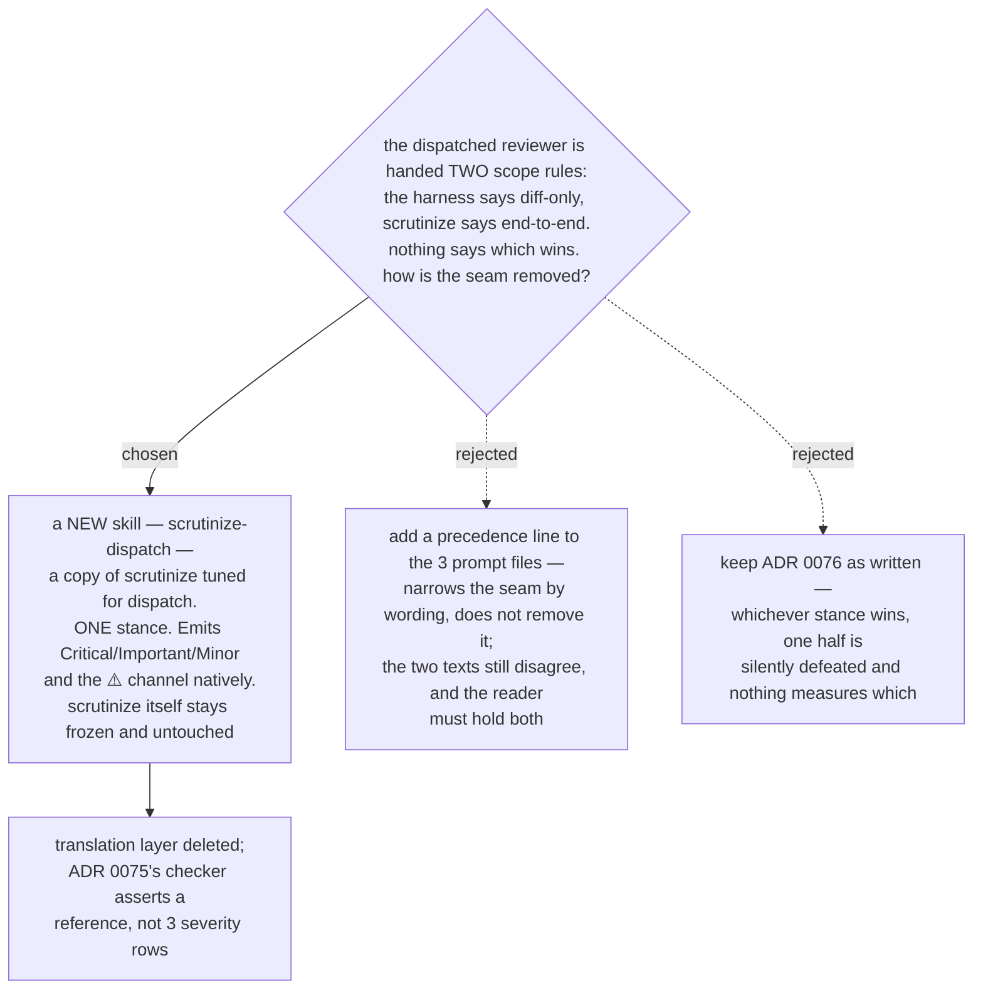

# The dispatched reviewer runs a dispatch-tuned copy, not the frozen `scrutinize`

- **Status:** Accepted
- **Date:** 2026-08-15
- **Supersedes** [ADR 0076](0076-reviewer-prompt-is-the-harness-scrutinize-is-the-engine.md).
  Its harness/engine split, its three-row severity translation and its dropped
  `Strengths` section are all replaced by this decision. Its *measurements* stand —
  including the live confirmation that a dispatched subagent inherits `effort: max`.
- **Takes the escape hatch** ADR 0076 recorded and did not take: *"`scrutinize` is never
  edited. If a change to it is genuinely required, the change goes into a NEW skill that
  is a copy of it."* Set by the owner at chart time, exercised here.
- **Changes the destination line** of the *route every superpowers review step to
  scrutinize* map, which is what taking the hatch was defined to mean.

## Amendment — 2026-08-16: two routed prompts, not three

**Amended 2026-08-16.** This ADR was written when class 1 of
[ADR 0074](0074-the-six-skills-are-vendored-whole-then-one-rewrite-pass.md) covered
**three** live reviewer prompts. It covers **two**. Only `code-reviewer.md` and
`task-reviewer-prompt.md` name `scrutinize-dispatch`.

`re-review-prompt.md` is deliberately **unrouted**. A re-review verdicts each prior
finding as ADDRESSED / NOT ADDRESSED — a concept `scrutinize-dispatch` has no notion of,
since that skill emits Critical/Important/Minor findings against a diff, not a
disposition against an earlier report. Routing it would hand the re-reviewer an output
contract that cannot express its verdict. The file is still vendored **verbatim** from
upstream, because ADR 0074's 1:1 upstream mapping depends on which files are *copied*,
not on which are *rewritten*.

**ADR 0075's checker must therefore assert two references, not three.** This corrects the
line under *Consequences* below (*"it asserts that each of the three prompt files
references `scrutinize-dispatch`"*), which specifies exactly what that checker asserts and
so propagates into its design. The same count is stale wherever this ADR says "three
prompt files" — in *The decision* (*"The three live reviewer prompts name **it** instead
of `scrutinize`"*), in *Why this is cheaper than the precedence line*, in *The cost,
recorded honestly*, and in *Measured for this decision*. Read "three prompt files" as
"the two routed prompt files, plus `re-review-prompt.md` unrouted" throughout. The four
reviewer *dispatches* and the three vendored prompt *files* are unchanged; only how many
of them carry a `scrutinize-dispatch` reference changes.

The original decision text is left as written below; only this amendment narrows the
count. This amendment — not any session-local ruling record — is the committed source for
the routing-target rule.

## The seam this removes

ADR 0076 split the dispatch in two: the prompt file is the **harness** — it keeps its
placeholders, its operational rules, its output contract **and its scoping rules** — while
the review *method* is delegated to the frozen `scrutinize`. The split is clean everywhere
except scope, where the two halves contradict each other in plain words.

| the harness says | the engine says |
|---|---|
| `task-reviewer-prompt.md:40` — *"The diff's context lines ARE the changed files: **do not Read a changed file separately**"* | `scrutinize` — *"**End-to-end, not diff-local.** The diff is the entry point, not the scope."* |
| `:45` — *"**Do not crawl the broader codebase.**"* | Step 2 — *"**Include the unchanged code on either side of the diff.** Bugs hide at the seams."* |
| `:111` — *"report it as a ⚠️ item **instead of broadening your search**"* | Step 3 — *"**Enumerate *every* call site**, field and branch the rule claims to cover."* |

The subagent receives both. Nothing states a precedence, and both outcomes fail quietly:

- **Engine wins.** The ⚠️ channel goes empty, because `scrutinize` resolves rather than
  defers. The controller's cross-task adjudication at
  `subagent-driven-development/SKILL.md:345-352` — *"you must resolve each one yourself
  before marking the task complete"* — then never fires, because it has no input. Cost
  compounds too: whole-codebase tracing per task, times every task, at the `effort: max`
  ADR 0076 measured at roughly 2-4x the thinking tokens of the control.
- **Harness wins.** `scrutinize`'s steps 2 and 3 are both disabled, and what remains of
  the delegation is its vocabulary. That is the built-in reviewer wearing new labels —
  precisely the silent failure this map exists to remove.

ADR 0079's routing probe does not settle it: it measures that the reviewer *loaded*
`scrutinize`, not which stance it then followed.

## The decision

A new skill, `plugins/dev-workflows/skills/scrutinize-dispatch/`, is a copy of
`scrutinize` tuned for one caller: a dispatched reviewer subagent. The three live reviewer
prompts name **it** instead of `scrutinize`. `scrutinize` is not edited, not referenced by
the prompts, and keeps its human-facing behaviour exactly.

The tuned copy differs from `scrutinize` in four places, and nowhere else:

1. **Scope is the task's blast radius, not the whole call graph.** It inherits the
   harness's rule directly — the diff is the view, and code outside it is inspected only
   to evaluate a named risk. The contradiction is gone because only one document now
   states a scope.
2. **It emits `Critical` / `Important` / `Minor` natively**, so nothing translates at the
   boundary and the controller's gates at `SKILL.md:356`, `:401` and `:442` match the
   words they were written for.
3. **It keeps the ⚠️ "cannot verify from diff" channel**, which `scrutinize` has no
   concept of and which the controller gates on at `:356` alongside severity.
4. **Its verdicts are upstream's** — `Ready to merge` / `Task quality: Approved | Needs
   fixes` — rather than `ship / fix-then-ship / rework / reject`.

Everything that makes `scrutinize` worth routing to is carried over unchanged: the
outsider stance, the mandatory simpler-alternative pass, the trace discipline, *"cite or
it didn't happen"*, *"distinguish claim from verification"*, the invariant-enumeration
check (now scoped to the blast radius), and *"no flattery, no hedging"*.

## Why this is cheaper than the precedence line

The rejected alternative adds one precedence sentence to each of the three prompt files
and a fourth assertion row to ADR 0075's checker. It is genuinely cheaper to write. It is
rejected because it narrows the seam without closing it: the harness text and the
`scrutinize` text still say opposite things, and the reviewer still has to hold both and
apply a tie-break. Every future upstream pull re-lands the harness half of that
contradiction, and the checker can only assert that the tie-break line is *present*, never
that it was *obeyed*.

This decision deletes the disagreement instead of adjudicating it. It also removes the
translation layer entirely — ADR 0076's three severity rows exist only because the engine
spoke a different language than the consumer, and a tuned copy speaks the consumer's
language.

## The cost, recorded honestly

ADR 0076 rejected inlining the stance into the three prompt files on the grounds that a
second copy of a frozen skill's text is **free to drift**. That objection applies to this
decision too, and it is not dissolved by the owner's sanction.

What changes is its size and its shape. Inlining made **three** copies, embedded inside
files that upstream churns and that every resync re-applies. This makes **one** copy, in a
file this repo owns outright, that no upstream pull ever touches. And it is a *declared
fork with a stated delta* — the four differences above — rather than three silent
duplicates. Drift in a declared fork is visible; drift in an embedded duplicate is not.

The residual risk is real and belongs on the fog list: nothing yet compares
`scrutinize-dispatch` against `scrutinize` when the latter is improved. That is a new
question this decision creates and does not answer.

## Consequences

- ➕ The scope contradiction is removed rather than adjudicated. One document states the
  reviewer's scope.
- ➕ The translation layer is deleted. ADR 0075's checker no longer asserts three severity
  rows; it asserts that each of the three prompt files references `scrutinize-dispatch`.
  That is a stronger check — a reference either resolves or it does not.
- ➕ `scrutinize` is untouched in the strongest sense: not edited *and* not depended on by
  the dispatch path, so it can be improved later without a dispatched review changing
  underneath anyone.
- ➖ The map's destination changes: touchpoints route to a dispatch-tuned copy of
  `scrutinize`, not to `scrutinize` itself. This was defined as the owner's call and was
  taken by the owner.
- ➖ One more skill in `dev-workflows`, and one more PLAYBOOK row.
- ➖ A second stance document exists and can drift. Unmitigated; see the fog line this
  decision adds.
- ADR 0076's `Strengths`-section reasoning no longer applies — the tuned copy owns its own
  output format and can carry or drop the section on its own terms.

## Measured for this decision

Upstream superpowers **`b36e0829c6d0`** (byte-identical to the `6.3.0` cache dir). The
harness scoping rules were read at `skills/subagent-driven-development/task-reviewer-prompt.md`
lines **40**, **45** and **111**; the controller's cross-task adjudication at
`skills/subagent-driven-development/SKILL.md` lines **345-352**, and its severity gates at
**356**, **401** and **442**. `scrutinize` is
`plugins/dev-workflows/skills/scrutinize/SKILL.md`, **74 lines**, `effort: max`. This repo
at **`381040d`** on `main`.

The four reviewer dispatches and three prompt files this decision applies to are
unchanged from [ADR 0074](0074-the-six-skills-are-vendored-whole-then-one-rewrite-pass.md),
re-verified against the source for this decision: `requesting-code-review/SKILL.md:34`,
`subagent-driven-development/SKILL.md:352`, `:398`, and `:454`.
