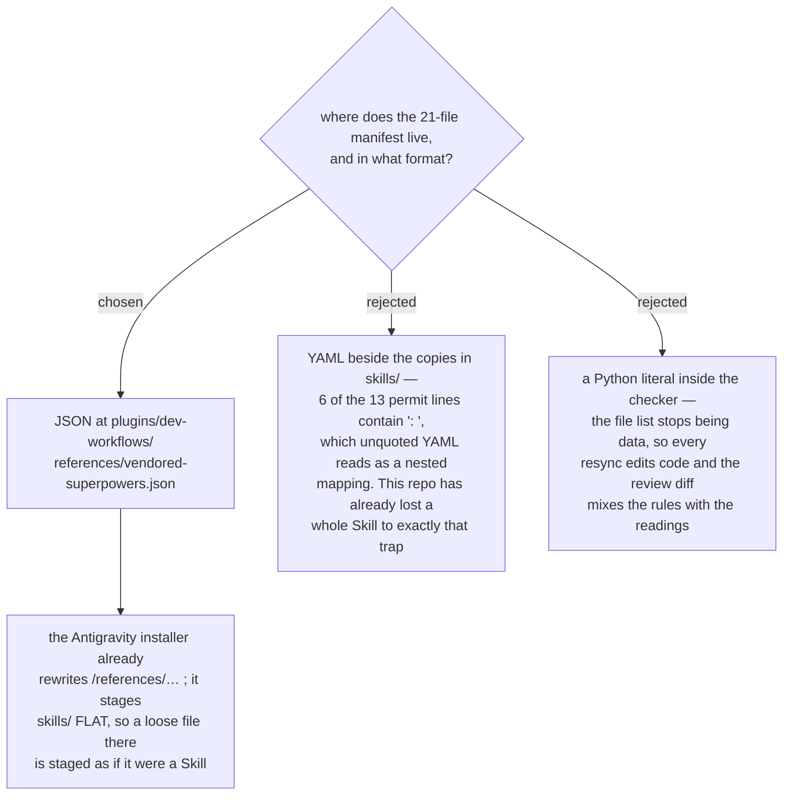

# The vendoring manifest is JSON under `references/`, not YAML beside the copies

- **Status:** Accepted
- **Date:** 2026-08-16
- **Refines** [ADR 0075](0075-resync-is-a-checker-script-and-one-recorded-sha.md), which places the
  manifest as *"one file beside the copies, read only by the program"*. The
  *read-only-by-the-program* half stands unchanged. This ADR moves the location and fixes
  the format, because *beside the copies* means `skills/`, and that directory has a
  staging rule the manifest would trip.

## Why not `skills/`

ADR 0075's *"beside the copies"* resolves to
`plugins/dev-workflows/skills/vendored-superpowers.json`. That location is wrong for one
harness-specific reason recorded in `CLAUDE.md`: the Antigravity installer
(`plugins/dev-workflows/.antigravity/install-antigravity.py`) stages skills **flat**,
mapping `${CLAUDE_PLUGIN_ROOT}/skills/` onto `<dest>/`. A non-skill file sitting at that
level is staged as though it were a Skill directory's neighbour, in a harness that has no
plugin namespace to disambiguate it.

`references/` is the plugin's documented location for data the plugin carries, and
`${CLAUDE_PLUGIN_ROOT}/references/…` is one of exactly three path shapes that installer
already rewrites. Putting the manifest there needs no installer change; putting it in
`skills/` would need one.

The manifest is also not read by any Skill — only by
`plugins/dev-workflows/scripts/check_vendored_superpowers.py`. Physical adjacency to the
files it describes buys nothing a path string does not already buy, and ADR 0075's real
requirement is that **one** file records the set, not that it sit in a particular folder.

## Why JSON and not YAML

The manifest carries a **permit list** ([ADR 0087](0087-the-permit-list-records-each-line-verbatim-not-a-rule-per-category.md))
that stores the exact text of every line allowed to hold a bare upstream Skill name.
Measured over the 13 entries that exist today:

| property of the 13 permitted lines | count |
|---|---|
| contain `: ` — the YAML key-separator sequence | **6** |
| contain a `:` anywhere | 8 |
| contain a single-quote | 10 |
| contain a double-quote | 2 |
| longest line | **363** characters |
| carry a non-ASCII character (em-dash) | 3 |

Six of the entries are the `description:` frontmatter lines this marketplace wrote, and
every one of them opens `description: 'You MUST use this, and not the upstream superpowers
…'`. Stored unquoted in YAML, a value containing `: ` parses as a nested mapping or is
rejected outright — and this repo has already lost a whole Skill to precisely that trap,
silently, with no error message. Ten of the thirteen also contain a single-quote, so the
usual mitigation (single-quote the value) itself needs escaping.

JSON has one string rule, one escape rule, and no context in which a colon inside a value
changes the parse. It is also in the standard library, so the checker gains no dependency;
`check_doc_provenance.py` needs PyYAML, and this program should not.

The repo precedent agrees: the `ado-backlog` data contracts are JSON.

## Consequences

- ➕ No installer change, and no risk of a data file being staged as a Skill.
- ➕ No new dependency: `json` is stdlib, where PyYAML is not.
- ➕ The one class of silent parse failure this repo has actually been bitten by cannot
  occur.
- ➖ The manifest no longer sits next to what it describes, so a reader browsing `skills/`
  does not trip over it. Mitigated by naming it in `CLAUDE.md`, in the resync procedure,
  and in the checker's own `--help`.
- ADR 0075's *"one file beside the copies"* is superseded on location only. Every other
  property it requires — one sha for the whole set, per-file state and hash, read by the
  program alone — is unchanged.

## Measured for this decision

The 13 permitted lines were read from the seven files that contain them at repo commit
`16de152`, and the counts above are computed from those lines, not transcribed. Upstream
`obra/superpowers` at `b36e0829c6d0`. The installer's three rewritten path shapes are
`/references/…`, `/scripts/…` and `/skills/…`, per `CLAUDE.md`.
