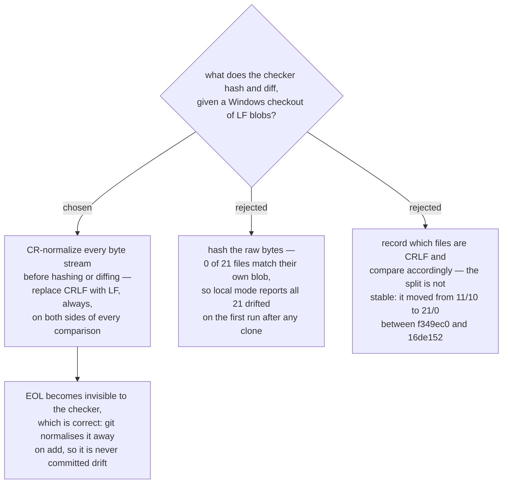

# Every hash and every comparison strips CR first — the working tree's line endings carry no information

- **Status:** Accepted
- **Date:** 2026-08-16
- **Corrects a measurement of** [ADR 0074](0074-the-six-skills-are-vendored-whole-then-one-rewrite-pass.md).
  Its *Resync diffs must ignore CR at end of line* section records **eleven** of the 21
  working-tree files as CRLF and **ten** as LF matching upstream exactly. Measured today at
  `16de152`: **twenty-one** of 21 are CRLF and **zero** match. ADR 0074's *conclusion* — a
  resync comparison must ignore CR — is not weakened by this; it is the only part that
  survives, and it now applies to every file rather than to six.

## What was measured

At `16de152`, reading each of the 21 files as raw bytes from the working tree and each
corresponding blob with `git cat-file blob HEAD:<path>`:

| | count |
|---|---|
| committed blobs that are CRLF | **0** of 21 |
| working-tree files that are CRLF | **21** of 21 |
| working-tree file equal to its own blob, byte for byte | **0** of 21 |

`core.autocrlf` is `true` and the repo has **no** `.gitattributes`, which explains both
columns: git normalises CRLF away on `add`, so every blob is LF, and converts back on
checkout, so every checked-out text file is CRLF.

## Why this forces the decision

ADR 0075 requires the manifest to hold *"a content hash taken at vendoring time"* per file.
A hash over **raw** bytes answers a different question depending on how the file most
recently arrived on disk. A file written directly by a tool is LF; the same file after a
`git checkout` is CRLF; the two hash differently at the same commit with identical content.

The consequence is not a subtle inaccuracy — it is total. Because 0 of 21 files match their
own blob, a raw-byte manifest built on one machine reports **all 21 files drifted** the
first time it runs on any other checkout. A drift checker that fails completely on its
first honest run is worse than no checker: it teaches its only reader to ignore it, and the
one real edit it was built to catch arrives inside a wall of 21 false ones.

## Why not track which files are CRLF

The tempting middle path is to record each file's line ending in the manifest and compare
in kind. It fails on the evidence that produced this ADR: ADR 0074 measured the split as
11 CRLF / 10 LF at `f349ec0`, and the same measurement at `16de152` — four commits later,
with no file content changed by those commits — reads 21 / 0. The split tracks which files
have been rewritten by a tool since the last checkout. **It is a property of the machine
and the hour, not of the content**, so recording it commits the checker to re-deriving a
number that moves underneath it.

Stripping CR removes the question instead of answering it. Nothing is lost: git already
refuses to record EOL in a blob here, so an EOL difference can never *be* the drift the
checker exists to find.

## Scope

This applies to every byte comparison the checker makes, on both sides:

- the manifest's per-file hash, at write time and at check time;
- local mode — copy versus recorded hash;
- `--upstream` mode — copy versus the upstream tree;
- the `verbatim` assertion, including `re-review-prompt.md`;
- the frozen-file guard ([ADR 0088](0088-the-checker-also-guards-the-frozen-scrutinize-skill.md)).

Equivalent to `diff --strip-trailing-cr` / `git diff --ignore-cr-at-eol`, applied
uniformly rather than per file.

## Consequences

- ➕ The same commit produces the same hash on any machine and after any checkout.
- ➕ ADR 0074's stated requirement is met by construction rather than by a runner
  remembering a flag.
- ➖ A genuine, intentional EOL change is invisible to the checker. Accepted: git cannot
  commit one here, so it is not a change the copies can carry.
- ➖ The counts in ADR 0074's resync section are stale as measurements. Its rule is not.
  Recorded here rather than by editing that ADR, since its decision is unaffected.
- The five vendored shell scripts are still committed `100644` where upstream is `100755`.
  That is a mode difference, not an EOL one; this ADR does not address it and the checker
  does not assert it.

## Measured for this decision

Repo at `16de152` on `main`, `core.autocrlf=true`, no `.gitattributes`, working tree clean.
Blobs read with `git cat-file blob`, working-tree files read as raw bytes. Cross-check
against ADR 0074's own figure: with CR stripped,
`sp-subagent-driven-development/SKILL.md` differs from upstream `b36e0829c6d0` by **24**
lines — identical to the 24 that ADR 0074 measured with `--strip-trailing-cr`, which
confirms this normalisation matches the one that ADR was written against.
