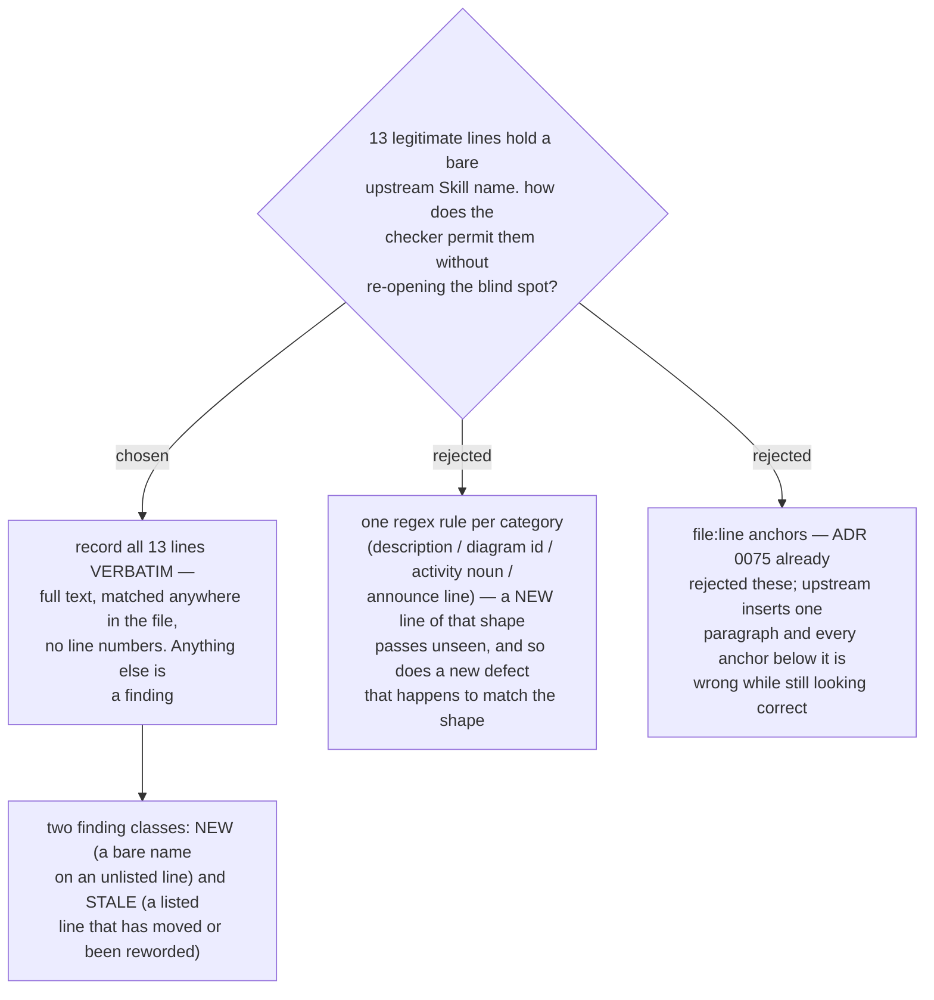

# The permit list records each line verbatim, not a rule per category

- **Status:** Accepted
- **Date:** 2026-08-16
- **Implements the check named in** [ADR 0071](0071-vendored-review-skills-take-the-sp-prefix-and-displace-upstream-by-description.md),
  Decision 2: *"a search for any of the six upstream short names, unprefixed, must return
  nothing."* That check was written down and never run. It is the check that would have
  caught the Critical defect Plan A shipped and later fixed.

## The failure this is shaped against

A Critical defect survived seven task gates, two fix rounds, a scoped re-review and a
passing acceptance probe. `sp-brainstorming` said *"writing-plans is the next step"*. A
bare short name resolves to the **unvendored** upstream Skill, with no error message —
ADR 0071 measured that substitution happening 2 out of 2 times when a twin exists, which
the `sp-` convention guarantees for all six copies.

Every assertion in Plan A missed it because every assertion was derived from the plan's
prose, and the prose carried the blind spot. ADR 0071 had the correct failing test written
in it the whole time and nothing ran it.

The lesson is specific: **a check derived from a sentence inherits the sentence's blind
spots.** So the permit list records the files, not a description of the files.

## What the 13 lines are

They fall into four groups, which is exactly why a rule-per-category looks attractive:

| group | count | example |
|---|---|---|
| our own `description:` frontmatter, naming the displaced upstream Skill | 6 | `description: 'You MUST use this, and not the upstream superpowers writing-plans skill, …'` |
| a DOT graph identifier | 1 | `digraph brainstorming {` |
| the word used as an activity noun, never as a Skill name | 4 | `…broken into sub-project specs during brainstorming.` |
| upstream's verbatim "announce the skill name" line | 2 | `**Announce at start:** "I'm using the writing-plans skill…"` |

Note what the two announce lines are: a bare short name, inside a quotation, naming a
Skill. Textually they are the **same shape as the defect**. They are inert only because
they instruct the agent to *say* a name, not to *load* one. No regex distinguishes "say
this name" from "hand off to this name" — only a reader does. That single fact disqualifies
the rule-based option: any rule loose enough to permit both announce lines is loose enough
to permit a handoff reworded into the same shape.

## Why loud is the correct trade here

Recording verbatim text means an upstream rewording of a permitted line becomes a finding.
That is noise, and it is the right noise:

- **The cost is bounded and mostly ours.** 6 of the 13 lines are the `description:` fields
  this marketplace wrote; upstream never touches them. Only 7 come from upstream, so a
  resync risks re-confirming at most 7 lines.
- **The moment of noise is the correct moment.** All of it lands during a resync, which is
  already a deliberate manual pass over 8 edited files. "Re-read 7 lines" is proportionate
  there and worthless as a background alarm.
- **The asymmetry is severe.** A false finding costs one read. A missed finding cost seven
  gates, two fix rounds and a probe that passed while the defect was live.

## Two finding classes, reported differently

The runner needs to know which of two things happened, because the repairs are opposite:

| class | meaning | repair |
|---|---|---|
| **NEW** | a bare short name on a line **not** in the permit list | read it. Either it is a routing defect — fix the file — or it is legitimate, and it joins the manifest |
| **STALE** | a permit entry whose text is **no longer present** in its file | the line moved, was reworded, or was deleted. Re-confirm it is still inert, then update the manifest |

A checker that reported both as one undifferentiated "mismatch" would push the runner back
to eyeballing, which is what ADR 0075 removed.

## Consequences

- ➕ ADR 0071's check finally runs, and runs against the files rather than against a
  sentence about them.
- ➕ No line numbers anywhere, as ADR 0075 requires — the program computes positions.
- ➖ Editing any of the six `description:` fields breaks the checker until the manifest is
  updated in the same change. This is a real friction and it is deliberate: a description
  is one of the three mechanisms that decides which Skill wins, so changing one should not
  be silent.
- ➖ The permit list grows with the copy set. At 13 entries it is legible; if it ever
  reaches a size where nobody reads it, that is the signal to revisit, not a reason to
  loosen it now.
- The count of 13 is a reading, not a constant. The checker must never assert "13"; it
  asserts that the *set* matches.

## Measured for this decision

The 13 lines were extracted at `16de152` from the seven files that contain them, with a
regex for the six upstream short names not preceded by `superpowers:` or `sp-`. Group
counts are computed from those lines. ADR 0071's second check — no `superpowers:` reference
to any of the six inside the copies — was measured at the same time and holds: the copies
carry 9 qualified references naming 3 upstream Skills
(`finishing-a-development-branch` x5, `using-git-worktrees` x3, `using-superpowers` x1),
none of which is in the copy set.
