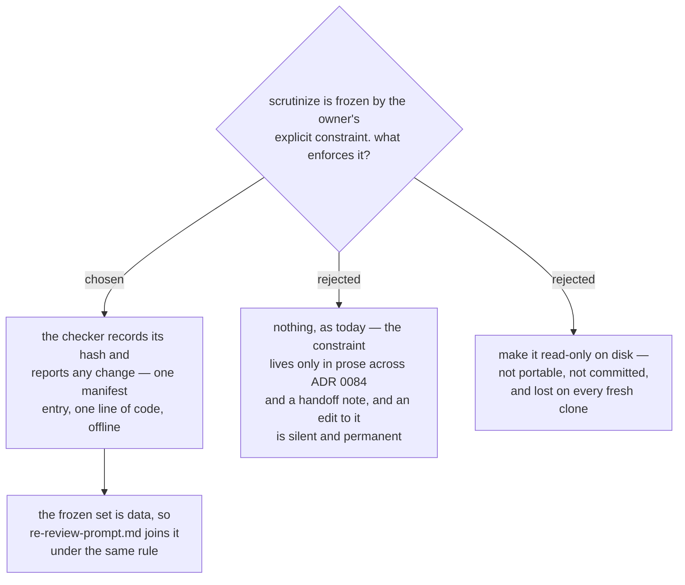

# The checker also guards the frozen `scrutinize`, which is not one of the 21 copies

- **Status:** Accepted
- **Date:** 2026-08-16
- **Extends** [ADR 0075](0075-resync-is-a-checker-script-and-one-recorded-sha.md) past its
  stated scope. That ADR's manifest covers the 21 vendored files. This adds one file that
  is not vendored at all.
- **Guards a constraint set by** [ADR 0084](0084-the-dispatched-reviewer-runs-a-dispatch-tuned-copy-not-the-frozen-scrutinize.md):
  *"`scrutinize` is never edited. If a change to it is genuinely required, the change goes
  into a NEW skill that is a copy of it."*

## Why it is in scope despite not being a copy

`plugins/dev-workflows/skills/scrutinize/SKILL.md` is this marketplace's own Skill, not a
vendored one, so ADR 0075's 21-file manifest does not reach it. But the reason the file
matters is the same reason the 21 matter: **an edit to it is silent, and the damage shows
up somewhere else.**

ADR 0084 took a deliberate fork. `scrutinize-dispatch` exists as a declared copy precisely
so that `scrutinize` never has to change. The whole argument for accepting a second stance
document — that *"drift in a declared fork is visible; drift in an embedded duplicate is
not"* — rests on `scrutinize` holding still. If someone improves `scrutinize` in place, the
fork silently becomes a fork of something that no longer exists, and nothing anywhere
reports it. Today that constraint is enforced by prose in one ADR and a line in a handoff
note.

The checker is already reading files in this plugin and hashing them CR-normalized. Adding
one entry costs a manifest row.

## The frozen set is data, not a special case

Two files are frozen for unrelated reasons:

| file | frozen because |
|---|---|
| `skills/scrutinize/SKILL.md` | the owner's explicit constraint (ADR 0084) — the human-facing engine must not move under the fork |
| `skills/sp-subagent-driven-development/re-review-prompt.md` | deliberately unrouted; must stay byte-identical to upstream (ADR 0084 amendment, ADR 0074 amendment) |

The second is already covered by the 21-file `verbatim` assertion, so it needs no second
mechanism — but it is listed in the manifest's frozen set anyway, because the *reason* it
must not be edited is different from the reason its neighbours must not be, and a future
reader looking for "what may I not touch?" should find one list rather than two rules in
two ADRs.

## What it does not do

This is a **tamper check, not a review**. It reports that `scrutinize` changed; it says
nothing about whether the change was good, and nothing about whether
`scrutinize-dispatch` should track it. ADR 0084 records that gap as fog — *"nothing yet
compares `scrutinize-dispatch` against `scrutinize` when the latter is improved"* — and
this decision does not close it. It converts the gap from **undetected** to **reported**,
which is the smallest honest step and the only one that needs no judgement at check time.

## Consequences

- ➕ An owner constraint that existed only in prose is now mechanical, offline and instant.
- ➕ The answer to "which files must I not edit?" is one list in one file.
- ➕ A frozen file's **directory** is governed too, not only the file. A hash guards
  `scrutinize/SKILL.md` against edits; the completeness check guards it against a
  *neighbour* appearing beside it, which a per-file hash cannot see.
- ➖ Any intentional future edit to `scrutinize` now requires a manifest update in the same
  change. That is the point, and it is one line.
- ➖ The manifest now describes 23 files while ADR 0075 speaks of 21. The 21 remain the
  *copy set*; the frozen set is a separate list in the same file, and the checker never
  conflates them — a frozen file has no upstream counterpart and is excluded from
  `--upstream` mode.
- The fog line ADR 0084 opened stays open.

## Measured for this decision

`plugins/dev-workflows/skills/scrutinize/SKILL.md` is **74 lines**, `effort: max`, unchanged
since ADR 0084 measured it at `381040d`. Repo at `16de152`.
`sp-subagent-driven-development/re-review-prompt.md` was measured **verbatim** against
upstream `b36e0829c6d0` at `16de152`, CR-normalized — confirming the amendment that
un-routed it was applied and that the file carries no `scrutinize-dispatch` reference.
