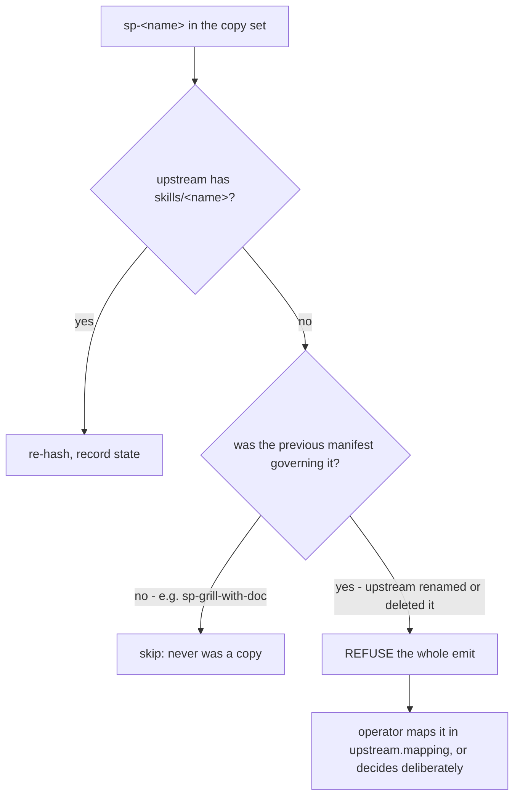

# ADR 0089 — `--emit-manifest` refuses an unmapped copy, and recomputes the upstream sha

- **Status:** Accepted
- **Date:** 2026-08-16
- **Context:** ADR 0075 (report-only resync checker), ADR 0085–0088

## Context

`--emit-manifest` recomputes the Vendoring manifest from the tree. It builds the
copy set by pairing each of our `sp-<name>` directories with upstream's
`skills/<name>`, and skips any `sp-` directory with no upstream counterpart —
that skip is how `sp-grill-with-doc` stays out of the copy set, since it carries
the prefix without being a copy (ADR 0071).

Two unrelated situations reach that same line. The second one is a rename or a
deletion upstream, and skipping there **silently deleted a file we still ship
from the manifest**. The copy stayed on disk; `check_copy_set` could not report
it, because it derives the governed set from the very manifest the file had just
left. A whole-branch review reproduced it: two governed files in, upstream
renames one, one file out, no stderr, and a clean run afterwards.

Separately, the emit carried `previous` forward wholesale and never recomputed
`upstream.sha`. Fresh hashes were therefore stamped with the previous commit's
provenance, and the resync procedure's own stop condition — *does upstream's
HEAD still match the recorded sha?* — could never be satisfied, because the
recorded sha could never advance.

Both defects share a shape: the emit resolving something on its own that only a
person can decide, or declining to recompute something only it can know.

## Decision

**An `sp-` directory that the current manifest governs, but which has no
upstream counterpart, aborts the entire emit.** No partial manifest is printed.
The error names the directory and the two legitimate resolutions.

**`upstream.mapping` is a real, validated manifest field** — `{"sp-beta":
"gamma"}` compares our `sp-beta/` against upstream's `skills/gamma/`. It is the
supported way to follow an upstream rename, and it is preferred over renaming
our own copy: our copy's name is how every routing reference in this marketplace
addresses the skill, and it should not change because upstream reorganised.

**`upstream.sha` is re-read from the checkout** with `git -C "$UP" rev-parse
HEAD` on every emit. If `$UP` is not a git checkout the emit writes a `REVIEW:`
placeholder. It never invents a sha and never carries the old one forward.

## Consequences

The emit can now fail where it used to succeed, and that is the point — the
failure is a rename nobody had noticed yet. The cost is one extra decision
during a resync that changes skill names upstream, which is rare and which
nobody should be making implicitly.

`upstream.mapping` adds a field a hand-editor can get wrong, so `load_manifest`
validates its shape and rejects a non-string target at exit 2, alongside every
other section.

Recomputing the sha means an emit run against a stale checkout records that
stale checkout honestly, rather than recording whatever the manifest happened to
say before. The summary line changed to match: it used to print `upstream
matches at <sha>` from the manifest's own record — a claim it had never checked,
with no git call anywhere in the program — and now names the commit actually
compared against.

This does not close the general gap. `emit_manifest` still cannot tell a
deliberate divergence from a lost rewrite, which is why the seven rewrite
classes in `references/resync-superpowers.md` are re-applied by hand and Class 7
carries an explicit warning that no finding will fire if it is dropped.
