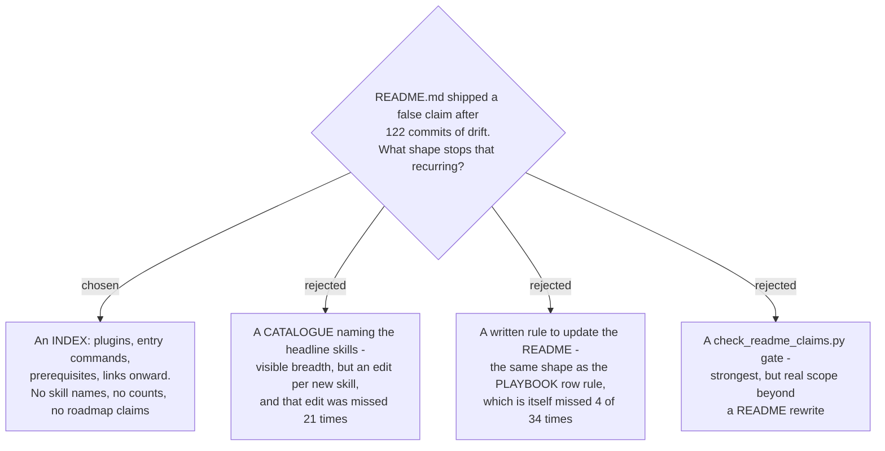

# The front page is an index for a stranger, not a catalogue of skills

- **Status:** Accepted
- **Date:** 2026-08-17

`README.md` is rewritten as an **index for a stranger**: what the marketplace is, a row per
plugin with its entry command and its real prerequisites, and links onward to
[PLAYBOOK.md](../../PLAYBOOK.md), `CONTEXT.md` and each plugin's own README. It states no
fact that churns — no skill names, no skill counts, no plugin version numbers, no roadmap
or "phase 2" status — because those are the facts that rotted.

## Context

The page had drifted **122 commits** without an edit, and the drift was not cosmetic:

| the claim | reality when measured, 2026-08-17 |
|---|---|
| decision-map is markdown-only, GitHub Issues is "phase 2 (ADR 0059)" | **false** — the GitHub backend shipped (ADR 0062, `github_map_ops.py`, plugin 0.9.1) |
| `dev-workflows` = the ~13 named skills | 34 skills; 21 never reached the page |
| prerequisites: `az login`, .NET 10, `openpyxl` | those are `ado-backlog`'s. `dev-workflows` needs Python 3 and the `superpowers` plugin; `github-backlog` needs `gh`, which was unlisted |

Two of those are worse than being out of date. The roadmap claim actively **turns a reader
away from a shipped feature**, and the global prerequisite block makes `dev-workflows` look
gated behind an Azure login it has never needed — while omitting the one dependency whose
absence fails *silently* (ADR 0080).

The procedural fix was tested against evidence before being rejected. `CLAUDE.md` already
carries the analogous rule — *every new skill adds one row to `PLAYBOOK.md`* — and that
rule is currently unmet for `reflect`, `review-pr`, `guide-and-verify` and
`sp-grill-with-doc`: 29 of 34. A rule of the same shape, on a page consulted even less
often during work, is not a mechanism.

## Decision

1. **Audience: a stranger first.** The first screen answers *what is this and why would I
   care*; install follows. A colleague loses little — install is four lines just below.
2. **Depth: index, not catalogue.** Plugins and *commands* are named, because commands are
   stable entry points. Skills are never named or counted here; the **Playbook** is the
   maintained skill index and the front page defers to it.
3. **No churning facts.** No plugin version numbers (which is why there is no version
   badge — the marketplace version has moved three times while `dev-workflows` reached
   0.43.0), and no roadmap status. Roadmap belongs in the ADR that owns it, where the
   supersession discipline already applies.
4. **Badges must be true.** `MIT`, `Claude Code`, `Antigravity`. No CI badge: this repo has
   no `.github/workflows`, and a green badge with nothing behind it is worse than none.

## Consequences

- **Breadth is now one click away, not zero.** A stranger sees five plugins with one crisp
  promise each; the 34-skill surface is visible only after opening `PLAYBOOK.md`. That is
  the accepted cost of a page that cannot rot.
- **The front page now depends on `PLAYBOOK.md` being complete.** Its four missing rows
  become load-bearing: the index points at a map with holes in it. Fixing them is the
  natural follow-up to this ADR.
- **Niche install paths moved out.** Antigravity collapses to a pointer at its own
  `INSTALL.md` (it had been documented in three places), and the personal-skills mirror
  moved to `docs/personal-skills-mirror.md` — it had been documented *only* on the front
  page, so it was moved rather than trimmed.
- **A checker was left on the table.** `check_readme_claims.py` — asserting the plugin rows
  match `marketplace.json` and that no forward-looking status claim survives — would make
  this structural, not merely intended. Two checker scripts already set that precedent
  (ADRs 0075, 0085–0089).
- **The glossary gained the two terms this decision needs** — **Front page** and
  **Playbook** — so "no skill names on the front page" is a rule the next contributor can
  look up instead of inferring.
