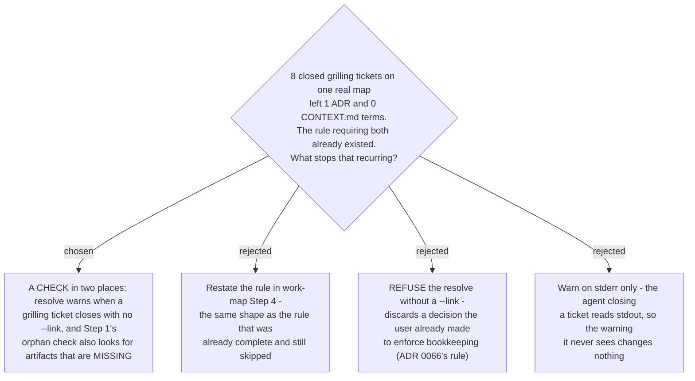

# A closed grilling ticket is checked for its artifact, at close time and at load time

- **Status:** Accepted
- **Date:** 2026-08-17

A `grilling` ticket exists to produce a durable artifact. `work-map` Step 3 already sends it
to `sp-grill-with-doc`, whose Step 4 already requires an ADR for every decision and a
`CONTEXT.md` term the moment one resolves. **That instruction was complete and was skipped
in silence**, because nothing ever checked it: `resolve` closed a `grilling` ticket with no
artifact as readily as one with an artifact, and Step 1's orphan check looked only for
artifacts that exist but are unrecorded — never for artifacts that were never written.

Measured on the `writing-practice-build` map: **8 closed `grilling` tickets, 1 ADR, 0
glossary terms.** A sibling feature (Discover) run straight through `grill-then-plan`
produced **14 ADRs** and edited the glossary in nearly every commit. Same instruction, same
author, two orders of magnitude apart — so the variable is not the rule, it is whether
anything looks.

Two changes, at the two moments the gap is visible:

1. **At close time.** `resolve` warns when a ticket whose type is in
   `map_core.TYPES_EXPECTING_A_DOC` (`grilling` today) closes with no `--link`. The wording
   lives in `map_core.MISSING_DOC_LINK` so both backends emit it identically, for the reason
   `GIST_TOO_LONG` is shared: a user who moves a map from local to GitHub must not get a
   different explanation of the same problem. It rides on the **result JSON as well as
   stderr**, because the agent closing a ticket reads stdout — a warning it never sees is the
   state that produced the gap.
2. **At load time.** `work-map` Step 1's orphan check now runs in **two directions**:
   artifact-exists-but-map-ignorant (as before), and map-says-closed-but-artifact-absent
   (new). The second is the more common and more expensive failure, because nothing about the
   map's state looks wrong — the frontier is clean and the reasoning is simply gone.

It **warns and records anyway**, never refuses, for ADR 0066's reason: failing the call would
discard a decision the user already made in order to enforce bookkeeping. The decision is the
thing worth keeping, and `resolve` is idempotent, so re-resolving with `--link` is cheap.

The check is typed rather than universal. A `research` ticket's answer **is** its resolution
body (Step 4, shape 2), so warning there would teach the reader to ignore the warning — which
costs more than the warning buys.

Step 1 also now carries the honest cost of the repair it may prompt: an ADR written long after
the code shipped tends to record *what the code does* rather than *what was decided and what
was rejected*, and a confident ADR documenting the implementation is worse than none, because
a later reader trusts it. So the check reports and asks; it never drafts unprompted, and when
it does draft it works from the ticket's own `Confirming exchange`, never from the code.
