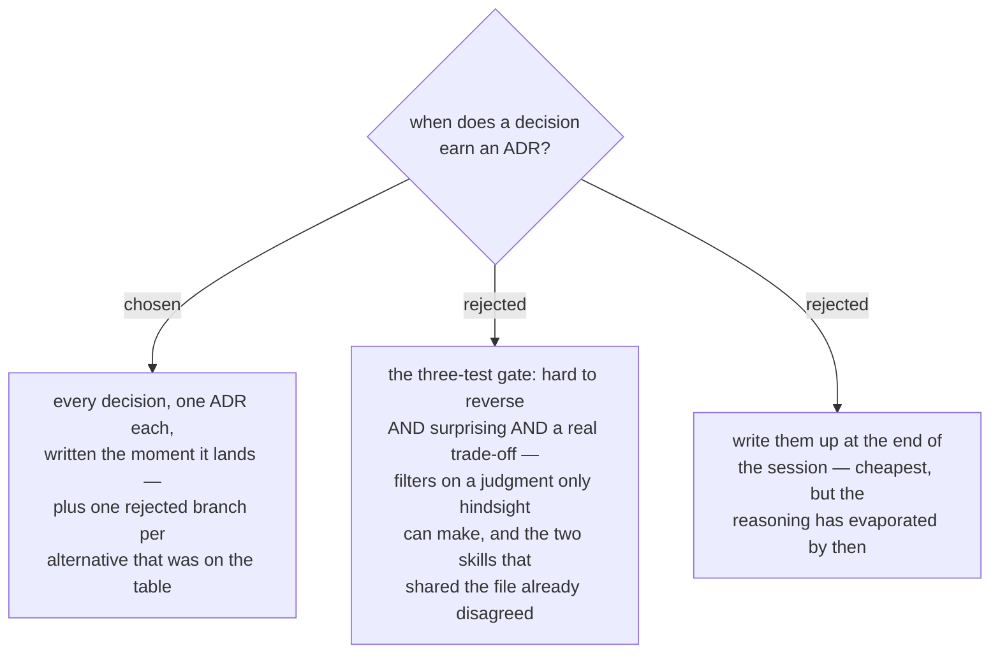

# ADR 0092 — Every design decision gets an ADR, and every option it rejected

- **Status:** Accepted
- **Date:** 2026-08-18
- **Context:** the two grilling skills (`sp-grill-with-doc`, `grill-then-plan`) and their shared `ADR-FORMAT.md`

## Context

The two grilling skills ship an **identical** `ADR-FORMAT.md` but gave opposite
instructions about when to use it. `sp-grill-with-doc`'s SKILL.md said *"Offer ADRs
sparingly — only when all three are true"*; `grill-then-plan`'s said *"Always create
an ADR for every design decision … when in doubt, write the ADR."*

Worse, the shared `ADR-FORMAT.md` itself carried the three-test gate under **When to
offer an ADR**. So `grill-then-plan` contradicted *itself*: its own step 4 said write
everything, and the file that step points at said write almost nothing. Which
behaviour you got depended on which document the session happened to weight.

The three tests were also the wrong shape for the moment they fire. "Is this hard to
reverse?" and "will a future reader be surprised?" are hindsight questions being asked
at the one instant nobody has hindsight — mid-grilling, seconds after the decision.
The cost of guessing wrong is asymmetric: an unnecessary ADR costs a paragraph, a
missing one costs the reasoning permanently.

## Decision

**Every design decision gets its own ADR, written the moment it is made.** A decision
qualifies if one option was chosen over another — architectural shape, technology,
naming, scope boundary, safety mechanism, a deliberate no. No batching, no deferring.
When in doubt, write it.

**Record the options, not just the winner.** Every alternative genuinely on the table
gets its own `|rejected|` branch in the ADR's decision diagram with a one-line reason
for losing. A decision recorded without its rejected options is half a record: the
next reader re-proposes what was already ruled out.

The former gate's "what qualifies" list survives as **Give these extra care** —
emphasis on which decisions deserve real reasoning rather than a bare statement, not a
filter on which ones get written.

## Consequences

- More ADRs, and that is the point. menunest has been run under the always-rule for
  months and sits at 177; the corpus is the asset, not the cost.
- Two follow-on lines in `ADR-FORMAT.md` that still read as filters were corrected in
  the same change: **Considered Options** (was *"only when the rejected alternatives
  are worth remembering"*) and the **Rejected alternatives** bullet (was *"when the
  rejection is non-obvious"*).
- Both skills now say the same thing, and the shared file agrees with both.
