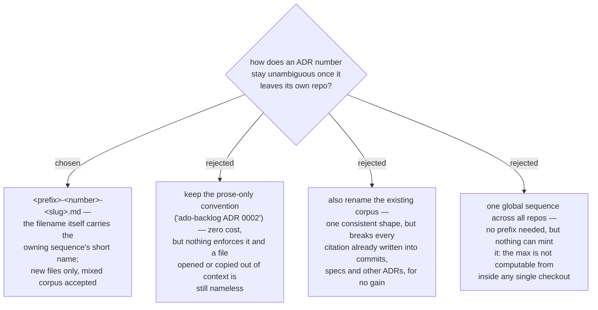

# ADR 0093 — ADR filenames carry the owning sequence's short name

- **Status:** Accepted
- **Date:** 2026-08-18
- **Amends:** [ADR 0056](0056-adr-numbers-minted-from-global-max-across-branches-and-worktrees.md) — numbering is unchanged; the filename shape and the fixed four-digit padding are not
- **Context:** [ADR 0092](workflow-daily-work-0092-every-design-decision-gets-an-adr.md)

## Context

`0177` identifies nothing outside the repo that minted it. Four sequences live in
this repo alone — the root `docs/adr/` plus one per plugin — and menunest has a fifth,
so `0002` is currently three different decisions. The existing answer was a prose
convention in CLAUDE.md (*"cite those namespaced (`ado-backlog ADR 0002`), never
bare"*), which works only for as long as every writer remembers it and does nothing
for a file opened on its own.

ADR 0056 already looked at prefixes and rejected date-prefixed IDs, partly because
they would mean *"mass migration or a mixed corpus"*. That objection was aimed at
migrating the existing 55+ ADRs. It does not carry here, because this decision
explicitly declines the migration and accepts the mixed corpus as the steady state.

## Decision

**New ADR filenames are `<prefix>-<number>-<slug>.md`**, where the prefix is the short
name of the project that *owns the sequence*. Existing ADRs keep their names — the
sequence continues at the same numbers and stays mixed indefinitely.

The prefix is resolved in a fixed order, and only the last step asks: the sequence's
highest-numbered file, then a prefix declared in the repo's CLAUDE.md / AGENTS.md,
then the user — once per sequence, with the answer written into CLAUDE.md in the same
turn so it is never asked twice.

Registered prefixes for this repo:

| sequence | prefix |
|---|---|
| `docs/adr/` (root) | `workflow-daily-work` |
| `plugins/ado-backlog/docs/adr/` | `ado-backlog` |
| `plugins/dev-workflows/docs/adr/` | `dev-workflows` |
| `plugins/github-backlog/docs/adr/` | `github-backlog` |

`workflow-daily-work` is long for a citation. It is chosen anyway because it is
already the canonical identifier for this marketplace everywhere else
(`marketplace.json`, `dev-workflows@workflow-daily-work`), and inventing a second,
shorter name for the same thing is the exact failure the prefix exists to prevent.
A bare `ADR 0093` remains correct *inside* this repo.

## Amendment to ADR 0056

0056's minting rule is unchanged and still governs: global max across every ref, the
index, and every worktree. Two details of it are superseded:

- *"re-pad to **four** digits"* → re-pad to **the sequence's own width**. menunest's
  is three; hard-coding four is the bug that made a `^[0-9]{4}` scan read a populated
  sequence as empty and mint `0001`.
- The rejected `DATE` branch's "mixed corpus" objection no longer stands as a reason
  against prefixes, for the reason given above.

## Consequences

- The minting script needed **no change** — it was already prefix- and width-tolerant.
  Verified against a mixed sequence in both shells: `0174`, `0175`, `menunest-0176`,
  `001` → `menunest-0177`; a 3-digit legacy set → `178`; `dev-workflows-0002` →
  `dev-workflows-0003`; `menunest-0059` → `menunest-0060` (no octal trap).
- One transition case the script cannot cover: while the highest-numbered file is
  still unprefixed it prints a bare number, and the prefix must be prepended by hand.
  This happens once per sequence.
- CLAUDE.md and AGENTS.md carry the prefix table, so step 2 of the resolution order
  hits and no session has to be asked again.
