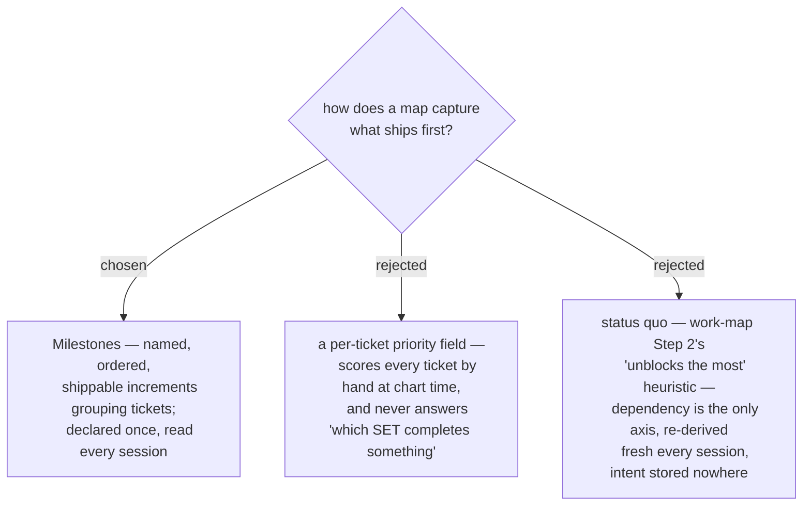

# A map's ordering intent is milestone grouping, not per-ticket priority

The frontier is deliberately key-ascending (ADR 0062 — determinism), and the only
pick guidance anywhere is work-map Step 2's one line ("usually that it unblocks the
most") — a dependency heuristic, not a value statement. On a map with 6+ open
tickets every entry looks equal, and the user re-decides "what do I want first"
every session because the map has nowhere to hold that intent. The unit the user
thinks in is the shippable increment, not the ticket. So the ordering dimension
decision-map gains is **milestone grouping**: a milestone is a named group of
decision tickets that, once all closed, lets building of that increment begin;
milestones are ordered on the map, and the frontier can then say "milestone 1
needs 2 more — take `auth-model`". A per-ticket priority number was rejected
because it moves the same per-session judgement to chart time (one score per
ticket) while still never answering the question actually being asked — *which
set of decisions completes something usable*.
