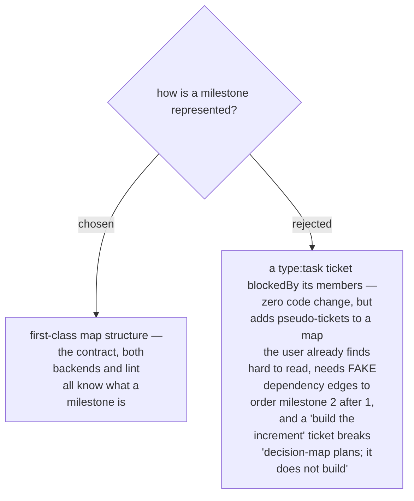

# A milestone is first-class structure, not a task-ticket emulation

A milestone (ADR 0094) could have been emulated today with no contract change: one
`task` ticket per milestone, blocked by its member tickets, surfacing on the
frontier when the members close. Rejected on three grounds. First, the founding
complaint is that the map is hard to read — emulation *adds* tickets that are not
decisions, so it worsens the problem it serves. Second, milestone ordering would
need `milestone-2 blockedBy milestone-1` edges that assert a dependency that does
not exist, and the position diagrams (ADR 0063/0064) would draw that lie on every
member ticket. Third, a ticket whose resolution is "the increment was built" sits
outside the map's charter — decision-map plans and hands off; it does not build.
So milestones enter the data contract as real structure, at the cost of touching
`map_core.py`, both backends, the dry-run plan and lint.
