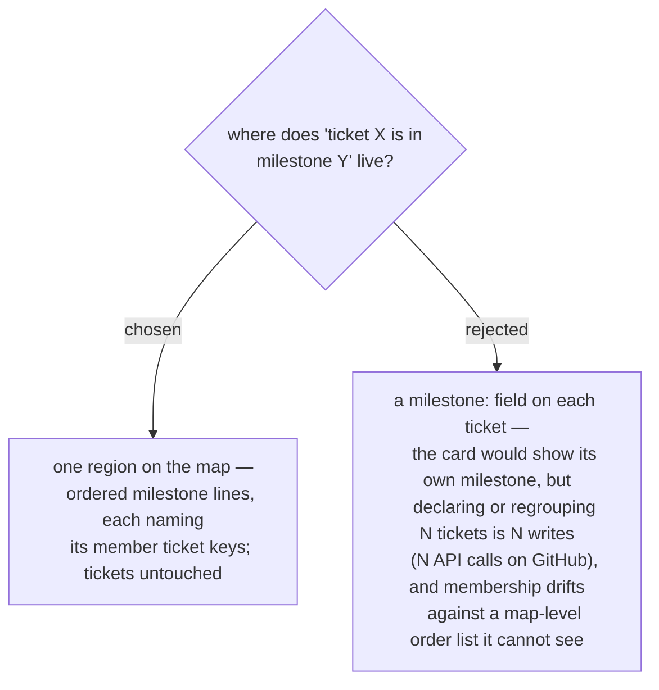

# Milestone membership and order live on the map, in one generated region

The declaration "what ships first" is a map-level statement, so it is stored where
it is spoken: a new tool-owned marker region on the map document (sibling to
`fog` / `scope` / `decisions`), holding the ordered milestone list with each
milestone's member keys. One edit surface for declaring and regrouping; the
existing region machinery (`map_core` merge, byte-identical no-op, lint) extends
to it instead of a new per-ticket write path. Both backends carry it identically —
the regions are already byte-identical across local and GitHub (ADR 0062). The
cost accepted: a ticket card does not name its own milestone; if that matters
later it is a rendering question for the position diagram (ADR 0063/0064), not a
storage question.
