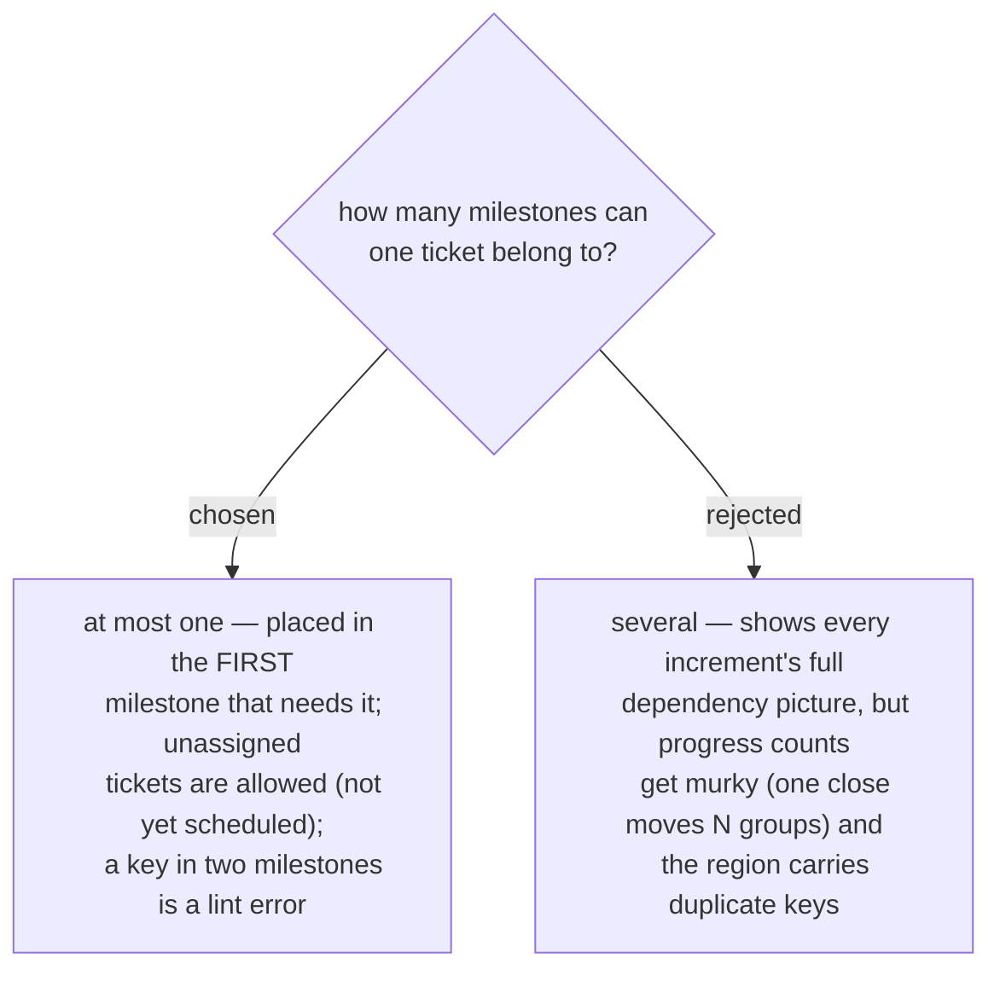

# A ticket belongs to at most one milestone, the first that needs it

A decision differs from a task here: **closed once, it serves every later
milestone automatically** — nothing is re-done per increment. So a ticket that two
milestones need sits in the earlier one; when that milestone completes, the
decision is already available to the later one. Membership is therefore exclusive,
and three rules follow: a ticket in no milestone is legal (it means "not yet
scheduled", the backlog state, so adopting milestones never forces a full
partition of an existing map); a closed ticket may appear as a member (it is the
history of what the increment needed); a key listed under two milestones is a
lint **error**. A milestone's identity is a slug under the same format rule as
ticket keys (`[A-Za-z0-9][A-Za-z0-9_-]*`, no `--` — it lives inside the same
marker/region machinery), with an optional free-text label alongside it for the
human meaning ("demo the search page").
